# JAVA


## String类常用API

1. **比较字符串内容（boolean）**

|                       方法名                        |                             说明                             |
| :-------------------------------------------------: | :----------------------------------------------------------: |
|     public boolean **equals** ( String another)     | 该字符串对象与指定字符串对象比较，只关心字符串内容是否完完全全一致 |
| public boolean **equalsIgnoreCase**(String another) |         也是比较内容，但忽略大小写，常用于验证码！！         |

为什么不用 == 来比较？因为字符串对象是引用类型，不是直接存储数据，再加上其内存的独特性，完全不能用==比较，根本判断不对！

2. **返回字符串长度**

   ```java
   public int length()
   ```

   

3. **获取字符串某个索引位置的字符**

   ```java
   public char charAt(int index)
   ```

   

4. **将当前字符串转换成字符数组返回**

   ```java
   public char[] toCharArray()
   ```

   

5. **根据开始和结束的索引进行截取，得到新的字符串（左闭右开）**

   ```java
   public String substring(int beginIndex, int endIndex)
   ```

6. **从传入的索引处截取，一直截取到末尾处，得到新的字符串**

   ```java
   public String substring(int beginIndex)
   ```

7. **将字符串里面的某一段值，用新给的值替换掉，返回新的字符串**

   ```java
   public String replace(String target, String replacement)
   ```

8. **切割字符串，得到一个字符串数组并返回（常用 " , "  " ; "  等）**

   ```java
   public String[] split(String s)//"," ";"
   ```

9. **判断该字符串内容里是否含有传入的字符串内容**

   ```java
   public boolean contains(String s)
   ```

   

10. **判断该字符串是否以输入的字符串内容开始**

    ```java
    public boolean startsWith(String s)
    ```


```java
// 获取对象的数据类型，是什么对象
String s1 = "1212"
s1.getClass().getSimpleName()

// 比较两个未知对象是否相等,有非空校验。
Objects.equals(s1, s2)
 
 // 操作集合和数组用Stream流
  超级好用YYDS
  
// 获取对象的类的类型
  user instanceof Business（判断user对象是否为Business类的，返回值为boolea）
  
/**
目前最优雅的定位文件方式
getResourceAsStream中的/是直接去src下寻找的文件；
Dom4JHelloWorldDemo1——当前写代码的这个类名；反射原理，舒舒服服
*/
        InputStream is = Dom4JHelloWorldDemo1.class.getResourceAsStream("/Contacts.xml");
        Document document = saxReader.read(is);

```

**相对路径的找法：**真的是很烦，一下子在项目工程下面，一下子又在模块下面，尼亚的，这里给出一个通用方法。

```java
// 这个可以获取我们当前class文件代码所在的主路径
System.out.println(System.getProperty("user.dir"));
```

这样我们就知道，相对路径应该怎么写。一般情况下，相对路径都是相对工程而言的，我们路径里面写模块名+...等等定位文件


## 1、Java编程中的[ ]和{ }是表示什么意思？

**【1】[ ]有两个用途，**

- 一是声明数组时使用，表示数组的长度，例如int a = new int[5],声明了长度为5的数组。
- 二是在正则表达式中，表示一个范围，例如：[a-z]表示取值在小写a到小写z之间copy

**【2】{ }是一个语句体，他是一段程序的边界，**

- 例如：（1）class A{} 这里的{}表示类实体，凡是在{}中的内容均是类的变量（属性）或方法（函zd数）
- （2）public void a(){} 这里的{}表示方法体，凡是在{}中的内容均是方法的实体。

- 【注意】我们可以在程序的任何合法语句两侧加{ }，例如：{int a = 0;}，这个等价于int a = 0;  也就入上所说，他是程序的一个“边界”，并没有实际的运行意义，只是把程序分隔成模块，是一种固定的写法

## 2、java对反斜杠很敏感

看正则表达式


## 3、变量初始化问题

**1、基本数据类型**

4大类8种。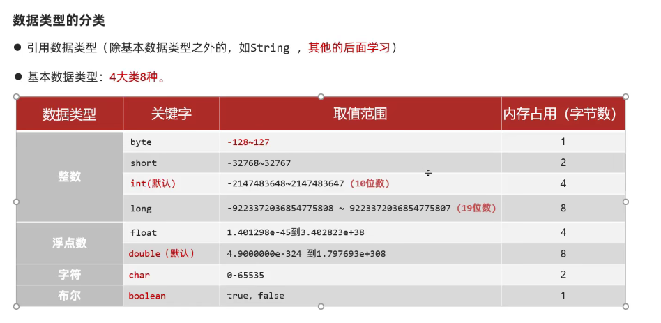

- **只有在方法中定义时（局部变量），无默认初始化值**。使用之前要赋值，否则报错未初始化。
- 在类中定义时（成员变量），有默认初始化值。
- 在数组中定义时，有默认初始化值。
- 默认初始化值：0，0.0，false。
- 字符在计算机中是存储的ASCII码，能算就算不能算就在一起，与字符串是两个概念哦

**2、引用类型**

​		无论在哪里定义，都有**初始化值NULL**，因为他存放的是引用地址撒，注意用之前要保证非NULL，否则空指针异常了


## 4、基本数据类型的类型转换

### 自动类型转换

因为程序中经常存在不同类型的变量赋值给其他类型的变量，所以要进行类型转换。char是2个字节，int是4个字节

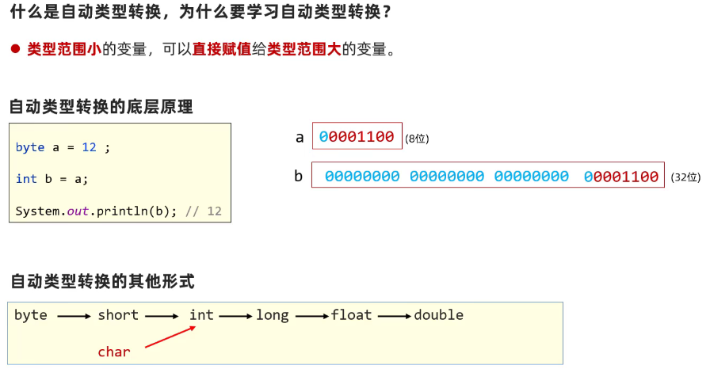

### 表达式的自动类型转换

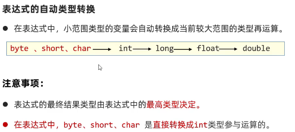

```java
byte a = 10;
int b = 20;
double c  = 18;
double z = a + b + c;//a+b+c表达式的输出类型为double
System.out.println(z);
//错误情况
byte i = 2;
byte j = 10;
byte k = i + j;//表达式中，byte是先转换成int，再参与运算的
System.out.println(k);
```

### 强制类型转换

强行将大范围类型的变量，数据赋值给小范围类型的变量。转换后可能会有数据缺失。浮点类型——整型，直接丢弃小数部分。

```java
int a = 20;
byte b = a;//这样会错误，因为a是大范围，b是小范围
byte b = (byte)a;
```

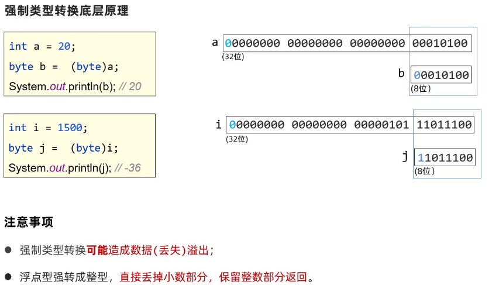

## 5、运算符

###  基本运算符

1、两个整数相除结果还是整数，因为表达式的最终类型，由式子里面最高类型决定==（表达式自动类型转换原理）.==

```java
a = 10;
b = 3;
c = a / b;
sout(c)>>>3
sout(a * 1.0 / b)>>>3.333333333
```

2、**"+"符号  在与字符串运算时作为连接符，结果仍为一个字符串。**

  	**"+"符号  在与  字符  运算时作为连接符，能算则算，不能算就在一起。**

注意字符与字符串的区别，字符在计算机里面就是一个数字类型，当可以一起算时，字符就变成数字进行运算，不能算时，就还是以字符的形式输出。

```java
 int a =5;
sout("abc" + a);//abc5
sout("abc" + 'a')//abca
sout(a + 'a')//102
sout("abc" + a + 'a')//abc5a
sout(a + "" + 'a')//5a
sout
```


### 扩展赋值运算符

**这种运算符隐含了强制类型转换。输出类型与前面那个数据类型相同**

这与表达式的自动类型转换有一点区别，一定记住扩展赋值运算符，输出类型与前面那个数据类型相同

```java
byte a = 10;
byte b = 20;
int i = a + b;//a + b输出为int类型
a += b;//输出a为byte类型，而不是int。因为他相当于a = (byte)(a + b)
//一定记住扩展赋值运算符，输出类型与前面那个数据类型相同
```

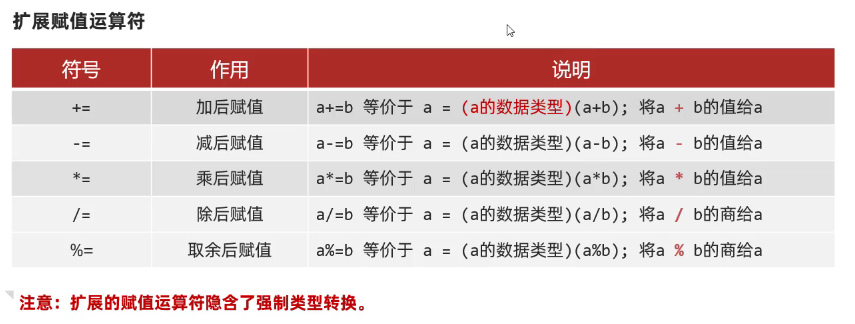

### 逻辑运算符

注意：结果是一个boolean布尔类型数据。

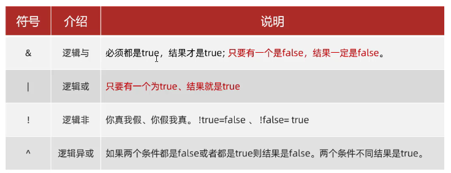

**&、|无论什么情况，左右两边都会执行**，而加上了短路的就有一个不满足就结束了

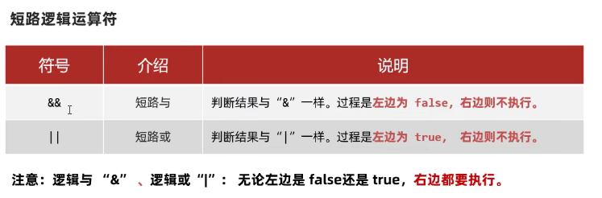

### 三元运算符

格式：条件表达式？值1：值2

​		if 表达式==True，则返回值1，否则返回值2。

```java
int score = 98;
String rs = score>=60 ? "Pass":"Fail";
```


## 6、常量

1.  **public static final 修饰的成员变量，必须有初始值**。

2. 命名规范：英文单词全部大	

   ```java 
   public static final SCHOOL_NAME= "西南交大";
   ```

3. 在编译阶段会进行“宏替换”，把使用常量的地方全部替换成真实的字面量。

4. 用处：做信息标志和分类，**但是**虽然可以实现可读性，但是入参值不受约束，代码相对不够严谨，所以有了枚举类。


## 7、枚举

- 枚举是Java中的一种特殊类型，**常常用于Switch语句**。

- 枚举的作用："是为了做信息的标志和信息的分类"。

  入参约束严谨，代码优雅，是最好的信息分类技术！建议使用!

**定义枚举类的格式：**

- ​	定义一个名为Season的枚举类型，其中有四个成员，SPRING , SUMMER , AUTUMN , WINTER，枚举成员一般使用大写。
- 直接使用创建好的对象即可

```java
修饰符 enum 枚举名称{
            第一行都是罗列枚举类实例的名称。
}
public enum Season{
  SPRING , SUMMER , AUTUMN , WINTER
}
```

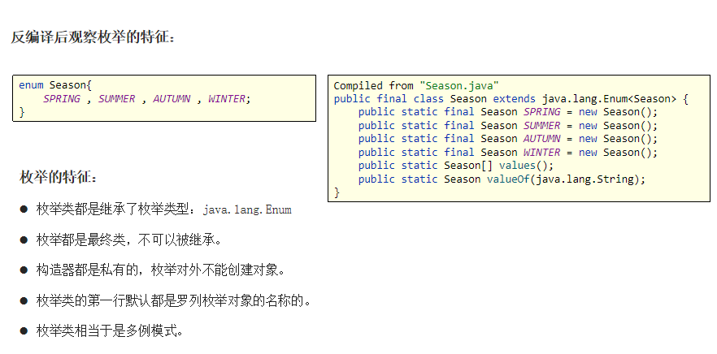

**访问枚举类的成员**

- 访问枚举类的成员可以直接通过 **类名.成员名** 对成员进行访问：

```java
System.out.println(Season.SPRING);
```

**在switch（）中使用枚举类**

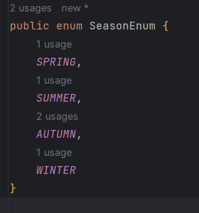

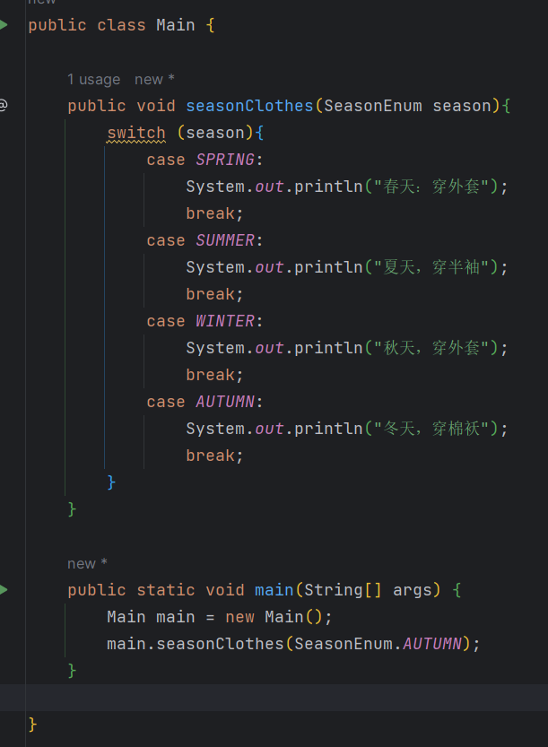


## 8、内部类

概述：内部类就是定义在一个类里面的类，作用有很多，例如说我一个汽车对象，汽车里面有发动机，我们就把发动机定义成一个类，放在里面等等。有几种类型，我们不用管，只要掌握匿名内部类就好了。

**局部内部类：**放在**方法、代码块、构造器等执行体{  }**中。

匿名内部类是局部内部类的一种形式。

###  匿名内部类

- 本质上是一个没有名字的局部内部类，定义在**方法中、代码块中等执行体**等。
- 作用：方便创建子类对象，最终目的为了简化代码编写。
- **在多态的基础，引出**

**Example：** 说不清楚，看用法

```java
public class Test {
    public static void main(String[] args) {
      // 抽象类是不能创建对象的哦，这个也不是创建抽象类对象哦，只是说java省略了中间创建一个子类的过程，因为我们只需要调用里面的方法嘛，创建一个子类有点多余
        Animal a = new Animal(){
            @Override
            public void run() {
                System.out.println("老虎跑的块~~~");
            }
        };
        a.run();
      
    }
}

这是一个内部类
//class Tiger extends Animal{
//    @Override
//    public void run() {
//        System.out.println("老虎跑的块~~~");
//    }
//}

// 定义一个抽象类（接口也可以）
interface Animal{
    public abstract void run();
}
```

**特点总结：**

- 匿名内部类是一个没有名字的内部类。
- 匿名内部类写出来就会产生一个匿名内部类的对象。
- 匿名内部类的对象类型相当于是当前new的那个的类型的子类类型。


## 9、Objects类

Objects 类是 **final 修饰**的类，不可继承，内部方法都是 **static 方法**，从 jdk1.7 开始才引入了 Objects 类。

这个类与Object是**继承关系**。

| 方法名                                           | 说明                                                         |
| ------------------------------------------------ | ------------------------------------------------------------ |
| public static boolean equals(Object a, Object b) | 比较两个对象的，底层会先进行非空判断，从而可以避免空指针异常。再进行equals比较 |
| public static boolean isNull(Object obj)         | 判断变量是否为null ,为null返回true ,反之                     |

判断两个对象是否相等，使用equals(s1，s2)的方法安全性最高！！！！

因为它验证了s1\s2是否为NUll，做了非空校验。报错：空指针异常，s1.equals(s2)这个是字符串对象调用里面的equals方法，但是如果s1是null呢，也就是s1不是对象，那他就没有对应的equals方法啊，这个空指针异常的问题经常出现，原因是程序员的技术不行。

所以说我们看到官方重写的equals（）方法里面用到了这个！


## 10、日期类

JAVA8以前：

- Date类 + SimpleDateFormat类

Java8之后：java.time包提供了新的日期和时间API：

- **LocalDate：**本地日期对象。年月日
- **LocalTime：**本地时间对象。时分秒
- **LocalDateTime**：本地日期时间对象，包含了日期及时间。
- **Instant：**时间戳对象（年月日时分秒）。与Date可以相互转换
- **DateTimeFormatter:**  用于做最上面三种时间对象的格式化和解析。


## 11、Arrays类

**数组操作工具类**

Arrays类的常用**API**：

| 方法名                                                       | 说明                                                         |
| ------------------------------------------------------------ | ------------------------------------------------------------ |
| public static String **toString(类型[] a)**                  | 返回数组的内容（字符串形式）                                 |
| public static void **sort(类型[] a)**                        | 对数组进行默认升序排序                                       |
| public static <T> void **sort(类型[]   a, Comparator<? super T>   c)** | **(仅引用类型）**使用比较器对象自定义排序                    |
| public static int **binarySearch(int[] a, int key)**         | 前提：数组已经排序。二分搜索数组中的数据，存在返回索引，不存在返回-1 |

```java
int[] arr = {10, 2, 55, 23, 24, 100};
//
String rs = Arrays.toString(arr);
//
Arrays.sort(arr); //数组对象传递的是！！！！地址
//
int index = Arrays.binarySearch(arr, 55);
```

- **注意注意**

Arrays.toString()用于普通数组的时候，例如in[]，String[]，直接返回的是其数组的内容；但是当是一个对象数组的时候，就有两种情况，一种是地址、一种是内容，要看该对象是否重写了toString方法，因为Arrays.toString()源码是这样写的，要学会看！！


## 12、Comparator比较器

- **重要API：引用数据类型自定义排序**。因为他觉得如果你是基本类型，那么按照官网的就已经给你排序好了，一般需要自己排序的都是对象，即引用类型的数据。

- Comparator比较器是**一个函数式接口**！！！！可以用Lambda表达式

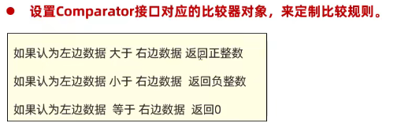

**当结果>0时，把把左右两边更换位置，其他情况不变**

- 有一点看不懂原理，其实没有关系，只要记住一个道理：

  ==注意一定返回的是整数才可以哦==，如果遇到double类型，就使用Double.compare(o1, o2)

```java
return o1 - o2; // 升序	
return o2 - o1; //  降序
return Double.compare(o1, o2) //double类型
```

Comparator比较器对象简介：

```java
// API
public static <T> void sort(类型[] a, Comparator<? super T> c)
  
// Comparator比较器对象。
        int[] ages = {34, 12, 42, 23};                         
        Arrays.sort(ages);
        System.out.println(Arrays.toString(ages));

        Integer[] ages1 = {34, 12, 42, 23};
        Arrays.sort(ages1, new Comparator<Integer>() {
            @Override
            public int compare(Integer o1, Integer o2) {
                return o2 - o1; //  降序
            }
        });
//Lambda简化函数式接口
        Arrays.sort(ages1,(o1, o2) -> o2-o1);
        System.out.println(Arrays.toString(ages1));

```

**对象数组进行排序：**

```java
// 对象数组排序
        Student[] students = new Student[3];
        students[0] = new Student("吴磊",23 , 175.5);
        students[1] = new Student("谢鑫",18 , 185.5);
        students[2] = new Student("王亮",20 , 195.5);
        System.out.println(Arrays.toString(students));//记得在Students里面重写toString，否则打印的是地址

        Arrays.sort(students, new Comparator<Student>() {
            @Override
            public int compare(Student o1, Student o2) {
              	return Double.compare(o2.getHeight(), o1.getHeight()); 
            }
        });
        System.out.println(Arrays.toString(students));
//lambda化简,前提是函数式接口
			Arrays.sort(students, (o1, o2) -> Double.compare(o1.getHeight(),o2.getHeight()));
```


## 13、接口

==接口就是抽象类进一步扩展出来的，定义了一个更加规范优雅的形式而已。==

```java
public interface 接口名 {
       // 常量 public static final
       // 抽象方法。记住没有方法体哦  public abstract（只能是这个修饰符，可以不写，默认就是的）
} 

@FunctionalInterface // 函数式接口，只能有一个抽象方法
interface Swimming{
    void swim();
}
```

- JDK8之前接口中只能是**抽象方法和常量**，没有其他成分了。
- 接口不能实例化。
- 接口中的成员都是public修饰的，写不写都是，因为规范的目的是为了公开化。


## 14、Lambda表达式

 Lambda表达式是JDK 8开始后的一种新语法形式。（仅仅适用于函数式接口！）

-  **作用：简化函数式接口的匿名内部类的写法形式**

Lambda表达式的简化格式：参数类型可省略不写

```java
(匿名内部类被重写方法的形参列表) -> {
     被重写方法的方法体代码。
}

注：-> 是语法形式，无实际含义。
```

```java
@FunctionalInterface // 函数式接口，只能有一个抽象方法
interface Swimming{
    void swim();
}


//main
public static void main(String[] args) {
//正常匿名内部类写法
       Swimming s1 = new Swimming() {
           @Override
            public void swim() {
               System.out.println("老师游泳贼溜~~~~~");
           }
        };

//Lambda简化后写法
        Swimming s1 = () -> {
          System.out.println("老师游泳贼溜~~~~~")
        };
  
        go(s1);
        go(() -> {
          System.out.println("学生游泳很开心~~~")
        });
}
```

**终极简化规则**

- 如果**只有一个参数**，形参列表的括号 (   )也可以省略。

  无参数时，必须要用一对空括号来表示

  ```java
  lists.forEach(s->{
    	.........
  })
  ```

- 如果方法体代码**只有一行代码**。可以省略大括号不写，如果这行代码还是一个return语句，则必须扔掉return，否则bug。

  ```java
  lists.stream().filter(s -> s.startsWith("张"));
  ```


## 15、Collection常用API

| 方法名称                                       | 说明                                 |
| ---------------------------------------------- | ------------------------------------ |
| boolean **add (E e)**                          | 把给定的对象添加到当前集合中         |
| void **clear( )**                              | 清空集合中所有的元素                 |
| boolean **remove (E e)**                       | 删除第一个相同的集合元素（仅仅一个） |
| boolean **contains (Object obj)**              | 判断当前集合中是否包含给定的对象     |
| boolean **isEmpty ( )**                        | 判断当前集合是否为空                 |
| int **size( )**                                | 返回集合中元素的个数。               |
| Object[ ] **toArray ( )**                      | 把集合中的元素，存储到数组中         |
| boolean **addAll(Collection<? extends E> c);** | 将另外一个集合的元素全部拷贝过来     |


## 16、Collection遍历方式

在 Java 集合的遍历中，如果你是遍历集合的引用类型元素，那么遍历时获取的是元素引用的拷贝，而不是元素本身的拷贝。这意味着，通过这些引用对元素进行的修改，实际上是直接影响到了集合中的元素。

举个例子：

```java
List<PreparationWorkVO> workList = new ArrayList<>();
// 假设workList已经被初始化并添加了元素

for(PreparationWorkVO work : workList) {
    work.setWorkStatus(StatusEnum.FINISHED); // 直接修改了集合中的元素
}
```

总结：

- 对于引用类型的集合元素，遍历时获取的是元素引用的拷贝，通过这些引用对元素进行的修改会直接影响到集合中的元素。
- 对于基本数据类型的集合元素（或者说包装类型，因为集合不能直接存储基本类型），遍历时获取的确实是值的拷贝，这时对拷贝的值进行修改不会影响到集合中的元素。


### 方式一：迭代器(遍历、删除)

迭代器在Java中的代表是Iterator，迭代器是集合的**专用遍历方式**。

- **获取迭代器**

  | collection的方法名称       | 说明                                                         |
  | -------------------------- | ------------------------------------------------------------ |
  | **Iterator<E> iterator()** | 返回集合中的迭代器对象，该迭代器对象默认指向**当前集合的0索引** |

  | Iterator常用方法名称      | 说明                                                         |
  | ------------------------- | ------------------------------------------------------------ |
  | boolean  **hasNext ( )**  | 询问当前位置是否有元素存在，存在返回true ,不存在返回false    |
  | E  **next()**             | 获取当前位置的元素，并同时将迭代器对象移向下一个位置，注意防止取出越界。 |
  | default void **remove()** | 删除当前元素，并且让指针不往后移动                           |

  1、先通过集合的 `iterator（）`方法获取当前集合的迭代器，调用Iterator类的`hasNext（）、next（）、remove（）`方法完成遍历或删除。
  
  2、迭代器进行遍历时，不能使用集合自带的删除方法，如 `List.remove（）`，只能使用迭代器的`remove（）`方法，否则会报 `ConcurrentModificationException()`异常。
  
  > 我们通过源码分析：it.next()是获取当前元素并同时将迭代器对象移向下一个位置，我们直接点开next（）方法，内部有一个checkForComodification();
  >
  > 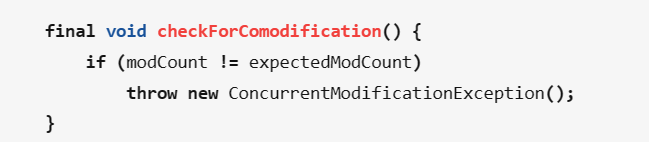
  >
  > 我们会看到只要modCount != expectedModCount就会报异常了，而这个modCount可以理解为集合的修改次数，然后这个modCount是集合内部的属性，，expectedModCount是迭代器内部属性，在获取迭代器（Iterator it = list.iterator()）时，会把expectedModCount设置为modCount，因此迭代期间如果集合被他自己类方法修改了，那么modCount就会变，所以会导致expectedModCount和modCount不相等，当我们调用next()方法的时候就会抛出异常了。（比如说list调用add方法，里面都会有modCount++ 这么个语句）

```java
Iterator<String> it = lists.iterator();
while(it.hasNext()){
  String ele = it.next();
  System.out.println(ele);
}
```


### 方式二：增强for循环ForEach(遍历，无删除)

jdk5出现的，内部原理就是一个迭代器，相当于是迭代器遍历集合的简化写法（编译时会增强for变成迭代器的写法遍历）。

- **格式：**

  ```java
  for(元素数据类型 变量名 : 数组或者Collection集合) {
           //在此处使用变量名即可，该变量名就是元素
  }
  ```

  ```java
  Collection<String> list = new ArrayList<>();
  ...
  for(String ele : list) {
     System.out.println(ele);
  }
  ```

  


### 方式三：lambda表达式(遍历，无删除)

JDK8开始的，更简单，更直接的遍历集合！！！底层是forEach

- **Collection结合Lambda遍历的API**

| 方法名称                                          | 说明               |
| ------------------------------------------------- | ------------------ |
| default void forEach(Consumer<? super T> action): | 结合lambda遍历集合 |

```java
Collection<String> lists = new ArrayList<>();

// 直接使用这个API
lists.forEach(new Consumer<String>() {
    @Override
    public void accept(String s) {
      System.out.println(s);
    }
});

// 加上lambda表达式后
list.forEach( s -> sout(s));
```


**终极简化规则**

- 如果**只有一个参数**，(   )也可以省略。

  ```java
  lists.forEach(s->{
    	.........
  })
  ```

- 如果方法体代码**只有一行代码**。可以省略大括号不写,同时要省略分号！如果这行代码还是一个return语句，则必须扔掉return，否则bug。

  ```java
  lists.stream().filter(s -> s.startsWith("张"));
  ```


### 遍历删除问题

删除集合中元素的方式有两种：

- 使用集合自带的remove方法，但一次仅能删除一个元素。
- **使用迭代器的remove方法，没有问题！！！**

PS：由于List集合带索引，所以多一种使用索引删除、添加等的API，但同样存在遍历删除问题


## 17、Map集合遍历方式

Map集合没有Iterator迭代器，无法直接进行遍历，都是通过先转换成Set集合（键是不重复的），然后采用Collection的遍历方式进行，因此也有三种方式：

- **1、获取Map集合中键的Set集合，遍历键的Set集合，然后通过键提取对应的值**

  - public Set< K>  keySet( )：获取Map集合里面的键的集合，返回Set集合。
  - get（key）：通过键获取值。

  ```java
     //先把所有键取出来
  	Set<String> s1= buyMap.keySet();
  	//开始根据键找值
  	for (String key : s1) {
  		Integer value= buyMap.get(key);
  		System.out.println(key+"->>>>"+value);	
  	}
  ```

- **2、获取键值对对象（Map.Entry<K,V>）的Set集合，然后通过Set集合进行遍历**

  - 先把Map集合转换成Set集合，Set集合中每个元素都是键值对实体类了。

    其实就是说，Map给我们定一个类，这个类用来存储Map元素的键和值，然后把这个类的每个对象放到Set集合里面去。这个类名字是   Map.Entry<K,V>——键值对类型。

  - public Set<Map.Entry<K,V>>  entrySet()：获取所有键值对对象的Set集合。

  - K getKey( ) 和 V getValue()：Map.Entry的两个方法获取键和值

  ```java
  	Set<Map.Entry<String,Integer>> en= buyMap.entrySet();
  	for (Map.Entry<String, Integer> entry : en) {
  		String key=entry.getKey();
  		Integer value=entry.getValue();
  		System.out.println(key+"->>>"+value);
  		
  	}
  ```

  

- **3、Lambda表达式 推荐**

  - 得益于JDK 8开始的新技术Lambda表达式，提供了一种更简单、更直接的遍历集合的方式。底层原理是：键值对类型+forEach。

  ```java
  buyMap.forEach((k , v) -> {
      System.out.println(k +"----->" + v);
  });
  ```


## 18、Map常用API

```java
public interface Map<K,V>
K——键的泛型；V——值的泛型
```

| 方法名称                                          | 说明                                          |
| ------------------------------------------------- | --------------------------------------------- |
| V **put(K key,V value)**                          | 添加元素                                      |
| V **remove(Object key)**                          | 根据键删除键值对元素                          |
| void **clear()**                                  | 移除所有的键值对元素                          |
| boolean **containsKey(Object key)**               | 判断集合是否包含指定的键                      |
| boolean **containsValue(Object value)**           | 判断集合是否包含指定的值                      |
| boolean **isEmpty()**                             | 判断集合是否为空                              |
| int **size()**                                    | 集合的长度，也就是集合中键值对的个数          |
| V **get(Object key);**                            | 根据键获取值                                  |
| Set<K> **keySet();**                              | 获取Map集合里面的键的集合，返回Set集合        |
| Collection<V> values();                           | 获取Map集合里面的值的集合，返回Collection集合 |
| void **putAll(Map<? extends K, ? extends V> m);** | 将其他集合并到现在这个集合                    |


## 19、List集合

单独讲一下List集合，因为就他由索引，所以多一些Api

List集合因为**支持索引**，所以多了很多索引操作的**独特api**，其他Collection的功能List也都继承了。

| 方法名称                                         | 说明                                   |
| ------------------------------------------------ | -------------------------------------- |
| void **add(int index,E element)**                | 在此集合中的指定索引插入指定的元素     |
| E **remove(int index)**                          | 删除指定索引处的元素，返回被删除的元素 |
| E **set(int index,E element)**                   | 修改指定索引处的元素，返回被修改的元素 |
| E **get(int index)**                             | 返回指定索引处的元素                   |
| List<E> **subList(int fromIndex, int toIndex);** | 按照索引范围截取集合元素               |


## 20、Collections集合工具类

- java.utils.Collections:是集合工具类，区分Arrays数组工具类
- 作用：Collections并不属于集合，是用来操作集合的工具类。

**API：**

| 方法名称                                                     | 说明                         |
| ------------------------------------------------------------ | ---------------------------- |
| public static <T> boolean **addAll**(Collection<? super T> c, T... elements) | 给集合对象批量添加元素       |
| public static void **shuffle**(List<?> list)                 | 打乱List集合元素的顺序       |
| public static <T> void **sort**(List<T> list)                | 将集合中元素按照默认规则排序 |
| public static <T> void **sort**(List<T> list，Comparator<? super T> c) | 将集合中元素按照指定规则排序 |


## 21、泛型

Java泛型是一种编程语言的特性，它允许类、接口和方法在定义时使用一个或多个类型参数，这些类型参数在调用时会被实际类型替换，从而增强了代码的重用性和类型安全性。通过使用泛型，我们可以编写出更加通用的代码，同时也可以减少代码中的强制类型转换操作，提高代码的可读性和可维护性。

**唯一的作用就是：**

- 灵活控制输入的数据类型，不需要在工具类等中写死，也就避免了使用方法重载，降低代码量，提高可读性；常用于集合中。

**注意点：**

- 仅在编译阶段进行数据类型矫正，进入到JVM后就管不了了，所以反射可以跳过泛型检查，如可以向一个List<String>中添加Integer对象。
- 其次，只能使用引用类型

**三种定义：泛型类+泛型接口+泛型方法**

在 Java 泛型中，我们经常使用以下符号来定义泛型：

<T>：表示定义一个类型参数 T，可以是任何标识符，通常用大写字母表示，例如 List。

<E>：表示定义一个元素类型参数 E，通常用于集合类中，例如 List。

<K, V>：表示定义一个键值对类型参数 K 和 V，通常用于 Map 类中，例如 Map<K, V>。

**通配符：在使用泛型时用到**

- **限定通配符**  对类型进行了限制。有两种限定通配符，

  - 一种是**<? extends T>**它通过确保类型必须是T的子类来设定类型的上界，

  - 另一种是**<? superT>**它通过确保类型必须是T的父类来设定类型的下界。泛型类型必须用限定内的类型来进行初始化，否则会导致编译错误。


- **非限定通配符 ？，可以用任意类型来替代**。如 `List<?>` 的意思是这个集合是一个可以持有任意类型的集合，它可以是`List<A>`，也可以是 `List<B>` ,或者 `List<C>` 等等。

- **泛型类：**

  ```java
  1、
  //此处T可以随便写为任意标识，常见的如T、E、K、V等形式的参数常用于表示泛型
  //在实例化泛型类时，必须指定T的具体类型
  public class Generic<T>{ 
      //key这个成员变量的类型为T,T的类型由外部指定  
      private T key;
  
      public Generic(T key) { //泛型构造方法形参key的类型也为T，T的类型由外部指定
          this.key = key;
      }
  
      public T getKey(){ //泛型方法getKey的返回值类型为T，T的类型由外部指定
          return key;
      }
  }
  
  2、
  //泛型的类型参数只能是类类型（包括自定义类），不能是简单类型
  //传入的实参类型需与泛型的类型参数类型相同，即为Integer.
  Generic<Integer> genericInteger = new Generic<Integer>(123456);
  //传入的实参类型需与泛型的类型参数类型相同，即为String.
  Generic<String> genericString = new Generic<String>("key_vlaue");
  Log.d("泛型测试","key is " + genericInteger.getKey());
  Log.d("泛型测试","key is " + genericString.getKey());
  
  ```

- **泛型接口：**

  ```java
  // 1、一个简单的泛型接口示例：
  public interface MyList<T> {    
  	void add(T element);   
   	T get(int index);   
    	int size();
    }
  // 2、一个实现 MyList 接口的示例代码：
  public class ArrayList<T> implements MyList<T> {
      private T[] array;
      private int size;
  
      public ArrayList() {
          array = (T[]) new Object[10];
          size = 0;
      }
  
      @Override
      public void add(T element) {
          if (size == array.length) {
              T[] newArray = (T[]) new Object[array.length * 2];
              System.arraycopy(array, 0, newArray, 0, array.length);
              array = newArray;
          }
          array[size++] = element;
      }
      @Override
      public T get(int index) {
          if (index < 0 || index >= size) {
              throw new IndexOutOfBoundsException();
          }
          return array[index];
      }
      @Override
      public int size() {
          return size;
      }
  }
  ```

- **泛型方法：**

  这个就要注意一点区别：泛型类的方法和泛型方法是两个概念，两个东西

  ```java
  // 1、泛型方法
  /**
   *     1）public与返回值中间<T>非常重要，可以理解为声明此方法为泛型方法。
   *     2）只有声明了<T>的方法才是泛型方法，泛型类中的使用了泛型的成员方法并不是泛型方法。
   *     3）<T>表明该方法将使用泛型类型T，此时才可以在方法中使用泛型类型T。
   *     4）调用方式：不用明确指定<String>，因为必须传入形参，所以传入的时候相当于指定了
   */
  public <T> T genericMethod(T data){
    	return data;
  }
  
  // 2、泛型类的方法
  public T run(T t){
    .......
  }
  
  // 3、泛型方法例子
  public class GenericMethodExample {
  
      // 泛型方法，输入参数类型为 T，返回值类型也为 T
      public static <T> T genericMethod(T data) {
          return data;
      }
  
      public static void main(String[] args) {
  
          // 调用泛型方法并指定参数类型为 String
          String strData = genericMethod("Hello World");
          System.out.println("String Data : " + strData);
  
          // 调用泛型方法并指定参数类型为 Integer
          Integer intData = genericMethod(123);
          System.out.println("Integer Data : " + intData);
  
          // 调用泛型方法并指定参数类型为 Double
          Double dblData = genericMethod(10.5);
          System.out.println("Double Data : " + dblData);
      }
  }
  
  运行结果：
  String Data : Hello World
  Integer Data : 123
  Double Data : 10.5
  
  ```

- **泛型类+泛型方法+成员方法**

  ```java
  public class GenericFruit {
    //1、定义几个类
      class Fruit{
          @Override
          public String toString() {
              return "fruit";
          }
      }
      class Apple extends Fruit{
          @Override
          public String toString() {
              return "apple";
          }
      }
      class Person{
          @Override
          public String toString() {
              return "Person";
          }
      }
    
  	//2、泛型类
      class GenerateTest<T>{
          public void show_1(T t){
              System.out.println(t.toString());
          }
  
          //在泛型类中声明了一个泛型方法，使用泛型E，这种泛型E可以为任意类型。可以类型与T相同，也可以不同。
          //由于泛型方法在声明的时候会声明泛型<E>，因此即使在泛型类中并未声明泛型，编译器也能够正确识别泛型方法中识别的泛型。
          public <E> void show_3(E t){
              System.out.println(t.toString());
          }
  
          //在泛型类中声明了一个泛型方法，使用泛型T，注意这个T是一种全新的类型，可以与泛型类中声明的T不是同一种类型。
          public <T> void show_2(T t){
              System.out.println(t.toString());
          }
      }
  
      public static void main(String[] args) {
          Apple apple = new Apple();
          Person person = new Person();
  
          GenerateTest<Fruit> generateTest = new GenerateTest<Fruit>();
          //apple是Fruit的子类，所以这里可以
          generateTest.show_1(apple);
          //编译器会报错，因为泛型类型实参指定的是Fruit，而传入的实参类是Person
          //generateTest.show_1(person);
  
          //使用这两个方法都可以成功
          generateTest.show_2(apple);
          generateTest.show_2(person);
  
          //使用这两个方法也都可以成功
          generateTest.show_3(apple);
          generateTest.show_3(person);
      }
  }
  
  ```

  


## 22、包装类开发注意问题

有些知识、如自动装箱、拆箱，装箱的缓冲区、拆箱的空指针就不写了；

- **与数据库链接的POJO必须是包装类**

  那为什么POJO 的属性必须要用包装类型呢?《阿里巴巴Java开发手册》上有详细的说明，数据库的查询结果可能是null，如果使用基本类型的话，因为要自动拆箱（将包装类型转为基本类型，比如说把 Integer对象转换成int值），就会抛出(NullPointerException)的异常。

  

## 23、Stream流

在Java 8中，得益于Lambda所带来的函数式编程， 引入了一个全新的Stream流概念。

**目的：用于简化集合和数组操作的API。**

​	==在Stream流中可以直接修改集合、数组中的数据，要看是引用类型，还是基本数据类型。==

**Stream流的三类方法**

- 获取Stream流方法

  创建一条流水线，并把数据放到流水线上准备进行操作

- 中间方法

  流水线上的操作。一次操作完毕之后，还可以继续进行其他操作。

- 终结方法

  一个Stream流只能有一个终结方法，是流水线上的最后一个操作


### Collection获取Stream流

别人已经给我们写好了接口，直接调用Collection接口中的默认方法stream（）就可以

| Collection方法名称               | 说明                       |
| -------------------------------- | -------------------------- |
| default Stream<E> **stream ( )** | 获取当前集合对象的Stream流 |

支持链式编程，超级好用哦。下面是快速入门。

```java
// 找出lists集合里面姓张的，并且三个字的人
List<String> lists = new ArrayList<>();
Collections.addAll(lists,"张三丰","张无忌","周只能","张强");

//filter----过滤条件，支持Lambda
List<String> list4 = new ArrayList<>();
        lists.stream()
                .filter(s -> s.startsWith("张"))
                .filter(s -> s.length()==3)
                .forEach(s -> list4.add(s));
        System.out.println(list4);
```

### **Map合获取Stream流**

只能通过先转换成Set集合，然后再stream分别拿到 **键流** 、 **值流**、**键值对流**。

```java
Map<String, Integer> map = new HashMap<>();
//键流
Stream<String> keyStream = map.keySet().stream();
//值流
Stream<Integer> valueStream = map.values().stream();
//键值对流
Stream<Map.Entry<String, Integer>> keyvalueStream = map.entrySet().stream();
```

### **数组获取Stream流的方式**

借用数组工具类——Arrays。

| 获取方法名称                                      | 说明                            |
| ------------------------------------------------- | ------------------------------- |
| public static <T> Stream<T> **stream(T[] array)** | 获取当前数组的Stream流          |
| public static<T> Stream<T> **of(T... values)**    | 获取当前数组/可变数据的Stream流 |

```java
String[] name = {"张三丰","张无忌","周只能","张强"};
Stream<String> stream = Arrays.stream(name);
```

### Stream流API

也叫做是：中间方法。

| 名称                                                         | 说明                                                         |
| ------------------------------------------------------------ | ------------------------------------------------------------ |
|                                                              |                                                              |
| Stream<T> **limit(long maxSize)**                            | 获取前几个元素                                               |
| Stream<T> **skip(long n)**                                   | 跳过前几个元素                                               |
| Stream<T> **distinct()**                                     | 去除流中重复的元素。依赖(hashCode和equals方法)               |
| static <T> Stream<T> **concat(Stream a, Stream b)**          | **合并**a和b两个流为一个流                                   |
| long **count();**                                            | 返回当前stream里面的元素个数                                 |
| void **forEach(Consumer<? super T> action);**                | 对当前Stream流里面的元素进行遍历。                           |
| <R> Stream<R> **map(Function<? super T, ? extends R> mapper);** | Map加工方法，对每个元素进行操作；                            |
| Stream<T> **filter(Predicate<? super T> predicate)**         | 用于对流中的数据进行过滤。用Lambda表达式，使用的比较频繁，传入一个方法，返回值为boolean，true时为保留该集合中的元素，false时为丢弃。 |

```java
        List<String> lists = new ArrayList<>();
        Collections.addAll(lists,"张三丰","张无忌","周只能","张强");

//filter原理，当返回的是false时表示舍弃该数据，一般我们写的是lambda表达式，所以注意一点，里面那行代码的返回值要是boolean类型
        lists.stream().filter(new Predicate<String>() {
            @Override
            public boolean test(String s) {
                return s.startsWith("张");
            }
        });
lists.stream().filter(s -> s.startsWith("张")).forEach(s -> System.out.println(s));

//map加工方法，给每个元素前面加一个黑马字符串
lists.stream().map(s -> "黑马"+s).forEach(s -> System.out.println(s));

    List<Long> channelPoiIdList = singlePreparationVOList.stream()
            .filter(vo -> vo.getPoiInfo().channelPoiCodeReady())
            .flatMap(vo -> Stream.of(vo.getPoiInfo().getWaimaiChannelPoiCode(), vo.getPoiInfo().getWemallChannelPoiCode()))
            .map(Long::valueOf)
            .collect(Collectors.toList());

```


### Stream终结方法

| 名称                              | 说明                         |
| --------------------------------- | ---------------------------- |
| void **forEach(Consumer action)** | 对此流的每个元素执行遍历操作 |
| long **count()**                  | 返回此流中的元素数           |

注意：终结操作方法，**调用完成后流就无法继续使用了，原因是不会返回Stream了。**


### 收集Stream流

前面不是说了，我们Stream流里面的数据，是从集合或数组里面拷贝过来的嘛，就有一个弊端，原始的集合内容不会被修改，其实这是一个普遍现象，包括for循环里面也是一样的，都是拷贝原理。所以这里提出了收集Stream流，真的不错，这就舒服了。

- **收集Stream流的含义：就是把Stream流操作后的结果数据 返回一个新的集合/数组**

Stream流：方便操作集合/数组的手段。

集合/数组：才是开发中的目的。

**stream流里面提供了收集方法：**

| 名称                               | 说明                         |
| ---------------------------------- | ---------------------------- |
| R **collect(Collector collector)** | 开始收集Stream流，指定收集器 |

这里Collectors是一个工具类，提供了具体的收集方式！！！返回值值Collector

| 名称                                                         | 说明                   |
| ------------------------------------------------------------ | ---------------------- |
| public static <T> Collector **toList()**                     | 把元素收集到List集合中 |
| public static <T> Collector **toSet()**                      | 把元素收集到Set集合中  |
| public static Collector **toMap(Function keyMapper , Function valueMapper)** | 把元素收集到Map集合中  |

```java
List<String> lists = new ArrayList<>();
Collections.addAll(lists,"张三丰","张无忌","周只能","张强","张三丰");
//找出姓张的人，
Stream<String> sss = lists.stream().filter(s -> s.startsWith("张"));
// 将现在的Stream流收集到List集合
List<String> newList = sss.collect(Collectors.toList());
```


## 24、自定义异常

- **自定义异常的必要？**

​			Java无法为这个世界上全部的问题提供异常类。

​			如果企业想通过异常的方式来管理自己的某个业务问题，就需要自定义异常类了。

- **自定义异常的好处**

​			可以使用异常的机制管理业务问题，如提醒程序员注意。

​			同时一旦出现bug，可以用异常的形式清晰的指出出错的地方。

- **定义方式**    

1. 定义一个异常类继承Exception.

2. 重写构造器。一个无参，一个message的有参

3. 在出现异常的地方用**throw new 自定义对象**抛出，

**作用：**编译时异常是编译阶段就报错，提醒更加强烈，一定需要处理！！！当我们想要强调某个地方一定需要某种格式或参数的情况下，即我一写，java马上就会给我标红，提醒我写的参数有问题；而不会等到我跑起来才出问题。

这里出现了一个新的关键字，throw；他与throws的区别如下：

| throw与throws | 适用范围                                                     |
| ------------- | ------------------------------------------------------------ |
| throws        | 用于方法的声明上，和方法参数写在一行，可以抛出方法内部的异常 |
| throw         | 在方法内部直接创建一个异常对象，并从此点抛出。一般用于自定义异常 |

Example：

```java
// 自定义一个异常类
public class MyException extends Exception{
    public MyException() {
    }
    public MyException(String message) {
        super(message);
    }
}

// 测试类
public class Test {
    public static void main(String[] args) {
        try {
            checkAge(9090);
        } catch (MyException e) {
            e.printStackTrace();
        }

    }
    public static void checkAge(int age) throws MyException {
        if (age<0 ||age >200){
            throw new MyException(age +"is 非法的兄弟");
        }else {
            System.out.println("GOOD");
        }
    }
}
```

- **自定义运行时异常**

1. 定义一个异常类继承RuntimeException.

2. 重写构造器。与前面一样。

3. 在出现异常的地方用throw new 自定义对象抛出!

**作用：**提醒不强烈，编译阶段不报错！！运行时才可能出现！！！一般不写这个，用处比较小。


## 25、创建线程的三种方式

**1）继承Thread类,重写run方法**

1. 定义一个子类MyThread继承线程类java.lang.Thread，重写run()方法

2. 创建子类对象，调用start( )方法启动线程（启动后会执行run方法的）

- **优势:** 编写简单

- **劣势:** 线程类已经继承了Thread类，所以==不能再继承其他父类，不利于扩展，没有返回值。不能抛出异常。==

  ```java
  public class demo1 {
      public static void main(String[] args) {
          //2. 创建线程的对象
          Thread mythread = new Mythread();
          //3. 调用启动该线程的方法
          mythread.start();
          for (int i = 0; i < 5; i++) {
              System.out.println("主线程在输出");
          }
      }
  }
  
  /**
   1. 定义线程类，一般单独起一个类，这里为了方便就算了
   */
  class Mythread extends Thread{
      @Override
      public void run() {
          for (int i = 0; i < 5; i++) {
              System.out.println("子线程在输出");
          }
      }
  }
  ```

  

**2）实现Runnable接口方式创建多线程**

1. 定义一个线程任务类实现Runnable接口，重写run()方法
2. 创建这个线程任务类对象，将其传递给Thread类的构造函数，得到Thread类的对象
3. 调用该线程对象的start()方法启动线程

- **优点：**==可以继续继承类和实现接口，扩展性强。==线程任务类只是实现了接口撒

- **缺点：**==编程稍微复制，没有返回值，不能抛出异常。==

- | 构造器                                            | 说明                                         |
  | ------------------------------------------------- | -------------------------------------------- |
  | public **Thread(String name)**                    | 可以为当前线程指定名称                       |
  | public **Thread(Runnable target)**                | 封装Runnable对象成为线程对象                 |
  | public **Thread(Runnable target ，String name )** | 封装Runnable对象成为线程对象，并指定线程名称 |

  ```java
  public class demo2 {
      public static void main(String[] args) {
          Runnable myRunnable = new MyRunnable();
          Thread t = new Thread(myRunnable, "新的线程名字");
          t.start();
          for (int i = 0; i < 5; i++) {
              System.out.println("=======主线程");
          }
      }
  }
  class MyRunnable implements Runnable{
      @Override
      public void run() {
          for (int i = 0; i < 5; i++) {
              System.out.println("子线程=====");
  
          }
      }
  }
  ```

  

**3）使用实现Callable接口方式创建多线程**

1. 新定义一个线程任务类实现Callable接口，重写call（）方法。
2. 创建Callable线程任务类对象，将他传到FutureTask构造器中，创建FutureTask的对象
3. FutureTask的对象传递给Thread类的构造器，得到Thread的对象

4. 调用Thread的start方法启动线程

5. 线程执行完毕后、通过**FutureTask的get方法**去获取call（）方法的返回值

- 优点：

  - ==可以继续继承类和实现接口，扩展性强。==
  - **call方法可以有返回值，并且支持泛型。还可以抛出异常。**

- 缺点：编程最复杂，需要借助 FutureTask 类

- | 方法名称                               | 说明                                 |
  | -------------------------------------- | ------------------------------------ |
  | public **FutureTask<>(Callable call)** | 把Callable对象封装成FutureTask对象。 |
  | public V **get() throws Exception**    | 获取线程执行call方法返回的结果。     |

- ```java
  public class demo4 {
      public static void main(String[] args) {
          //3. 创建callable的任务对象
          Callable<String> mycall = new MyCall(10);
          //4. 把callable任务对象交给 FutureTask对象
          //  FutureTask对象的作用1： 是Runnable的对象（实现了Runnable接口），可以交给Thread了
          //  FutureTask对象的作用2： 可以在线程执行完毕之后通过调用其get方法得到线程执行完成的结果
          FutureTask<String> f1 = new FutureTask<>(mycall);
          // 5. 交给线程处理
          Thread t1 = new Thread(f1);
          t1.start();
  
          // 6. 用FutureTask拿去线程执行完毕的结果
          try {
              String result = f1.get();
              System.out.println(result);
          } catch (InterruptedException | ExecutionException e) {
              e.printStackTrace();
          }
      }
  }
  
  /**
   * 1. 定义一个任务类，实现Callable接口，并且声明返回值的类型哦
   */
  class MyCall implements Callable<String>{
      private int n;
      // 2. 重写call（）方法
      @Override
      public String call() throws Exception {
          int sum=0;
          for (int i = 0; i < n; i++) {
              sum = sum+i;
          }
          return "子线程的结果："+sum;
      }
      public MyCall(int n) {
          this.n = n;
      }
  }
  ```

  

## 26、synchronized用法

**`synchronized` 是 Java 中的一个关键字，属于悲观锁的实现，**主要解决的是多个线程之间访问资源的同步性，可以保证被它修饰的方法或者代码块在任意时刻只能有一个线程执行。

`synchronized` 关键字的使用方式主要有下面 3 种：

**1、修饰实例方法 （锁当前对象实例）**

​		给当前对象实例加锁，进入同步代码前要获得 **当前对象实例的锁** 。

```java
synchronized void method() {
    //业务代码
}
```

**2、修饰静态方法 （锁当前类）**

​		给当前类加锁，会作用于类的所有对象实例 ，进入同步代码前要获得 **当前 class 的锁**。

​		这是因为静态成员不属于任何一个实例对象，归整个类所有，被类的所有实例共享。

```java
synchronized static void method() {
    //业务代码
}
```

**3、修饰代码块 （锁指定对象/类）**

​		对括号里指定的对象/类加锁：

- `synchronized(this)` 表示进入同步代码库前要获得 **锁当前对象实例**。
- `synchronized(类.class)` 表示进入同步代码前要获得 **锁当前类**

```java
synchronized(同步锁对象) {
    //业务代码
}
```

**静态 `synchronized` 方法和非静态 `synchronized` 方法之间的调用互斥么？**

不互斥！！！如果一个线程 A 调用一个实例对象的非静态 `synchronized` 方法，而线程 B 需要调用这个实例对象所属类的静态 `synchronized` 方法，是允许的，不会发生互斥现象，因为访问静态 `synchronized` 方法占用的锁是当前类的锁，而访问非静态 `synchronized` 方法占用的锁是当前实例对象锁。


## 27、线程池

  线程池就是一个可以复用线程的技术。如果用户每发起一个请求，后台就创建一个新线程来处理，下次新任务来了又要创建新线程，而创建新线程的开销是很大的，这样会严重影响系统的性能。

使用线程池的好处:

- **降低资源消耗。**通过重复利用已创建的线程，降低线程创建和销毁造成的消耗。
- **提高响应速度。**当任务到达时，任务不需要的等到线程创建就能立即执行。
- **提高线程的可管理性。**线程是稀缺资源，如果无限制的创建，不仅会消耗系统资源，还会降低系统的稳定性，使用线程池可以进行统一的分配，调优和监控。


### 如何创建线程池

> Java的线程池，也叫Executor框架。因为接口Executor是其根接口
>
> 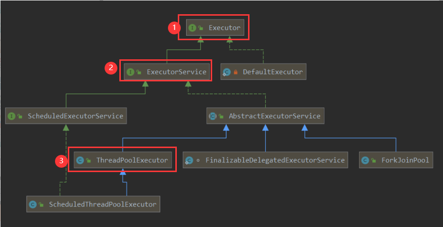
>
> - Executor:运行新任务的简单接口
> - ExecutorService：扩展了Executor，添加了用来管理执行器生命周期和任务生命周期的方法
> - ScheduleExcutorService：扩展了ExecutorService，支持Future和定期执行任务


==方式一：==使用**ExecutorService**的实现类**ThreadPoolExecutor类 ** 去创建一个线程池对象


==方式二：==使用**Executors（线程池的工具类）**调用方法返回不同特点的线程池对象

但是《阿里巴巴 Java 开发手册》中**强制线程池不允许使用 Executors 去创建**，而是通过 ThreadPoolExecutor 的方式，规避资源耗尽的风险。

> Executors 返回线程池对象的弊端如下：
>
> - **FixedThreadPool 和 SingleThreadExecutor** ： 允许请求的队列长度为 Integer.MAX_VALUE ，可能堆积大量的请求，从而导致 OOM。
> - **CachedThreadPool 和 ScheduledThreadPool** ： 允许创建的线程数量为 Integer.MAX_VALUE ，可能会创建大量线程，从而导致 OOM。


### ThreadPoolExecutor类

**ThreadPoolExecutor构造器的参数说明：7个**

```java
public ThreadPoolExecutor(int corePoolSize,
                          int maximumPoolSize,
                          long keepAliveTime,
                          TimeUnit unit,
                          BlockingQueue<Runnable> workQueue,
                          ThreadFactory threadFactory,
                          RejectedExecutionHandler handler)
```

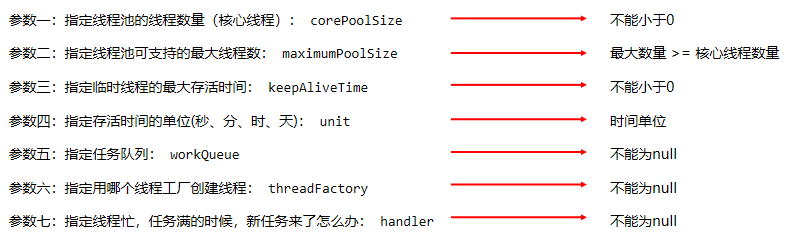

**`ThreadPoolExecutor` 3 个最重要的参数：**

- **`corePoolSize` : 核心线程数** ，核心线程是不会被回收销毁的线程，一来任务就会创建，直到达到最大值。
- **`maximumPoolSize` : 最大线程数** 当任务队列满了，并且核心线程都在忙时，会将可以运行的线程数量变为最大线程数，并且创建临时线程。
- **`workQueue`: 阻塞队列** ，用来存放线程任务。当新任务来的时候会先判断核心线程是否都在忙，如果忙的话，新任务就会被存放在队列中。
- **`handler`：饱和策略** ，核心线程和临时线程都在忙，任务队列也满了，新的任务过来的时候才会开始任务拒绝。
- **`threadFactory`：线程工厂** :executor 创建新线程的时候会用到。
- **`keepAliveTime`：临时线程最大存活时间**，如果临时线程等待 `keepAliveTime`时间后，依然没有运行任务，就会被回收销毁；
- **`unit`：最大存活时间的单位** : `keepAliveTime` 参数的时间单位。

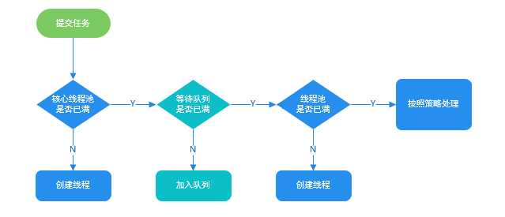


### 3.ThreadPoolExecutor 运行任务对象

- ==执行Runnable任务对象，用execute（）方法；==
- ==执行Callable 任务，用submit（）方法；==

| ExecutorServic方法名称                      | 说明                                                         |
| ------------------------------------------- | ------------------------------------------------------------ |
| void **execute(Runnable command)**          | 执行任务/命令，没有返回值，一般用来执行 Runnable 任务        |
| ==Future==<T>  **submit(Callable<T> task)** | 执行任务，返回未来任务对象获取线程结果，一般拿来执行 Callable 任务 |
| void **shutdown()**                         | 等任务执行完毕后关闭线程池                                   |
| List<Runnable> **shutdownNow()**            | 立刻关闭，停止正在执行的任务，并返回队列中未执行的任务       |


## 28、反射

### 反射概述

- 反射是指对于任何一个Class类，**在"运行的时候"都可以直接得到这个类全部成分。**
- 在运行时,可以直接得到这个类的构造器对象：Constructor
- 在运行时,可以直接得到这个类的成员变量对象：Field
- 在运行时,可以直接得到这个类的成员方法对象：Method
- **这种运行时，动态获取类信息以及动态调用类中成分的能力称为Java语言的反射机制。**

**反射的关键：**

反射的第一步都是先得到编译后的**Class类对象**，然后就可以得到Class的全部成分。

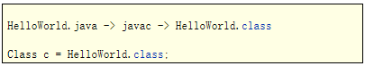

### 反射获取类对象

首先，整理一些，Java文件的整个生命周期，即执行过程。首先是javac将  .java  编译成Class文件，如何这个文件会运到内存中，创建Class类对象。最后java的运行是java执行工具跑。

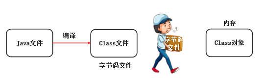

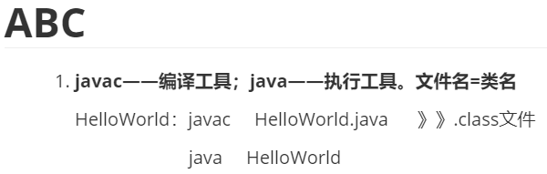

内存中的Class类对象结构如下：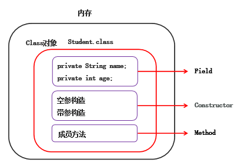

所以说我们反射是需要得到——Class类对象，可以从三个过程中获取，如下：

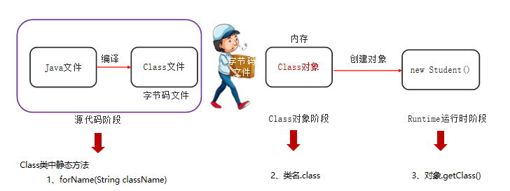

**反射的第一步是什么？**

- 获取Class类对象，如此才可以解析类的全部成分

**获取Class类的对象的三种方式**

- 方式一：Class c1 = Class.forName(“全类名”);
- 方式二：Class c2 = 类名.class
- 方式三：Class c3 = 对象.getClass( );

```java
public class reflect1 {
    public static void main(String[] args) throws ClassNotFoundException {
        //1. Class类对象的一个静态方法：forName（全限名：包名+类名）
        Class<?> c = Class.forName("com.CCooky.Student");
        System.out.println(c);

        //2. 类名.class
        Class<Student> c1 = Student.class;
        System.out.println(c1);

        //3. 对象.getClass()  获取该对象对应的Class类对象
        Student s = new Student();
        Class<? extends Student> c2 = s.getClass();
        System.out.println(c2);
    }
}
```


### 反射获取构造器对象

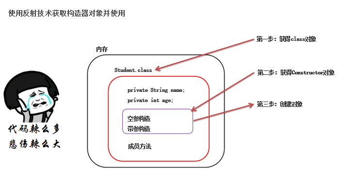

**反射的第一步是先得到类对象，然后从类对象中获取类的成分对象。**

**Class类中用于获取构造器的方法**

| Class的方法                                                  | 说明                                                         |
| ------------------------------------------------------------ | ------------------------------------------------------------ |
| Constructor<?>[]  **getConstructors()**                      | 返回public构造器对象的数组                                   |
| Constructor<?>[]  **getDeclaredConstructors()**              | 返回所有构造器对象的数组                                     |
| Constructor<T>  **getConstructor(Class<?>... parameterTypes)** | 返回public单个构造器对象（按照类中构造器的声明顺序的第一个） |
| Constructor<T>  **getDeclaredConstructor(Class<?>... parameterTypes)** | 返回单个构造器对象                                           |

```java
// getConstructor(Class... parameterTypes)
// 获取某个特定特定的构造器
@Test
public void getDeclaredConstructor() throws Exception {
    // a.第一步：获取类对象
    Class c = Student.class;
    // b.定位单个构造器对象 (按照参数定位无参数构造器)
    Constructor cons = c.getDeclaredConstructor();
    System.out.println(cons.getName() + "===>" + cons.getParameterCount());

    // c.定位某个有参构造器
    Constructor cons1 = c.getDeclaredConstructor(String.class, int.class);
    System.out.println(cons1.getName() + "===>" + cons1.getParameterCount());
}
```

**获取构造器的作用依然是初始化一个对象返回**

| Constructor类中用于创建对象的方法           | 说明                                                         |
| ------------------------------------------- | ------------------------------------------------------------ |
| T **newInstance(Object... initargs)**       | 根据指定的构造器创建对象                                     |
| public void **setAccessible(boolean flag)** | 设置为true,表示取消访问检查，进行暴力反射,表明，反射可以破坏封装性 |

```java
@Test
public void getDeclaredConstructor() throws Exception {
    // a.第一步：获取类对象
    Class c = Student.class;
    // b.定位单个构造器对象 (按照参数定位无参数构造器)
    Constructor cons = c.getDeclaredConstructor();
    System.out.println(cons.getName() + "===>" + cons.getParameterCount());

    // 如果遇到了私有的构造器，可以暴力反射
    cons.setAccessible(true); // 权限被打开

    Student s = (Student) cons.newInstance();
    System.out.println(s);

    System.out.println("-------------------");

    // c.定位某个有参构造器
    Constructor cons1 = c.getDeclaredConstructor(String.class, int.class);
    System.out.println(cons1.getName() + "===>" + cons1.getParameterCount());

    Student s1 = (Student) cons1.newInstance("孙悟空", 1000);
    System.out.println(s1);
}
```


### 反射获取成员变量对象


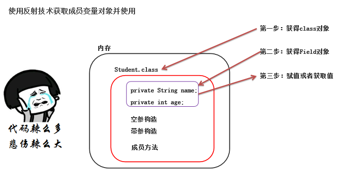

**反射的第一步是先得到类对象，然后从类对象中获取类的成分对象。**

| **Class类中用于获取成员变量的方法**     | 说明                                                         |
| --------------------------------------- | ------------------------------------------------------------ |
| Field[] **getFields()**                 | 返回所有public成员变量对象的数组                             |
| Field[] **getDeclaredFields()**         | 返回所有成员变量对象的数组                                   |
| Field **getField(String name)**         | 返回public的单个成员变量对象（参数是类中成员变量的具体名字） |
| Field **getDeclaredField(String name)** | 返回单个成员变量对象，存在就能拿到                           |

```java
@Test
public void getDeclaredFileds(){
    Class<Student> s = Student.class;
    Field[] fileds = s.getDeclaredFields();
    for (Field filed : fileds) {
        System.out.println(filed.getName()+"===>>>"+filed.getType());
    }
    try {
        Field age = s.getField("age");
    } catch (NoSuchFieldException e) {
        e.printStackTrace();
    }
}
```

**获取成员变量的作用依然是在某个对象中取值、赋值**

| Field类中用于取值、赋值的方法            | 说明                                                         |
| ---------------------------------------- | ------------------------------------------------------------ |
| void **set(Object obj, Object value)：** | 赋值（第一个参数是对象，需要我们自己去创建，第二个是该Filed的设置的值） |
| Object **get(Object obj)**               | 获取值。                                                     |

```java
    @Test
    public void setFiled() throws Exception{
        Class<Student> s = Student.class;
        Field age = s.getDeclaredField("age");
        
        // 因为成员变量都是私有，所以这里需要暴力拆解的
        age.setAccessible(true);
        Student student = new Student();
        age.set(student,22);
    }
```


### 反射获取成员方法对象


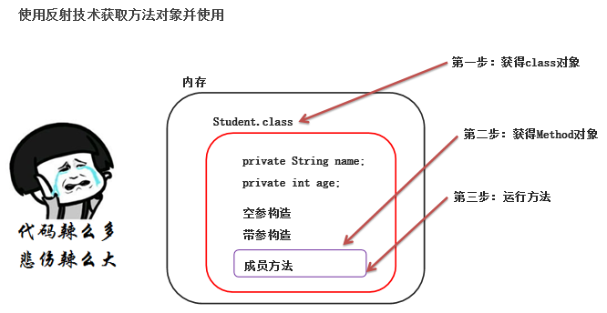

反射的第一步是先得到类对象，然后从类对象中获取类的成分对象。

| Class类中用于获取成员方法的方法                              | 说明                               |
| ------------------------------------------------------------ | ---------------------------------- |
| Method[] **getMethods()**                                    | 返回所有public成员方法的对象数组   |
| Method[] **getDeclaredMethods()**                            | 返回所有成员方法对象的数组         |
| Method **getMethod(String name, Class<?>... parameterTypes)** | 返回public单个成员方法对象         |
| Method **getDeclaredMethod(String name, Class<?>... parameterTypes)** | 返回单个成员方法对象，存在就能拿到 |

```java
@Test
public void testString() throws NoSuchMethodException {
    Class<Student> studentClass = Student.class;
    Method method = studentClass.getMethod("toString",null);
    System.out.println(method.getName()+" 返回值类型："+method.getReturnType()+"  参数个数："+method.getParameterCount());
}
```

**获取成员方法的作用依然是在某个对象中进行执行此方法**

| Method类中用于触发执行的方法                                 | 说明                                                         |
| ------------------------------------------------------------ | ------------------------------------------------------------ |
| Object                                                                                              invoke(Object obj, Object... args) | 参数一：用obj对象调用该方法；参数二：调用方法的传递的参数（如果没有就不写）；返回值：方法的返回值（如果没有就不写） |

```java
@Test
public void testString() throws NoSuchMethodException, InvocationTargetException, IllegalAccessException {
    Class<Student> studentClass = Student.class;
    Method method = studentClass.getMethod("toString",null);
    System.out.println(method.getName()+" 返回值类型："+method.getReturnType()+"  参数个数："+method.getParameterCount());
  	// 调用方法
    Student student = new Student("zq",12);
    System.out.println(method.invoke(student, null));
}
```


### 反射作用一

**反射的作用一：绕过编译阶段为集合添加数据**

**解释：**反射是作用在运行时的技术，反射是作用在运行时的技术，此时集合的泛型将不能产生约束了，此时是可以为集合存入其他任意类型的元素的。

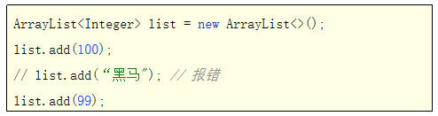

泛型只是在编译阶段可以约束集合只能操作某种数据类型，在编译成Class文件进入运行阶段的时候，其真实类型都是ArrayList了，泛型相当于被擦除了。

```java
public class reflect2 {
    public static void main(String[] args) throws NoSuchMethodException, InvocationTargetException, IllegalAccessException {
        ArrayList<String> list1 = new ArrayList<>();
        ArrayList<Integer> list2 = new ArrayList<>();
        System.out.println(list1.getClass());
        System.out.println(list2.getClass());
        System.out.println(list1.getClass()==list2.getClass());

        System.out.println("==============");
        list1.add("java");
        list1.add("python");
        Class c = list1.getClass();
        Method add = c.getMethod("add", Object.class);
        add.invoke(list1,12345);
    }
}
//发现这样使用其实是有点麻烦的，其实可以采用下面这种方法.采用多个对象指向一个地址的方法
ArrayList list3 = list1;
list3.add(123);
list3.add(456);
sout(list1)
```


### 反射作用二

**反射作用二：通用框架的底层原理**

需求：给你任意一个对象，在不清楚对象字段的情况可以，可以把对象的字段名称和对应值存储到文件中去。

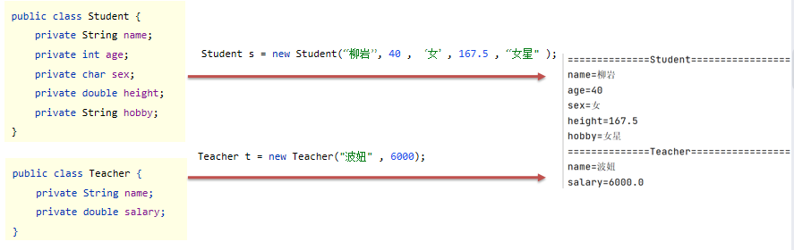

思路：

1. 定义一个方法，可以接收任意类的对象。
2. 每次收到一个对象后，需要解析这个对象的全部成员变量名称。
3. 使用反射获取对象的Class类对象，然后获取全部成员变量信息。
4. 遍历成员变量信息，然后提取本成员变量在对象中的具体值
5. 存入成员变量名称和值到文件中去即可。

```java
public class MybatisUtil {
    /**
     保存任意类型的对象
     * @param ob
     */
    public static void save(Object ob){
        try {
            PrintStream ps = new PrintStream(new FileOutputStream("F:\\Java_Project\\studying\\Reflect\\src\\com\\CCooky\\data.txt"),true);
            Class<?> c = ob.getClass();
            ps.println("======="+c.getSimpleName()+"===========");
            Field[] fileds = c.getDeclaredFields();
            for (Field filed : fileds) {
                String name = filed.getName();
                filed.setAccessible(true);
                String value = filed.get(ob)+"";
                ps.println(name+"="+value);
            }
        } catch (IllegalAccessException e) {
            e.printStackTrace();
        } catch (FileNotFoundException e) {
            e.printStackTrace();
        }
    }
}
```


## 29、 注解

**概述：**

- Java 注解（Annotation）又称 Java 标注，是 JDK5.0 引入的一种注释机制。


- Java 语言中的**类、构造器、方法、成员变量、参数等都可以被注解进行标注。**


**作用：**

- **对Java中类、方法、成员变量做标记，然后进行特殊处理，至于到底做何种处理由业务需求来决定。**

- 例如：JUnit框架中，标记了注解@Test的方法就可以被当成测试方法执行，而没有标记的就不能当成测试方法执行。

==注解和反射是配套使用的，在SpringBoot里面到处都是==

在 SpringMVC 中用注解用的飞起，各种 @RequestMapping, @Service, @Controller 等注解信手拈来，但还是不了解它的运作原理到底是什么样的。尤其是在框架中，大量运用到了**注解与反射操作**，所以以后也会认真了解一下如 Spring 框架中注解的运行原理，想必这无论是对理解框架，还是对理解注解本身，都会有很大的帮助。


### 自定义注解

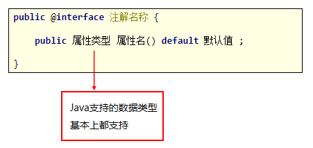

```java
public @interface Mybook {
    public String name();
    String[] authors();
    double price();
}
```

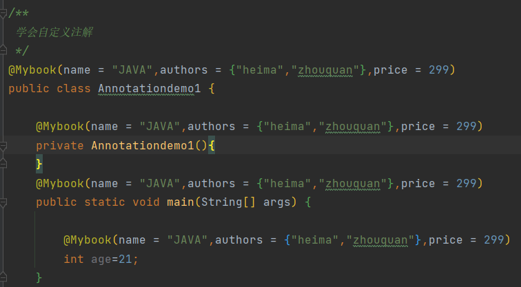

注解可以标记几乎任何地方哦。除此之外，**注解有一个特殊的属性**，如下：

- **value属性**，如果只有一个value属性的情况下，使用value属性的时候可以省略value名称不写!!
- 但是如果有多个属性,  且多个属性没有默认值，那么value名称是不能省略的。

```java
// 只有一个value属性
public @interface Book {
    String value();
}
```

```java
// 在使用的时候，就不需要加这个属性名——value
@Book("/delete")
public class Annotationdemo1 {
    @Mybook(name = "JAVA",authors = {"heima","zhouquan"},price = 299)
    private Annotationdemo1(){
    }
    public static void main(String[] args) {
    }
}
```


### 元注解

元注解：就是注解的注解。 

元注解有两个：

-  **@Target**: 约束自定义注解的 使用范围；

   **@Target中可使用的值定义在ElementType枚举类中，常用值如下：**

   -  TYPE，类，接口
   -  FIELD, 成员变量
   -  METHOD, 成员方法
   -  PARAMETER, 方法参数
   -  CONSTRUCTOR, 构造器
   -  LOCAL_VARIABLE, 局部变量

   ```java
   //元注解,只能注解方法和成员变量
   @Target({ElementType.METHOD,ElementType.FIELD}) 
   public @interface MyTest {
       
   }
   ```

-  **@Retention**：申明注解的生命周期

   **@Retention中可使用的值定义在RetentionPolicy枚举类中，常用值如下**

   -  SOURCE： 注解只作用在源码阶段，生成的字节码文件中不存在
   -  CLASS：  注解作用在源码阶段，字节码文件阶段，运行阶段不存在，默认值.
   -  **RUNTIME：注解作用在源码阶段，字节码文件阶段，运行阶段（开发常用）**

   ```java
   //元注解,只能注解方法和成员变量
   @Target({ElementType.METHOD,ElementType.FIELD}) 
   @Retention(RetentionPolicy.RUNTIME)
   public @interface MyTest {
   
   }
   ```


### 注解解析

**注解的解析：**注解的解析就是判断是否存在注解，存在注解就解析出内容。

**与注解解析相关的接口：**

- **Annotation**: 注解的顶级接口，注解都是Annotation类型的对象

- **AnnotatedElement:**  该接口定义了与注解解析相关的解析方法

| AnnotatedElement解析方法                                     | 说明                                                         |
| ------------------------------------------------------------ | ------------------------------------------------------------ |
| Annotation[]  **getDeclaredAnnotations()**                   | 获得当前对象上使用的所有注解，返回注解数组。                 |
| T **getDeclaredAnnotation(Class<T> annotationClass)**        | 根据注解类型获得对应注解对象                                 |
| boolean **isAnnotationPresent(Class<Annotation> annotationClass)** | 判断当前对象是否使用了指定的注解，如果使用了则返回true，否则false |

**注意：所有的类成分Class, Method , Field , Constructor，都实现了AnnotatedElement接口，所以他们都拥有解析注解的能力：**

**解析注解的技巧**

- 注解在哪个成分上，我们就先拿哪个成分对象。
- 比如注解作用成员方法，则要获得该成员方法对应的Method对象，再来拿上面的注解
- 比如注解作用在类上，则要该类的Class对象，再来拿上面的注解
- 比如注解作用在成员变量上，则要获得该成员变量对应的Field对象，再来拿上面的注解


### 案例

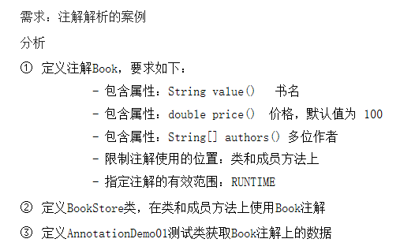

```java
// 定义注解
@Target({ElementType.METHOD,ElementType.TYPE})
@Retention(RetentionPolicy.RUNTIME)
public @interface BOOkk {
    String value();
    double price();
    String[] authors();
}

```

```java
// 新建一个类，写上注解
@BOOkk(value = "倚天屠龙记",price = 200,authors = {"琼瑶","吴磊"})
class BookStore{
    @BOOkk(value = "三少爷的键",price =  600,authors = {"刘德华","周杰伦"})
    public void Test(){
    }
}
```

```java
public class Annotation3 {
    @Test
    public void parseClass() throws NoSuchMethodException {
        //1. 获得类对象
        Class<BookStore> c = BookStore.class;
        //2. 获得类方法
        Method method = c.getDeclaredMethod("Test");

        //3. 从类对象中解析出来注解内容
        //a. 首先判断该类对象上面有没有这个注解
        if (c.isAnnotationPresent(BOOkk.class)) {
            //b. 直接获取该注解对象
            BOOkk book = c.getDeclaredAnnotation(BOOkk.class);
            System.out.println(book.value());
            System.out.println(book.price());
            System.out.println(Arrays.toString(book.authors()));
        }
        //4. 从类方法中解析出注解内容
        if (method.isAnnotationPresent(BOOkk.class)) {
            BOOkk book = method.getDeclaredAnnotation(BOOkk.class);
            System.out.println(book.value());
            System.out.println(book.price());
            System.out.println(Arrays.toString(book.authors()));
        }
    }
}
```


### 模拟Junit

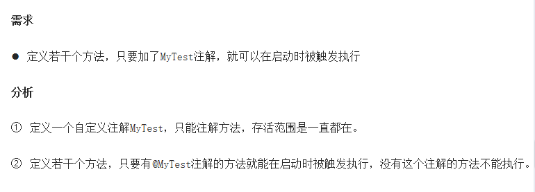

```java
@Target({ElementType.METHOD,ElementType.FIELD}) //元注解,只能注解方法和成员变量
@Retention(RetentionPolicy.RUNTIME)
public @interface MyTest {

}
```

```java
public class Annotationdemo4 {
    @MyTest
    public void test1(){
        System.out.println("====test1=====");
    }
    public void test2(){
        System.out.println("====test2=====");
    }
    @MyTest
    public void test3(){
        System.out.println("====test3=====");
    }

    /**
     * 启动菜单
     * @param args
     */
    public static void main(String[] args) throws Exception{
        Annotationdemo4 t = new Annotationdemo4();
        //1. 获取类对象
        Class<Annotationdemo4> c = Annotationdemo4.class;

        //2.
        Method[] methods = c.getDeclaredMethods();

        //3.
        for (Method method : methods) {
            if (method.isAnnotationPresent(MyTest.class)) {
                method.invoke(t);
            }
        }
    }
}
```


## 30、JavaSe的动态代理Proxy

**概述**

- 代理就是被代理者没有能力或者不愿意去完成某件事情，需要找个人代替自己去完成这件事，动态代理就是用来对业务功能（方法）进行代理的。例如我要出国，但我不想去弄很多的证明，所以我出钱要别人给我弄，我只用做飞机就行了。

- 其实他出现的原因是在于：想让程序员在业务实现层仅仅保留你的逻辑代码就好了，**一些其他的冗余，重复，没有技术的东西让代理去做**，这样代码很整洁，方便查看。

==原理是基于反射得到的，会创建一个代理类对象帮我们去执行方法；==

==其次，动态代理是Spring AOP的底层实现；所以说反射真的很重要！！！==

**关键步骤**

1. 必须有接口，实现类要实现接口（**代理通常是基于接口实现的**）。

2. 创建一个实现类的对象，该对象为业务对象，紧接着为业务对象做一个代理对象。

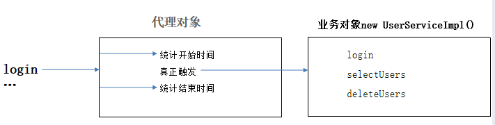

**举个案例说明好处与基本使用：**

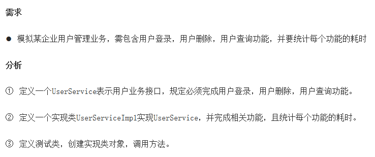

这里我们会发现，这个统计耗时的工作是明显重复的，并且让我们的业务实现层变得很复杂，代码看着不优雅！！

**UserService:**

```java
/**
   模拟用户业务功能
 */
public interface UserService {
    String login(String loginName , String passWord) ;
    void selectUsers();
    boolean deleteUsers();
    void updateUsers();
}
```

**UserServiceImpl:**

```java
public class UserServiceImpl implements UserService{
    @Override
    public String login(String loginName, String passWord)  {
        try {
            Thread.sleep(1000);
        } catch (Exception e) {
            e.printStackTrace();
        }
        if("admin".equals(loginName) && "1234".equals(passWord)) {
            return "success";
        }
        return "登录名和密码可能有毛病";

    }

    @Override
    public void selectUsers() {
        System.out.println("查询了100个用户数据！");
        try {
            Thread.sleep(2000);
        } catch (Exception e) {
            e.printStackTrace();
        }
    }

    @Override
    public boolean deleteUsers() {
        try {
            System.out.println("删除100个用户数据！");
            Thread.sleep(500);
            return true;
        } catch (Exception e) {
            e.printStackTrace();
            return false;
        }
    }

    @Override
    public void updateUsers() {
        try {
            System.out.println("修改100个用户数据！");
            Thread.sleep(2500);
        } catch (Exception e) {
            e.printStackTrace();
        }
    }
}
```

**代理对象：ProxyUtil（写成了一个工具类）**

这里写的是泛型，表明可以接收任意类型，为任意业务进行耗时统计。

```java
/**
    public static Object newProxyInstance(ClassLoader loader,  Class<?>[] interfaces, InvocationHandler h)
    参数一：类加载器，负责加载代理类到内存中使用。
    参数二：获取被代理对象实现的全部接口。代理要为全部接口的全部方法进行代理
    参数三：代理的核心处理逻辑
 */
public class ProxyUtil {
    /**
      生成业务对象的代理对象。
     * @param obj
     * @return
     */
    public static <T> T  getProxy(T obj) {
        // 返回了一个代理对象了
        return (T)Proxy.newProxyInstance(obj.getClass().getClassLoader(),
                obj.getClass().getInterfaces(),
                new InvocationHandler() {
                    @Override
                    public Object invoke(Object proxy, Method method, Object[] args) throws Throwable {
                        // 参数一：代理对象本身。一般不管
                        // 参数二：正在被代理的方法
                        // 参数三：被代理方法，应该传入的参数
                       long startTimer = System .currentTimeMillis();
                        // 马上触发方法的真正执行。(触发真正的业务功能)
                        Object result = method.invoke(obj, args);

                        long endTimer = System.currentTimeMillis();
                        System.out.println(method.getName() + "方法耗时：" + (endTimer - startTimer) / 1000.0 + "s");

                        // 把业务功能方法执行的结果返回给调用者
                        return result;
                    }
                });
    }
}
```

**测试类**

```java
public class Controller {
    public static void main(String[] args) {
      	// 使用时就这里，实现类时通过代理Proxy.拿到的
        UserService1 userService1 = ProxyUtil1.getProxy(new UserServiceImpl1());
      
        System.out.println(userService1.login("admin", "123456"));
        userService1.selectUsers();
        System.out.println(userService1.deleteUsers());
        System.out.println(userService1.updateUsers());
    }
}
```


### 动态代理的优点

1. 非常的灵活，==支持任意接口类型的实现类对象做代理==，也可以直接为接本身做代理。
2. 可以为被代理对象的所有方法做代理。
3. ==可以在不改变方法源码的情况下，实现对方法功能的增强。==
4. 不仅简化了编程工作、提高了软件系统的可扩展性，同时也提高了开发效率。


# IDEA快捷键

- ​	**crtl+D**——直接复制当行语句到下一行；
- ​	**Crtl+ALT+L**——格式化；
- ​	**ALT+Shift+↑**——上下移动当前代码；
- ​	**Crtl + ALT +T** ——先选取代码部分，然后按住，可以将代码用**循环语句**包住66666；
- ​    **ALT + Enter**——快速提示，很多地方用到，异常抛出
- ​    **ALT + Insert** ——提示插入的东西
- ​    **Shift + F6** ——选择所有同名的**变量**，一起更改
- ​    **Ctrl + F12** ——查看实体类内在的成员方法
- ​    **Ctrl + H**——查看接口的实现类
- ​    **Ctrl + O**，展示出Object中可以重写的方法！！！
- ​    **Ctrl+Alt+V**——自动补全代码
- ​    **Alt + 7**——查看类中的方法 
- ​    **ALT + 鼠标左键**——可以按照列的方向整列选择，并统一编辑成输入内容
- ​	for 循环的快速操作：arr是我们定义的数组，arr.for i 就可以直接遍历arr数组所有元素。即 " **变量名.for i** "
- ​    增强for——即 " **变量名.for**"
- ​    **Crtl+Shift+F**——全局搜索，R是替换。


一键生成类中的有参构造器和Getter、Setter方法：

- 定义完成员变量后，直接右键generate，选择Constructor  ，选择要赋值的成员变量，一键生成有参构造器！
- 定义完成员变量后，直接右键generate，选择Getter and Setter 生成所有成员变量的两个方法！


# 命名规范

## 1、mysql

mysql所有数据库、表、字段命名均采用**小写字母、数字、下划线**组成；不同单词连接采用下划线；

- **数据库：**一般为项目名称+库名称简写，比如IM项目的工作流数据库，可以是 im_flow。
- **表：** t + 模块（包含模块含义的简写）+ 表（包含表含义的简写），比如用户模块的教育信息表：t_user_eduinfo。一般以t开发（代表table）

- **字段：**合理表达字段意思即可。此外，表之间相同意义的字段必须同名，比如a表和b表都有创建时间，应该统一为create_time，不一致会很混乱。

- **索引：**

  唯一索引：使用uni + 字段名 来命名：

  ```sql
  create unique index uni_uid on t_user_basic(uid) 
  ```

  非唯一索引：使用idx + 字段名 来命名：

  ```sql
  create index idx_uname_mobile on t_user_basic(uname,mobile) 
  ```

  

## 2、Java

**除了类名是大写、其他的都是小写，代码以及各配置文件中均为小驼峰；模块名、包名均为小写字母。**

- 项目名（工程名）：小写字母+中划线（study-project)

- 模块名：小写字母+中化线（hello-ssm）

- 包名：单个英文单词小写；（controller、service、pojo）

- **类名：大驼峰写法（UserController）**

- 代码中各个属性、方法等等：小驼峰写法（userName）

- 配置文件：小驼峰写法和中横线都可以（mybatis-config.xml、applicationContext.xml）


# Java实体类的快速构建

因为这里需要对应于数据库表里面的字段，正常情况我们要按照类型、变量名（最好相同，规范）一模一样写，就会很麻烦，所以快捷键+快捷操作又来了，强大的IDEA。

1. 我们先直接直接把数据库里面的设计字段的代码复制到实体类里面

   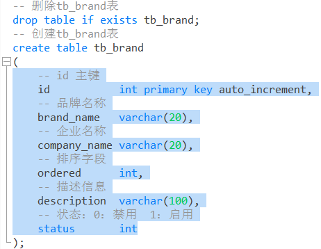

   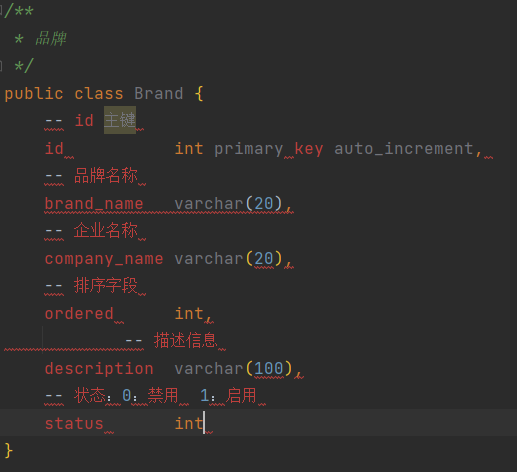

2. 分析，我们首先要把sql语法里面这个  ”--“  改成java里面的  ” // “  的注释写法

   快捷键：**Crtl + R**——IDEA里面的快速搜素加替换快捷键，超级好用。

   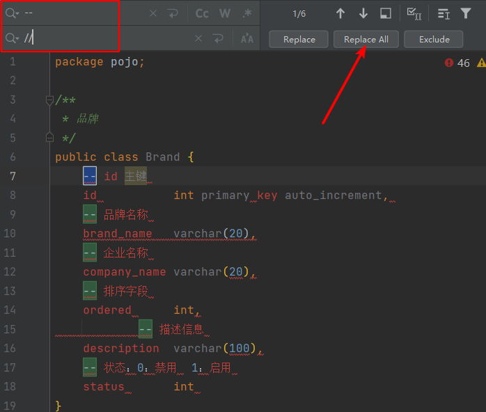

3. 然后我们需要把sql里面这个声明变量类型的给换成分号；  先把这部分代码移到右边一点，让他们单独成一列的这种。

   快捷键：**ALT+ 鼠标左键**——然后全部选择他们，按列选择整体，输入分号；

   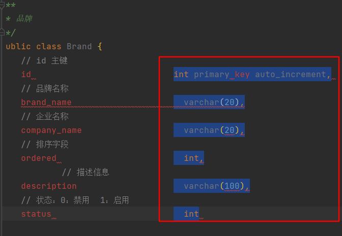

   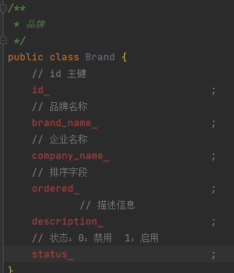

4. 现在先不要乱动哦，保证光标依然选择的是这几行。然后我们一步步左移到，变量的前面。统一先全部用String类型。其他的类型，我们最后一个个改，

   ==在实体类中，基本数据类型建议使用其对应的包装类型==,因为基本数据类型的默认值有的是有数据的，例如int的默认值为0，但0这个在数据库里面是有实际意义的，会对业务造成巨大影响，而包装类都是对象，默认值为null。

   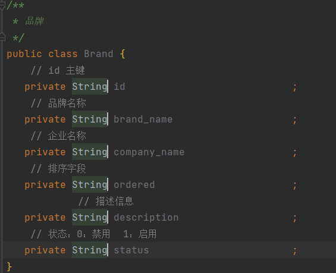

5. 最后格式化Crtl + ALt + L。舒舒服服舒舒服服

   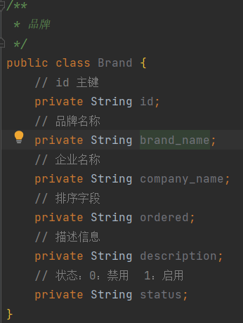

6. 写好Getter、Setter、toString（）。

