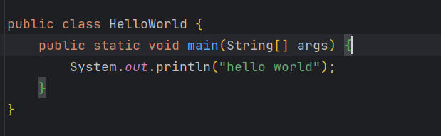
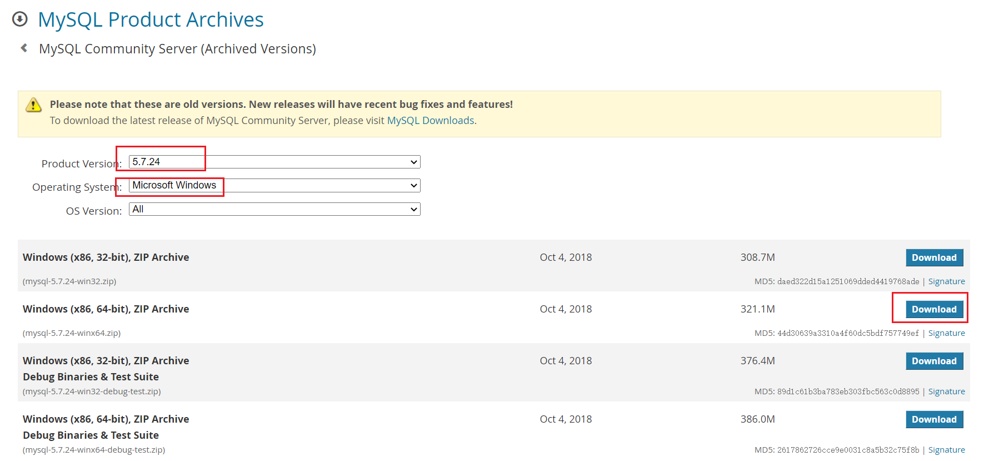
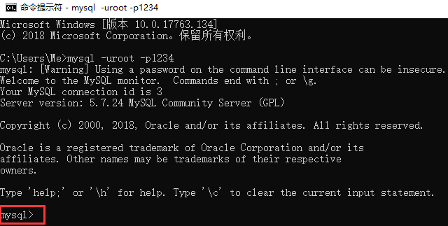
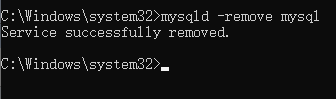
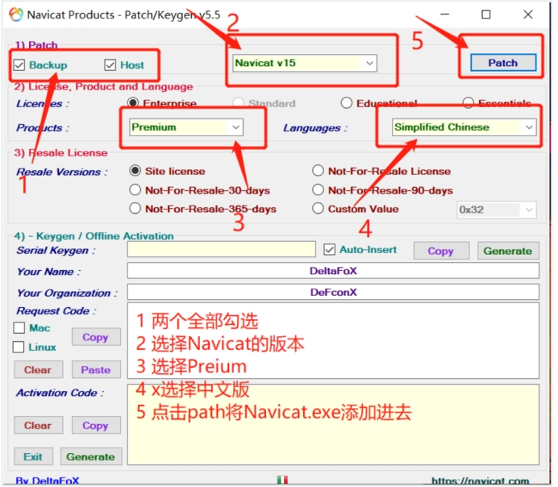

# 1、安装JDK

使用JDK8哦，一般是官网下载安装exe文件。

然后配置环境变量Path和JAVA_HOME。

单IDEA已经可以给我们下载安装JDK了，所以不要自己下罗，就是注意一下环境变量是否配置好就行了。


# 2、安装IDEA

官网下载的IDEA可能已经内置了JDK，但不知道是哪个版本，所以不需要再单独下载安装JDK了。

需要自己配置环境变量就行了，还是很方便的，用这个下载jdk


# 3、安装Maven

官网下载二进制压缩包、开箱即用，然后配置环境变量、配置本地仓库路径和私服仓库路径，最后IDEA绑定Maven设置即可使用了


## **3.1 MAC安装**

**1、打开Maven的官网下载安装；**

[Maven – Download Apache Maven](https://maven.apache.org/download.cgi)


> Binary是可执行版本，已经编译好可以直接使用。
> Source是源代码版本，需要自己编译成可执行软件才可使用。

> tar.gz和zip两种压缩格式,其实这两个压缩文件里面包含的内容是同样的,只是压缩格式不同
> tar.gz格式的文件比zip文件小很多,用于unix操作系统。
> zip格式用于Windows操作系统,但在Windows系统使用WinRar工具一样能够解压缩tar.gz格式

安装解压完了之后会有一个maven的文件夹，其中bin为可执行文件。


**2、添加maven的bin文件目录到环境变量里面去；**

 1. 进入到当前用户的home目录

    ```shell
    cd ~
    ```

 2. 创建.bash_profile（如果已经存在就不用创建了）

    ```sh
    touch .bash_profile
    ```

 3. 编辑该文件，加上maven的bin的环境变量

    ```sh
    vim ~/.bash_profile 
    # 加入下面一行（引号内容按照自己的maven安装路径修改）
    export PATH=$PATH:"/Users/zhoudas/Desktop/Java/apache-maven-3.9.2/bin"
    ```

 4. 更新环境变量配置文件；

    ```sh
     source ~/.bash_profile
    ```

 5. 检查是否配置成功

    ```sh
    mvn -v 
    ```

    

**3、配置本地仓库+私服仓库**

​	其实就是修改conf里面的setting.xml配置文件内容。如果公司有的话，直接覆盖这个配置文件就行了。

​	

​	1、在E:\Tools\Maven\路径下新建maven-repository文件夹，用作maven的本地库。


​	2、在路径E:\Tools\Maven\apache-maven-3.8.1\conf下找到settings.xml文件


​	3、找到节点localRepository，在注释外添加 

- ```java
  <localRepository>E:\Tools\Maven\maven-repository</localRepository>
  ```

  


​	4、配置私服仓库，找到mirrors节点

​		1、在settings.xml配置文件中找到mirrors节点

​		2、添加如下配置（注意要添加在<mirrors>和</mirrors>两个标签之间，其它配置同理）

- ```xml
  <!-- 阿里云仓库 -->
  <mirror>
  	<id>alimaven</id>
  	<mirrorOf>central</mirrorOf>
  	<name>aliyun maven</name>
  	<url>http://maven.aliyun.com/nexus/content/repositories/central/</url>
  </mirror>
  ```

  


## 3.2 Win安装

也是分为五步步、除了环境变量配置不用外，其他的都一样。Win中环境变量均采用 **Path+XXX_HOME**的形式。


**补充环境变量注意点：**

Maven是用java写的，它是需要配置Java的运行环境的，这个是在bin下面的mvn.cmd里面，打开你会发现这些东西：

- 也就是说，我们前面配置的Java环境变量，一定要起名规范哦，不然Maven会无法识别。
- Maven的环境变量起码也是要规范！！！

 


 


# 4、安装git

## 4.1 MAC

MAC安装很简单。

新款 Mac 计算机通常会预装 Git，最简单的验证方法是在「终端」中执行一条命令。如果已经安装，会看到当前 Git 的版本信息。

打开「终端」，输入并运行`git --version`命令。如果系统提示需要安装「命令行开发者工具」，表示尚未安装 Git。现在，点击「安装」并同意条款，即可安装 Git 及必要的开发工具。


安装完成后，再次执行`git --version`命令，验证 Git 安装。


然后配置个人信息即可。

**配置当前用户的用户名和邮箱**

```bash
git config --global user.name "Your Name"
git config --global user.email "email@example.com"

# 查看配置信息
git config --global user.name
git config --global user.email
```

与远程仓库连接等这些，看git笔记。


## 4.2 win

Windows安装比较麻烦一点：


# 5、IDEA必备插件

1. **Rainbow Brackets**：彩色括号   (所有的括号加上颜色）

   

2. **HighlightBracketPair**：高亮提示  （括号开始结尾 高亮显示。一眼就能看到！ ） 

   

3.  **translation plugin**：翻译插件 

 

4. **MybatisX**：（出现两只小鸟，方便跳转SQL映射文件Mapper.xml与对应的Mapper接口）

 

5.  **RestfulToolkit**：快捷跳转Action方法（spring的开发中经常有根据浏览器url找对应action方法的需求，这个可以快捷的根据url跳转，不用findAll查询了）

 

6.   **Grep Console**：控制台日志 高亮

 

7. **Maven  Helper**：便捷的Maven操作，添加到右键菜单，并且可以进行debug	

   

 

8. **Lombok**：自动生成实体类中的常用方法。“一个插件+一个依赖”

   ```xml
     <dependency>
         <groupId>org.projectlombok</groupId>
         <artifactId>lombok</artifactId>
         <version>1.18.20</version>
         <scope>provided</scope>  
     </dependency>
   ```

   

   

   在我们写好的实体类上加@Data注解。

   

   ALT + 7查看类中的成员属性（变量+方法）

   

   ==为什么配置<scope>provided</scope>==

   我们点击进去看一下这个Data注解，

   

   这一行表明了该注解的有效范围，是在源码有效的，也就是说当源码变成字节码文件，发给别人或者服务器上时注解就失效了。但是他在源码已经给我们写好了所有方法，变成字节码文件的时候已经添上了的。所以说配置成provided，因为在字节码文件时已经无该注解，这样可以避免服务器依赖冲突。

   

9. **JRebel and XRebel：**

   - JRebel：修改完代码，不想重启服务，就使想代码生效。

     XRebel：请求中，各个部分代码性能监控。例如：方法执行时间，出现的异常，SQL执行时间，输出的Log，MQ执行时间等。

10. **Github Copilot：**由 GitHub 和 OpenAI 共同开发的编程工具，基于人工智能技术，旨在帮助开发人员提高编码效率

    [GitHub Copilot · Your AI pair programmer](https://github.com/features/copilot)


11. **POJO to JSON：**直接讲Java代码里面的POJO对象转换成json串，复制给你的剪贴板；


12. **SequenceDiagram：**idea上 类调用时序图    [Sequence Diagram - IntelliJ IDEs Plugin | Marketplace (jetbrains.com)](https://plugins.jetbrains.com/plugin/8286-sequence-diagram)

​		在梳理别人的代码的时候， 能够很清晰的看到依赖调用时序


# 6、然后就没了，创建Maven可以进行开发了


# 7、Mysql

去Mysql官网下载免安装zip版；


- 1、配置环境变量
- 2、新建配置文件
- 3、初始化mysql、注册服务、启动、修改登录密码


> **安装环境:Win10 64位**
> **软件版本:MySQL 5.7.24 解压版**

## 一、下载

点开下面的链接：
https://downloads.mysql.com/archives/community/




------

## 二、安装(解压)

下载完成后我们得到的是一个压缩包，将其解压，我们就可以得到MySQL 5.7.24的软件本体了(就是一个文件夹)，我们可以把它放在你想安装的位置。

------


## 三、配置

### 1. 添加环境变量

> 环境变量里面有很多选项，这里我们只用到`Path`这个参数。为什么在初始化的开始要添加环境变量呢？
> 在黑框(即CMD)中输入一个可执行程序的名字，Windows会先在环境变量中的`Path`所指的路径中寻找一遍，如果找到了就直接执行，没找到就在当前工作目录找，如果还没找到，就报错。我们添加环境变量的目的就是能够在任意一个黑框直接调用MySQL中的相关程序而不用总是修改工作目录，大大简化了操作。


右键`此电脑`→`属性`，点击`高级系统设置`


点击`环境变量`


在`系统变量`中新建MYSQL_HOME


在`系统变量`中找到并**双击**`Path`


点击`新建`


最后点击确定。

**如何验证是否添加成功？**

右键开始菜单(就是屏幕左下角)，选择`命令提示符(管理员)`，打开黑框，敲入`mysql`，回车。
如果提示`Can't connect to MySQL server on 'localhost'`则证明添加成功；
如果提示`mysql不是内部或外部命令，也不是可运行的程序或批处理文件`则表示添加添加失败，请重新检查步骤并重试。

### 2. 新建配置文件

新建一个文本文件，内容如下：

```properties
[mysql]
# 设置mysql客户端默认字符集
default-character-set=utf8

[mysqld]
# 服务端使用的字符集默认为UTF8
character-set-server=utf8
default-storage-engine=INNODB
# 设置3306端口
port=3306 
```

把上面的文本文件另存为，在保存类型里选`所有文件 (*.*)`，文件名叫`my.ini`，存放的路径为MySQL的`根目录`(例如我的是`D:\software\mysql-5.7.24-winx64`,根据自己的MySQL目录位置修改)。

上面代码意思就是配置数据库的默认编码集为utf-8和默认存储引擎为INNODB。

### 3. 初始化MySQL

在刚才的黑框中敲入`mysqld --initialize-insecure`，回车，稍微等待一会，如果出现没有出现报错信息(如下图)则证明data目录初始化没有问题，此时再查看MySQL目录下已经有data目录生成。

```java
// 全程一定要进入 mysql安装包的bin目录 ，不然容易报错！！！
mysqld --initialize-insecure
```


tips：如果出现如下错误


是由于权限不足导致的，去`C:\Windows\System32` 下以管理员方式运行 cmd.exe


### 4. 注册MySQL服务

在黑框里敲入`mysqld -install`，回车。

```
mysqld -install

mysqld --remove mysql
```


现在你的计算机上已经安装好了MySQL服务了。MySQL服务器

### 5. 启动MySQL服务

在黑框里敲入`net start mysql`，回车。

```java
net start mysql  // 启动mysql服务
    
net stop mysql  // 停止mysql服务
```


### 6. 修改默认账户密码

在黑框里敲入`mysqladmin -u root password 1234`，这里的`1234`就是指默认管理员(即root账户)的密码，可以自行修改成你喜欢的。

```
mysqladmin -u root password 123456
```


**至此，MySQL 5.7 解压版安装完毕！**

------

## 四、登录MySQL

右键开始菜单，选择`命令提示符`，打开黑框。
在黑框中输入，`mysql -uroot -p1234`，回车，出现下图且左下角为`mysql>`，则登录成功。

```
mysql -uroot -p123456
```




**到这里你就可以开始你的MySQL之旅了！**

退出mysql：

```
exit
quit
```

登陆参数：

```
mysql -u用户名 -p密码 -h要连接的mysql服务器的ip地址(默认127.0.0.1) -P端口号(默认3306)
```


------

## 五、卸载MySQL

如果你想卸载MySQL，也很简单。

右键开始菜单，选择`命令提示符(管理员)`，打开黑框。

1. 敲入`net stop mysql`，回车。

```
net stop mysql
```


2. 再敲入`mysqld -remove mysql`，回车。

```
mysqld -remove mysql
```




3. 最后删除MySQL目录及相关的环境变量。

**至此，MySQL卸载完成！**


## 安装图像可视化软件Navicat15


15的版本（官网正版哦）和破解工具在百度网盘。

链接：https://pan.baidu.com/s/1rWfVtxRkEpP6CMTXDcKc4Q 

提取码：0xao

目录如下：

 

先正常安装navicat15，安装了千万不要运行！！！！然后打开破解工具。

 

 

 

 

出现下列界面说明路径添加成功

 

生成和复制注册码

 

 

打开navicat软件进行注册

 

将复制的注册码填入，点击激活

 

 

选择手动激活

 

 

会产生请求码，将请求码复制到激活软件中，产生激活码，***\*左下角的generate。\****

 

***\*然后填入激活码到软件界面，显示永久激活。\****


# 8、Redis


## 1. **下载安装redis**

Redis官网没有windows版本的，需要去GitHub上下载安装包。

地址： https://github.com/MicrosoftArchive/redis/releases

 

解压完打开是这样的目录，找到redis的配置文件。

 

## 2. **设置redis密码(一般不要设置）**

 

## 3. **启动redis服务**

管理员运行cmd命令。进入到安装的文件夹目录，执行

```
redis-server.exe redis.windows.conf
```

启动服务，如果出现1688错误则依次执行 

```
redis-cli.exe

shutdown

exit
```

然后再执行启动命令即可。

 

然后关闭cmd窗口即会关闭数据库。

## 4. **添加windows服务**

因为每次开启比较麻烦，所以我们将redis添加到windows服务列表中，以后就可以直接在服务列表中直接开启。

管理员运行cmd，进入到安装文件夹目录，执行

```
redis-server.exe --service-install redis.windows.conf --loglevel verbose
```

就会发现已经添加成功了。

如果想要卸载服务，在cmd命令窗口中输入：

```
redis-server --service-uninstall
```

 

## 5. **可视化管理软件RDM**

链接：https://pan.baidu.com/s/1X261NyXkaglH_iYXKIx24A 

提取码：f635

安装好之后，连接redis服务器。

 

 

连接成功之后是这样的，给了15个存储文件夹，可以分别进行编辑。

 

 


