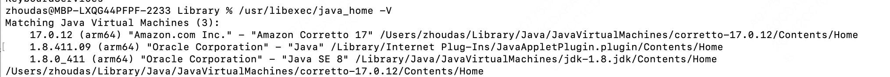
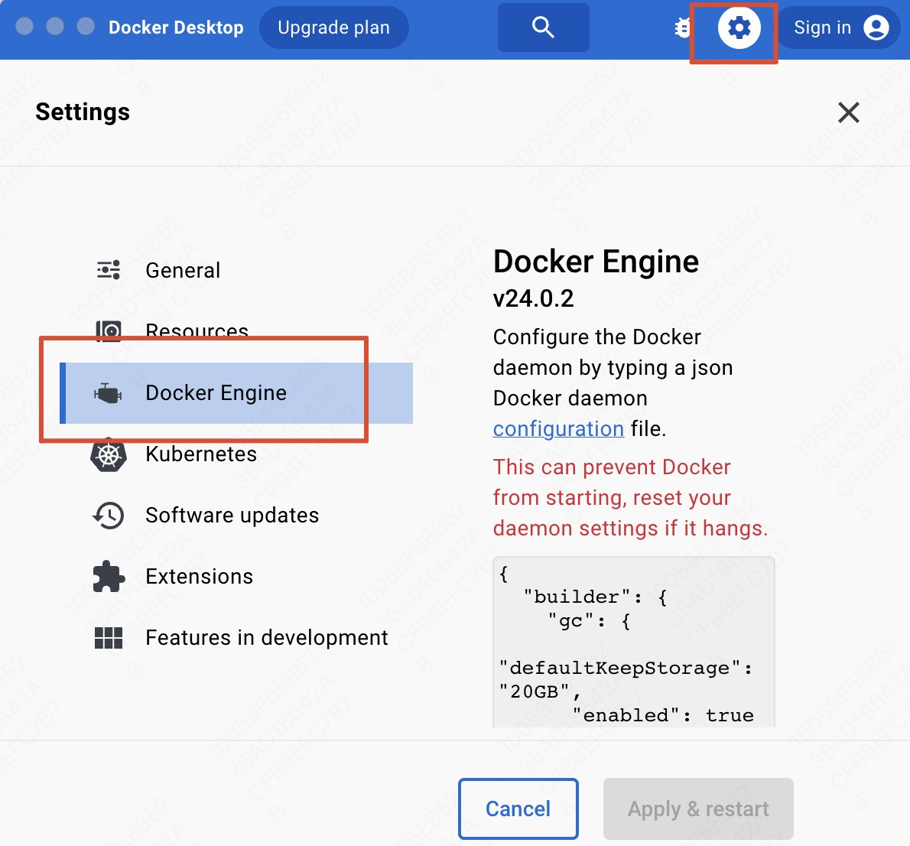
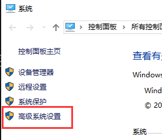
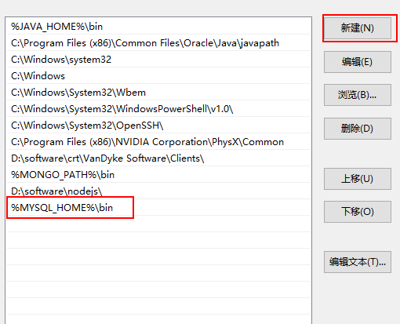
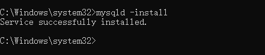
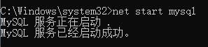
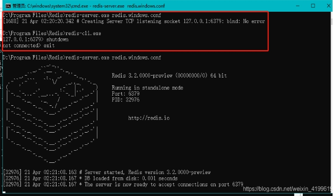

# 1、安装JDK

使用JDK8哦，一般是官网下载安装可执行文件。

然后配置环境变量Path和JAVA_HOME。

但是IDEA已经可以给我们下载安装JDK了，所以不要自己下罗，就是注意一下环境变量是否配置好就行了。

## 1.1 MAC安装

官网Oracle下载：[Java Downloads | Oracle](https://www.oracle.com/java/technologies/downloads/)，


下载下来之后，无法自己选择安装路径之类的，也不推荐自己选择，直接默认就可以了，然后他会自动配置环境变量的，什么都不需要管了。还是蛮方便的；


**PATH：**path是系统中的一个固定环境变量，用于快速定位各种可执行命令，在terminal中，内部原理都是软连接，例如/usr/bin/java就是链接到了Jdk的安装目录下的bin目录；

**JAVA_HOME**：这个其实我们自己新建的一个变量而已，叫这个名字的原因在于业界的规范罢了，他和PATH是同级别的；


```java
// 检查是否安装成功
java -version
javac -version
  
// 列出所有已安装的 Java 版本及其路径
/usr/libexec/java_home -V
  
// 列出当前默认使用的JDK路径（是上面命令的第一个）
/usr/libexec/java_home  
  
// 切换默认使用的JDK
  https://blog.csdn.net/suixinfeixiangfei/article/details/132296094

// 查找java可执行命令的路径。该命令会搜索系统的 PATH 环境变量中列出的目录，找到并返回第一个找到的 `java` 可执行文件的完整路径。如果系统中安装了 Java，并且 `java` 命令的位置已经添加到了 PATH 环境变量中，那么这个命令就能够找到并显示出 `java` 的安装路径。
which java
  
// 查看JAVA_HOME环境变量：
// 如果你的JAVA_HOME环境变量已经设置，可以直接查看其值来找到Java的安装目录。
echo $JAVA_HOME
```

```java
// 查看所有的环境变量，你会发现有很多环境变量，非你自己写的那个bash_profile里面的
env
```

> **echo $JAVA_HOME为空，但是我可以直接输入java命令是为什么？？**
>
> 如果`echo $JAVA_HOME`为空，但你仍然可以直接使用java命令，这通常是因为java命令已经被添加到了系统的`PATH`环境变量中。在macOS中，当你安装Java JDK后，系统会自动将java命令链接到`/usr/bin/java`，这个目录通常已经包含在系统的`PATH`环境变量中。
>
> 你可以使用以下命令来确认java命令的位置：
>
> ```sh
> which java 
> whereis java
> ```
>
> 这个命令会显示java命令的路径，通常是一个到实际Java安装位置的符号链接;
>
> ```
> /usr/libexec/java_home
> ```
>
> 即使`JAVA_HOME`环境变量没有设置，系统也能通过`/usr/libexec/java_home`来找到默认的Java版本，并执行相应的java命令。如果你想要设置`JAVA_HOME`环境变量，可以根据`/usr/libexec/java_home`命令的输出来设置。例如，你可以在你的`.bash_profile`、`.zshrc`或其他shell配置文件中添加以下行：
>
> ```bash
> // 打开配置文件
> vim ~/.bash_profile
> 
> // 添加如下内容（第一个命令在jdk8下是错误的，指向的是jvm，不是jdk）
> export JAVA_HOME=$(/usr/libexec/java_home)
> 
> export JAVA_HOME=/Library/Java/JavaVirtualMachines/jdk-1.8.jdk/Contents/Home
> 
> // 刷新配置文件
> source ~/.bash_profile
> ```
>
> **没有JAVA_HOME 会有什么影响？**
>
> 没有设置JAVA_HOME环境变量通常不会影响到日常使用Java的基本功能，但可能会在某些特定情况下造成问题：如某些Java开发工具和框架可能依赖`JAVA_HOME`来定位Java安装目录。


## 1.2 卸载jdk

参考：https://www.cnblogs.com/Flat-White/p/15823443.html

**1、查看本机上安装的所有jdk版本和路径**

```java
/usr/libexec/java_home -V
```



可以看到安装了jdk8和jdk17，之所以jdk8会有两个路径，是因为java8版本的JRE和jdk目录是分开的，高版本的都是合并在一起的。

**2、卸载JDK8**

根据上述提供的官方文档卸载Java8

Java8

- https://docs.oracle.com/javase/8/docs/technotes/guides/install/mac_jdk.html
- https://docs.oracle.com/javase/8/docs/technotes/guides/install/mac_jre.html

首先卸载JDK，查看当前JDK环境

```bash
cd /Library/Java/JavaVirtualMachines
ls
```


当前的JDK环境为 **jdk1.8.0.jdk**

```bash
sudo rm -rf /Library/Java/JavaVirtualMachines/jdk-1.8.jdk
```

然后卸载JRE

> To uninstall the JRE, you must have Administrator privileges and execute the remove commands either as root or by using the sudo(8) tool.

```bash
sudo rm -rf /Library/Internet Plug-Ins/JavaAppletPlugin.plugin
sudo rm -rf /Library/PreferencePanes/JavaControlPanel.prefpane
```

与卸载前的设置界面对比可以注意到Java控制面板已经消失了。

**3、卸载jdk17**

根据上述提供的官方文档卸载Java17

很简单，直接卸载删除就可以

- Java17
  - https://docs.oracle.com/en/java/javase/17/install/installation-jdk-macos.html#GUID-F9183C70-2E96-40F4-9104-F3814A5A331F

> To uninstall the JDK on macOS:
>
> You must have Administrator privileges.
>
> Note:
>
> Do not attempt to uninstall Java by removing the Java tools from `/usr/bin`. This directory is part of the system software and any changes will be reset by Apple the next time that you perform an update of the OS.
>
> 1. Go to `/Library/Java/JavaVirtualMachines`.
>
> 2. Remove the directory whose name matches the following format by executing the `rm` command as a root user or by using the `sudo` tool:
>
>    `/Library/Java/JavaVirtualMachines/jdk-17.interim.update.patch.jdk`
>
>    For example, to uninstall 17 Interim 0 Update 0 Patch 0:
>
>    `$ rm -rf jdk-17.jdk`


```bash
cd /Library/Java/JavaVirtualMachines
ls
sudo rm -rf jdk-17.0.3.1.jdk
```


## 1.3 mac配置文件类型

在 macOS 上，环境变量可以在多个文件中配置，这取决于你使用的 shell 类型（如 Bash 或 Zsh）以及系统的配置。以下是一些常见的配置文件：

1. **对于 Bash 用户**：
   - `~/.bash_profile`：当你登录到你的账户时执行。通常用于设置环境变量。
   - `~/.bashrc`：对于每一个新的 Bash shell，都会执行这个文件。通常用于设置命令别名和函数。
   - `~/.bash_logout`：当你退出 shell 时执行。

2. **对于 Zsh 用户**（在 macOS Catalina 及更高版本中，Zsh 是默认的 shell）：
   - `~/.zshenv`：每次启动 Zsh 时都会读取，适合设置环境变量。
   - `~/.zprofile`：类似于 Bash 的 `~/.bash_profile`，登录时执行。
   - `~/.zshrc`：对于每一个新的 Zsh shell，都会执行这个文件。通常用于设置命令别名、函数和其他交互式操作。
   - `~/.zlogout`：退出时执行。

3. **全局配置文件**：
   - `/etc/profile`：系统级别的，对所有用户有效的 Bash 登录 shell 配置。
   - `/etc/bashrc` 或 `/etc/bash.bashrc`：系统级别的，对所有用户有效的 Bash 非登录 shell 配置。
   - `/etc/zshenv`, `/etc/zprofile`, `/etc/zshrc`, `/etc/zlogout`：系统级别的，对所有用户有效的 Zsh 配置文件。

不同的配置文件在不同的情况下被读取，这取决于 shell 是作为登录 shell 还是非登录 shell 启动的，以及是交互式的还是非交互式的。因此，你可能需要根据你的具体需求，选择在哪个文件中配置环境变量。


# 2、安装IDEA

官网下载的IDEA可能已经内置了JDK，但不知道是哪个版本，所以不需要再单独下载安装JDK了。

需要自己配置环境变量就行了，还是很方便的，用这个下载jdk


# 3、安装Maven

官网下载二进制压缩包、开箱即用，然后配置环境变量、配置本地仓库路径和私服仓库路径，最后IDEA绑定Maven设置即可使用了


## **3.1 MAC安装**

**1、打开Maven的官网下载安装；**

[Maven – Download Apache Maven](https://maven.apache.org/download.cgi)


> Binary是可执行版本，已经编译好可以直接使用。
> Source是源代码版本，需要自己编译成可执行软件才可使用。

> tar.gz和zip两种压缩格式,其实这两个压缩文件里面包含的内容是同样的,只是压缩格式不同
> tar.gz格式的文件比zip文件小很多,用于unix操作系统。
> zip格式用于Windows操作系统,但在Windows系统使用WinRar工具一样能够解压缩tar.gz格式

安装解压完了之后会有一个maven的文件夹，其中bin为可执行文件。


**2、添加maven的bin文件目录到环境变量里面去；**

 1. 进入到当前用户的home目录

    ```shell
    cd ~
    ```

 2. 创建.bash_profile（如果已经存在就不用创建了）

    ```sh
    touch .bash_profile
    ```

 3. 编辑该文件，加上maven的bin的环境变量

    ```sh
    vim ~/.bash_profile 
    # 加入下面一行（引号内容按照自己的maven安装路径修改）
    export PATH=$PATH:"/Users/zhoudas/Desktop/Java/apache-maven-3.9.2/bin"
    ```

 4. 更新环境变量配置文件；

    ```sh
     source ~/.bash_profile
    ```

 5. 检查是否配置成功

    ```sh
    mvn -v 
    ```

    

**3、配置本地仓库+私服仓库**

​	其实就是修改conf里面的setting.xml配置文件内容。如果公司有的话，直接覆盖这个配置文件就行了。

​	

​	1、在E:\Tools\Maven\路径下新建maven-repository文件夹，用作maven的本地库。


​	2、在路径E:\Tools\Maven\apache-maven-3.8.1\conf下找到settings.xml文件


​	3、找到节点localRepository，在注释外添加 

- ```java
  <localRepository>E:\Tools\Maven\maven-repository</localRepository>
  ```

  


​	4、配置私服仓库，找到mirrors节点

​		1、在settings.xml配置文件中找到mirrors节点

​		2、添加如下配置（注意要添加在<mirrors>和</mirrors>两个标签之间，其它配置同理）

- ```xml
  <!-- 阿里云仓库 -->
  <mirror>
  	<id>alimaven</id>
  	<mirrorOf>central</mirrorOf>
  	<name>aliyun maven</name>
  	<url>http://maven.aliyun.com/nexus/content/repositories/central/</url>
  </mirror>
  ```

  


## 3.2 Win安装

也是分为五步步、除了环境变量配置不用外，其他的都一样。Win中环境变量均采用 **Path+XXX_HOME**的形式。


**补充环境变量注意点：**

Maven是用java写的，它是需要配置Java的运行环境的，这个是在bin下面的mvn.cmd里面，打开你会发现这些东西：

- 也就是说，我们前面配置的Java环境变量，一定要起名规范哦，不然Maven会无法识别。
- Maven的环境变量起码也是要规范！！！

 


 


# 4、安装git

## 4.1 MAC

MAC安装很简单。

新款 Mac 计算机通常会预装 Git，最简单的验证方法是在「终端」中执行一条命令。如果已经安装，会看到当前 Git 的版本信息。

打开「终端」，输入并运行`git --version`命令。如果系统提示需要安装「命令行开发者工具」，表示尚未安装 Git。现在，点击「安装」并同意条款，即可安装 Git 及必要的开发工具。


安装完成后，再次执行`git --version`命令，验证 Git 安装。


然后配置个人信息即可。

**配置当前用户的用户名和邮箱**

```bash
git config --global user.name "Your Name"
git config --global user.email "email@example.com"

# 查看配置信息
git config --global user.name
git config --global user.email
```

与远程仓库连接等这些，看git笔记。


## 4.2 win

Windows安装比较麻烦一点：


# 5、IDEA必备插件

1. **Rainbow Brackets**：彩色括号   (所有的括号加上颜色）

   

2. **HighlightBracketPair**：高亮提示  （括号开始结尾 高亮显示。一眼就能看到！ ） 

   

3.  **translation plugin**：翻译插件 

 

4. **MybatisX**：（出现两只小鸟，方便跳转SQL映射文件Mapper.xml与对应的Mapper接口）

 

5.  **RestfulToolkit**：快捷跳转Action方法（spring的开发中经常有根据浏览器url找对应action方法的需求，这个可以快捷的根据url跳转，不用findAll查询了）

 

6.   **Grep Console**：控制台日志 高亮

 

7. **Maven  Helper**：便捷的Maven操作，添加到右键菜单，并且可以进行debug	

   

 

8. **Lombok**：自动生成实体类中的常用方法。“一个插件+一个依赖”

   ```xml
     <dependency>
         <groupId>org.projectlombok</groupId>
         <artifactId>lombok</artifactId>
         <version>1.18.20</version>
         <scope>provided</scope>  
     </dependency>
   ```

   

   

   在我们写好的实体类上加@Data注解。

   

   ALT + 7查看类中的成员属性（变量+方法）

   

   ==为什么配置<scope>provided</scope>==

   我们点击进去看一下这个Data注解，

   

   这一行表明了该注解的有效范围，是在源码有效的，也就是说当源码变成字节码文件，发给别人或者服务器上时注解就失效了。但是他在源码已经给我们写好了所有方法，变成字节码文件的时候已经添上了的。所以说配置成provided，因为在字节码文件时已经无该注解，这样可以避免服务器依赖冲突。

   

9. **JRebel and XRebel：**

   - JRebel：修改完代码，不想重启服务，就使想代码生效。

     XRebel：请求中，各个部分代码性能监控。例如：方法执行时间，出现的异常，SQL执行时间，输出的Log，MQ执行时间等。

10. **Github Copilot：**由 GitHub 和 OpenAI 共同开发的编程工具，基于人工智能技术，旨在帮助开发人员提高编码效率

    [GitHub Copilot · Your AI pair programmer](https://github.com/features/copilot)


11. **POJO to JSON：**直接讲Java代码里面的POJO对象转换成json串，复制给你的剪贴板；


12. **SequenceDiagram：**idea上 类调用时序图    [Sequence Diagram - IntelliJ IDEs Plugin | Marketplace (jetbrains.com)](https://plugins.jetbrains.com/plugin/8286-sequence-diagram)

​		在梳理别人的代码的时候， 能够很清晰的看到依赖调用时序

13. 阿里巴巴开发规范插件：[alibaba/p3c: Alibaba Java Coding Guidelines pmd implements and IDE plugin (github.com)](https://github.com/alibaba/p3c)

    [嵩山版Java开发手册-阿里云开发者社区 (aliyun.com)](https://developer.aliyun.com/topic/java20)


# 6、可以进行开发了


# 7、Mac开发环境搭建


## 1、根目录无法创建文件问题


## 2、homebrew

Homebrew是MacOS的软件包管理器。通过它，我们可以方便的对Mac上的各种应用软件进行管理，例如：安装、更新、查看、搜索、卸载等。用Homebrew官网的一句话总结：Homebrew 使 macOS（或您的 Linux 系统）更完整。

> 同Centos的yum包管理器、Ubuntu的apt包管理器，这些都是基于不同的发布版本给的软件管理；
>
> 例如我要安装mysql，直接就可以brew install mysql@8.0 ，卸载查询等都是一样的，你会发现这套软件安装管理方式更加适用于程序员或者代码行业。例如你看，我们用python，就会用conda，用docker，也是docker install。
>
> 也可以brew serach qq，brew install qq。

下面是Homebrew官方给出的安装命令：（如果没有VPN，不要使用此命令安装！）

```
/bin/bash -c "$(curl -fsSL https://raw.githubusercontent.com/Homebrew/install/HEAD/install.sh)"
```

然后通常会报错，所以就不要用这种方式。

以下为国内安装Homebrew的正确姿势：(基于gitee上某大神的自动安装脚本)

```sh
/bin/zsh -c "$(curl -fsSL https://gitee.com/cunkai/HomebrewCN/raw/master/Homebrew.sh)"
```

回车执行指令后，根据提示操作。具体包括以下提示操作：

**（1）选择镜像源**


选择自己要下载的镜像源头，例如选择中科大下载源，就输入 1 ，回车。

**（2）确认删除旧版本**

如果存在旧版本，会弹出删除旧版本提示，输入"Y"，回车。

**（3）安装git，如果之前没有安装的话，会弹出git安装提示，点击确定即可，等待一会。**

**（4）再次执行上述的homebrew安装指令**

安装需要一段时间，过程中，可以在终端看到脚本执行了那些操作。

**（6）验证是否安装成功**

输入"brew -v"，可以查看homebrew版本。


**(7）Homebrew卸载**

```sh
/bin/zsh -c "$(curl -fsSL https://gitee.com/cunkai/HomebrewCN/raw/master/HomebrewUninstall.sh)"
```


MAC 专用brew。

```shell
# 基本命令
brew install <package>         # 安装软件包
brew search <package>          # 查找软件包
brew list                      # 显示已安装的软件包
brew info <package>            # 显示软件包信息

# 更新和升级
brew update                    # 更新 Homebrew 和软件包列表
brew upgrade                   # 升级所有已安装的软件包
brew upgrade <package>         # 升级指定的软件包

# 删除和清理
brew uninstall <package>       # 卸载软件包
brew cleanup                   # 清理不再需要的文件

# 通用命令
brew doctor                    # 显示 Homebrew 和系统的诊断信息
brew help                      # 显示 Homebrew 的帮助信息

# 服务管理
brew services start <package>  # 启动服务
brew services stop <package>   # 停止服务
brew services restart <package># 重启服务
brew services list             # 列出所有服务的状态

```


## 3、Docker安装

对于M1/M2系列，最好安装桌面版的docker，之前装过非桌面版的，踩坑了！

```shell
brew install --cask docker  #桌面版
# brew install docker  #安装包版本
```

安装完成后，会在桌面看到鲸鱼图标


接下来，需要配置docker的镜像源，否则会出现拉去镜像报错，因为官方拉去镜像需要登陆账号验证。镜像源的选择，个人使用的是阿里云的docker镜像服务和中科大源；

桌面端打开docker应用，然后右上角的设置，打开配置文件这里。



在最下面加上镜像源的配置，如下，最后重启docker即可。

```java
  "registry-mirrors": [
    "https://twdz2jj0.mirror.aliyuncs.com",
    "https://docker.mirrors.ustc.edu.cn"
  ]
```


**搭建本地license server服务器，用于激活的。**

直接使用大佬用GO提供的dokcer 镜像进行搭建，两条命令就搞定。

```java
docker pull ilanyu/golang-reverseproxy
docker run -d -p 8888:8888 ilanyu/golang-reverseproxy
```


## 4、MAC JRebel激活问题

安装JRebel需要前端Docker服务起正常启动（**本地license server服务器）**

1. **Idea先安装JRebel插件。**

   这里不说了，扩展直接搜就行了。

2. **开始激活。**

先生成uuid，直接打开如下网址：https://www.uuidgenerator.net/version1

然后在设置的地方，找到JRebel这块，这里我已经激活了，没有激活的会会显示activate选项。


第一行：http://127.0.0.1:8888/{uuid}

第二行：随便写一个邮箱即可。如123456@qq.com


然后点击Work offline设置离线状态。这里会有一个到期时间，到时候到期了，再生成一个新的uuid，进行激活就行了。


# 9、Mysql

## 7.1 homeBrew

参考：[超详细！全避坑！macOS下的m芯片安装mysql并连接Navicat，解决Access denied for user ‘root‘@‘localhost‘ 及系统红绿状态跳_macos navicat-CSDN博客](https://blog.csdn.net/qq_48642405/article/details/139700640)

用brew进行mysql安装，其他方式 都是问题。

```sh
# 查找mysql安装版本
brew search mysql
# 不指定就是默认安装最新
brew install mysql

# 启动mysql
brew services start mysql

# 配置MYSQL初始安全设置，可以设置密码，这将启动MySQL的安全安装程序，
mysql_secure_installation

# 设置完密码后，后续的选项配置需要特别注意！！！除了最后一个，我们千万都不要选y，一路n或者其他拒绝符号！！！
```


> 用起来，有点像docker的感觉，和本地机器的文件夹完全隔离了，都在它自定义的文件内管理，如果要卸载的话，直接卸载就好了，重新安装也很方便。


最后就是，mysql的配置文件了

- 首先需要知道系统是按如下顺序去找my.cnf：

```sh
i.   /etc/my.cnf
ii.  /etc/mysql/my.cnf
iii. /usr/local/etc/my.cnf
iv.  ~/.my.cnf
```

我们就在第一个里面建立配置文件即可——**/etc/my.cnf**

```sh
[mysql]
# 设置mysql客户端默认字符集
default-character-set=utf8

[mysqld]
# 服务端使用的字符集默认为UTF8
character-set-server=utf8
default-storage-engine=INNODB
# 设置3306端口
port=3306 
```

然后重启一下brew的mysql服务就好了：brew services restart mysql


解决办法：

1、先修改my.cnf：

在[mysqld]块增加下面两行代码：

```sh
[caching_sha2_password]
default_authentication_plugin= mysql_native_password
```

重启mysql服务：brew services restart mysql

> 有可能还是解决不了，原因在于：新版mysql服务端可能不再提供mysql_native_password这种5.7版本的密码加密插件，因为安全系数较低。而链接mysql的客户端，大部分没有最新的这个caching加密插件，导致两边的插件对不上。
>
> 没关系，IDEA的数据库连接软件有最新的插件，他可以正常连接。


### 修改密码

https://www.cnblogs.com/Flat-White/p/18166721

```sh
# 接着输入，然后此时已经连接mysql成功了
./mysql
# 刷新权限
flush privileges;
# 重制密码
ALTER USER 'root'@'localhost' IDENTIFIED BY '12345678';
# ALTER USER 'root'@'%' IDENTIFIED BY '12345678';
# 退出mysql
quit;
然后执行 exit；退出sudo模式
密码成功重置完毕，你可以执行mysql -u root -p 12345678 连接使用mysql数据库啦。
```


## 7.2 MAC传统安装

### mac安装8.0.38版本没有问题


**目前，我可以通过系统设置启动、暂停mysql。如果不可以的话，参考下面：**

升级了最新的macOS Big Sur11.4后MySQL8.0.x版本的在系统偏好面板里就无法启动了，整个8.0.x版本的MySQL都安装试了一遍还是一样的问题，也没有弹出任何错误信息，需要在控制台使用命令启动、停止，命令如下：

```shell
sudo /usr/local/mysql/support-files/mysql.server start
sudo /usr/local/mysql/support-files/mysql.server stop
sudo /usr/local/mysql/support-files/mysql.server restart

// 跳过权限表启动 MySQL
sudo mysqld_safe --skip-grant-tables &
```


###  MAC（8.4.1）失败

mac使用dmg文件安装，不用压缩包，比较简单，但是！！！！！

安装完成之后，无法使用安装时设置的初始密码登录，会报出如下错误：因为mysql的安装验证模式，我们用户需要手动改一次密码才可以。

```sql
ERROR 1045 (28000): Access denied for user 'root'@'localhost' (using password: YES/NO)
```

**1、先停止mysql服务;**

​	

你会发现通过系统设置无法stop mysql的服务，原因是第一次的时候 必须通过命令行关闭mysql， 之后 就可以从系统偏好里 开启关闭 mysql 了。

```shell
# 杀掉进程的方式关闭mysql
ps -ef | grep mysqld  
```


```sh
sudo kill 59174 
# 然后mysql服务就关闭了，后面我们就可以通过系统设置开启、关闭了
```

**2、修改密码 **

```shell
# 进入mysql的可执行文件中
cd /usr/local/mysql/bin/
# 获取管理员权限
sudo su
# 禁止mysql验证功能 回车后mysql会自动重启（偏好设置中mysql的状态会变成running）
./mysqld_safe --skip-grant-tables &
# 接着输入，然后此时已经连接mysql成功了
./mysql
# 刷新权限
flush privileges;
# 重制密码
ALTER USER 'root'@'localhost' IDENTIFIED BY '12345678';
# ALTER USER 'root'@'%' IDENTIFIED BY '12345678';
# 退出mysql
quit;
然后执行 exit；退出sudo模式
密码成功重置完毕，你可以执行mysql -u root -p 12345678 连接使用mysql数据库啦。
```

**3、修改加密版本（8.0以上）**

报错：MySQL said: Authentication plugin 'caching_sha2_password' cannot be loaded: 

很傻逼，改了这种密码验证方式，一点不好用，Mysql8.0 引入了新特性 caching_sha2_password；这种[密码加密](https://so.csdn.net/so/search?q=密码加密&spm=1001.2101.3001.7020)方式客户端不支持；客户端支持的是mysql_native_password 这种加密方式；例如我们的Navicat都不支持。

```shell
# 查看用户的密码规则，及对应host
use mysql;
select user, host, plugin from user;
```


注意看你的用户的host，修改加密规则及密码（注意：下面的 % 是对应上图的host）

```shell
ALTER USER 'root'@'%' IDENTIFIED WITH mysql_native_password;
```

报错：

MySQL 8.4(截至 2024 年的最新 LTS 版本)中引入的一个主要变化是，默认情况下不再启用 “MySQL Native Password” 插件。

```shell
#查询mysql插件信息
show plugins;
```


如何启用呢，需要通过配置文件的方式，但是MAC安装mysql是不会创建配置文件的，所有的配置项都按照默认加载，我们需要自己创建配置文件；首先找到mysql的安装位置，以及他默认加载的配置文件路径，

默认安装位置：/usr/local/mysql

加载my.cnf位置顺序查看：有四个位置依次加载，我们就新建第一个位置的就好了，一般都是采用这个

```shell
mysql --verbose --help | grep my.cnf
```


新建配置文件 my.cnf

```shell
sudo vim /etc/my.cnf

[mysqld]
mysql_native_password=ON #添加此行

sudo chmod 664 /etc/my.cnf
```

重启mysql即可。


## 7.3 win安装

去Mysql官网下载免安装zip版；


- 1、配置环境变量
- 2、新建配置文件
- 3、初始化mysql、注册服务、启动、修改登录密码


> **安装环境:Win10 64位**
> **软件版本:MySQL 5.7.24 解压版**

### 一、下载

点开下面的链接：
https://downloads.mysql.com/archives/community/


------

### 二、安装(解压)

下载完成后我们得到的是一个压缩包，将其解压，我们就可以得到MySQL 5.7.24的软件本体了(就是一个文件夹)，我们可以把它放在你想安装的位置。

------


### 三、配置

#### 1. 添加环境变量

> 环境变量里面有很多选项，这里我们只用到`Path`这个参数。为什么在初始化的开始要添加环境变量呢？
> 在黑框(即CMD)中输入一个可执行程序的名字，Windows会先在环境变量中的`Path`所指的路径中寻找一遍，如果找到了就直接执行，没找到就在当前工作目录找，如果还没找到，就报错。我们添加环境变量的目的就是能够在任意一个黑框直接调用MySQL中的相关程序而不用总是修改工作目录，大大简化了操作。


右键`此电脑`→`属性`，点击`高级系统设置`



点击`环境变量`


在`系统变量`中新建MYSQL_HOME


在`系统变量`中找到并**双击**`Path`


点击`新建`



最后点击确定。

**如何验证是否添加成功？**

右键开始菜单(就是屏幕左下角)，选择`命令提示符(管理员)`，打开黑框，敲入`mysql`，回车。
如果提示`Can't connect to MySQL server on 'localhost'`则证明添加成功；
如果提示`mysql不是内部或外部命令，也不是可运行的程序或批处理文件`则表示添加添加失败，请重新检查步骤并重试。

#### 2. 新建配置文件

新建一个文本文件，内容如下：

```properties
[mysql]
# 设置mysql客户端默认字符集
default-character-set=utf8

[mysqld]
# 服务端使用的字符集默认为UTF8
character-set-server=utf8
default-storage-engine=INNODB
# 设置3306端口
port=3306 
```

把上面的文本文件另存为，在保存类型里选`所有文件 (*.*)`，文件名叫`my.ini`，存放的路径为MySQL的`根目录`(例如我的是`D:\software\mysql-5.7.24-winx64`,根据自己的MySQL目录位置修改)。

上面代码意思就是配置数据库的默认编码集为utf-8和默认存储引擎为INNODB。

#### 3. 初始化MySQL

在刚才的黑框中敲入`mysqld --initialize-insecure`，回车，稍微等待一会，如果出现没有出现报错信息(如下图)则证明data目录初始化没有问题，此时再查看MySQL目录下已经有data目录生成。

```java
// 全程一定要进入 mysql安装包的bin目录 ，不然容易报错！！！
mysqld --initialize-insecure
```


tips：如果出现如下错误


是由于权限不足导致的，去`C:\Windows\System32` 下以管理员方式运行 cmd.exe


#### 4. 注册MySQL服务

在黑框里敲入`mysqld -install`，回车。

```
mysqld -install

mysqld --remove mysql
```




现在你的计算机上已经安装好了MySQL服务了。MySQL服务器

#### 5. 启动MySQL服务

在黑框里敲入`net start mysql`，回车。

```java
net start mysql  // 启动mysql服务
    
net stop mysql  // 停止mysql服务
```




#### 6. 修改默认账户密码

在黑框里敲入`mysqladmin -u root password 1234`，这里的`1234`就是指默认管理员(即root账户)的密码，可以自行修改成你喜欢的。

```
mysqladmin -u root password 123456
```


**至此，MySQL 5.7 解压版安装完毕！**

------

### 四、登录MySQL

右键开始菜单，选择`命令提示符`，打开黑框。
在黑框中输入，`mysql -uroot -p1234`，回车，出现下图且左下角为`mysql>`，则登录成功。

```
mysql -uroot -p123456
```


**到这里你就可以开始你的MySQL之旅了！**

退出mysql：

```
exit
quit
```

登陆参数：

```
mysql -u用户名 -p密码 -h要连接的mysql服务器的ip地址(默认127.0.0.1) -P端口号(默认3306)
```


------

### 五、卸载MySQL

如果你想卸载MySQL，也很简单。

右键开始菜单，选择`命令提示符(管理员)`，打开黑框。

1. 敲入`net stop mysql`，回车。

```
net stop mysql
```


2. 再敲入`mysqld -remove mysql`，回车。

```
mysqld -remove mysql
```


3. 最后删除MySQL目录及相关的环境变量。

**至此，MySQL卸载完成！**


## 安装图像可视化软件Navicat15


15的版本（官网正版哦）和破解工具在百度网盘。

链接：https://pan.baidu.com/s/1rWfVtxRkEpP6CMTXDcKc4Q 

提取码：0xao

目录如下：

 

先正常安装navicat15，安装了千万不要运行！！！！然后打开破解工具。

 

 

 

 

出现下列界面说明路径添加成功

 

生成和复制注册码

 

 

打开navicat软件进行注册

 

将复制的注册码填入，点击激活

 

 

选择手动激活

 

 

会产生请求码，将请求码复制到激活软件中，产生激活码，***\*左下角的generate。\****

 

***\*然后填入激活码到软件界面，显示永久激活。\****


# 10、Redis


## 1. **下载安装redis**

Redis官网没有windows版本的，需要去GitHub上下载安装包。

地址： https://github.com/MicrosoftArchive/redis/releases

 

解压完打开是这样的目录，找到redis的配置文件。

 

## 2. **设置redis密码(一般不要设置）**

 

## 3. **启动redis服务**

管理员运行cmd命令。进入到安装的文件夹目录，执行

```
redis-server.exe redis.windows.conf
```

启动服务，如果出现1688错误则依次执行 

```
redis-cli.exe

shutdown

exit
```

然后再执行启动命令即可。

 

然后关闭cmd窗口即会关闭数据库。

## 4. **添加windows服务**

因为每次开启比较麻烦，所以我们将redis添加到windows服务列表中，以后就可以直接在服务列表中直接开启。

管理员运行cmd，进入到安装文件夹目录，执行

```
redis-server.exe --service-install redis.windows.conf --loglevel verbose
```

就会发现已经添加成功了。

如果想要卸载服务，在cmd命令窗口中输入：

```
redis-server --service-uninstall
```

 

## 5. **可视化管理软件RDM**

链接：https://pan.baidu.com/s/1X261NyXkaglH_iYXKIx24A 

提取码：f635

安装好之后，连接redis服务器。

 

 

连接成功之后是这样的，给了15个存储文件夹，可以分别进行编辑。

 

 


