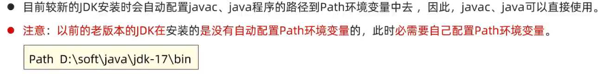
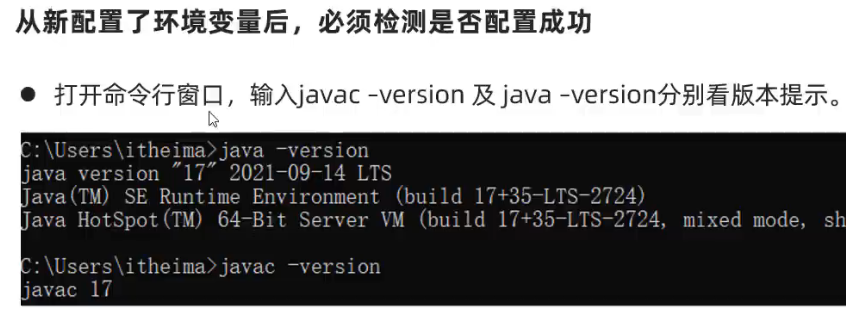
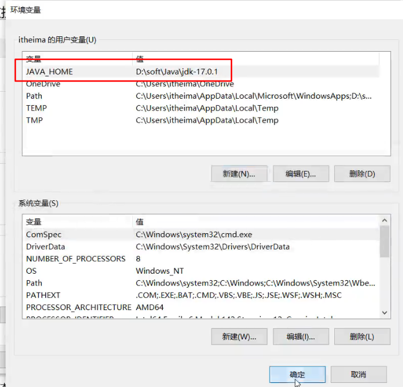
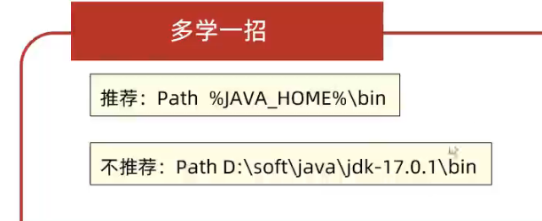
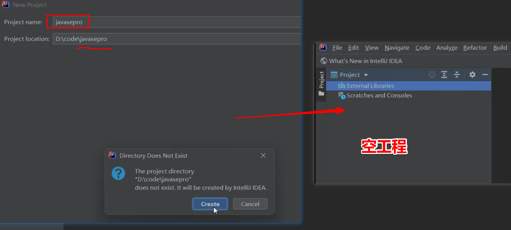
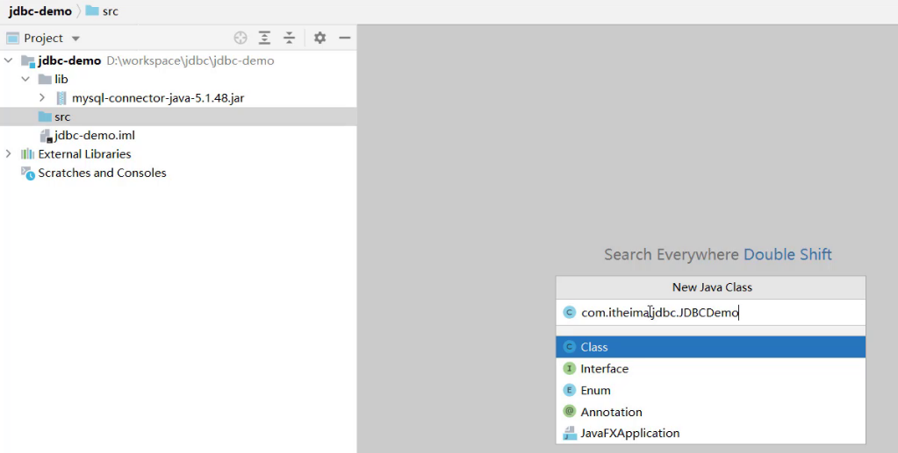
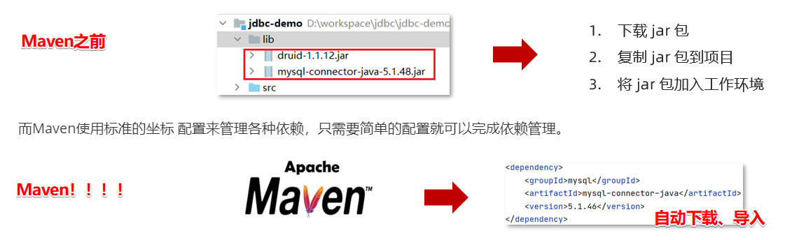

这篇笔记主要讲从0开始学习使用Java，到一步步用什么工具，为什么要用这些工具，如IDE、Maven等等。

# 1、JDK

**直接去Oracle下载jdk8，exe文件安装**

**用来编译、运行开发好的Java程序；**

可见编写Java程序和运行JAVA程序是两码事，编写JAVA程序可以有很多种方式，例如记事本、使用不同的IDE；而运行写好的Java程序就只有一种方式：JDK，要先通过javac编译 然后通过java 运行

- Java是一门高级编程语言，要使用Java我们就要用JDK ( Java Development Kit : Java开发者工具包)，大家一般来说，Java和JDK是一个意思。

- JDK有很多个版本，在逐渐升级，Java8是长期支持版本，也是YYDS；

我们从Oracle官网下载Java8，直接安装很简单，安装完之后就可以写Java程序，然后对其进行编译、运行了。

打开bin文件，看到我们主要用到的就是两个可执行文件——javac、java；


验证是否安装成功：

```cmd
cmd 打开命令窗口
java   javac   java -version   javac -version 
// 能直接在任意目录调用该执行文件，原因在于jdk安装的时候给我们配置了环境变量Path
// 如果没有自动配置就需要自己手动配置了
```


**使用最原始的方式，来开发一个Java程序：**


我们来写一个Java代码，然后运行：使用记事本就是最原始的开发Java程序的方法：

- 可以看到需要经过写代码——编译代码成为字节码文件——放到JVM里面去运行三个步骤


# 2、什么是Path、JAVA_HOME？

Path环境变量简单来说就是一个文件路径的超链接或快捷方式，里面可以有多个路径，当我们随意输入某个可执行文件的名称时，例如QQ、java，他就会马上去Path环境变量中依次挨个去文件路径下找，如果找到的话就直接执行他，没有找到则报错，而不需要我们再手动切换到某个软件的bin文件目录下了。

Path：在系统中记住一个文件路径，方便在命令行窗口的任意目录启动可执行程序（如exe），而不需要切换到该exe目录下。



最好我们都自己配置，如果以及配置了也可以删除掉，重新搞



**JAVA_HOME**

为什么要配置JAVA_HOME变量呢，他其实就是一个用户变量了，就好比我们程序里面的新建的一个String ss变量，需要新建他的原因在于有很多其他的软件、技术里面默认是通过这个JAVA_HOME变量来确定我们JDK的安装位置的，例如Maven等。其实是一样的。

此外，我们可以把Path变量里面的路径换成 %JAVA_HOME%\bin来，就可以统一维护了，终于搞懂了为什么一看博客都是要配置这两个变量，还以为没有什么用呢！！！！







# 3、IDE

**直接去Intellij官网，下载IDEA安装即可**

**解决问题：解决了原始java程序开发方式（如记事本）的不足，可以自动编译自动运行Java程序、其次提供了合理的项目管理方式（工程—模块—包—类），最后提供了编写代码时的智能提示、自动补全，极大提高了开发效率**（自动编译、运行，不是说的IDE可以跑Java代码哈，他只是用来写的，底部是用的配置的JDK跑的）


作用：简单来说：就是原始开发方式太繁琐，很多无意义工作，例如编译、运行；其次就是无智能提示、无项目管理方式。

- 自动编译、运行；
- 项目管理；
- 智能提示；

IDEA项目管理方式：

- 工程project——模块module——包package——类class


**1、新建project工程**

- 我们新建工程推荐选择最下面的EmptyProject，即全空的一个工程，后面我们再到里面建立模块就行了
- 当学习到了Spring、Springboot这些后就是用到Spring Initialzr那部分新建工程了




**2、新建module模块**

- 这里一定建立的是Java模块哦，要选择；后面我们使用Maven进行Web开发后就选择的是Maven模块了
- 一般下载安装的时候就集成了，没有的话下拉框选择自己的安装JDK的位置即可；（不是bin哦）


**3、新建package包、包下新建java类文件就行了**、


这样就可以正常写我们Java代码了

**4、运行Java代码**

- 很简单，直接右键运行就行了，他会帮我们编译，并且执行该java文件；

- 自动编译生成的字节码文件：在工程路径下的out文件夹里面；

- 可以自己进入到目录中看看

  


**核心：项目管理+自动编译运行      这就是为什么要使用IDE集成开发工具进行开发！！！！！！！！！！！！！！！！！！**


## 3.1 IDEA工程和模块操作

- Project:

  - 有.idea文件，无.iml文件、无src文件夹、无pom.xml。

  - idea文件夹存放项目的配置信息

- Module:

  ​		有.iml文件（每个模块特有）

  

- 举个例子

  1. **使用open打开工程**（选工程名文件夹）


​				**2. 使用new导入模块**（选.iml文件）导入模块比较麻烦


- **删除模块**：module要删两次

  

- **导入模块**：

  ​	1. 关联导入，找目标模块文件夹下的小黑点**.iml文件**（导入后该项目文件里 并没有此模块代码）


​			2. 创建导入

​				   即自己先创建模块，然后再复制代码到自己的src下面。复制的是别人模块src下的代码文件夹，一定注意。

​					或者我们直接把别人的模块文件夹复制到自己的project下面，然后导入也可以，这样天然就已经在我们工程下面了


# 4、MySQL

**直接去Mysql官网下载免安装zip版，因为安装版本在安装过程中会有很多的插件和额外的选项，很容易出现问题，注意事项比较多，免安装的只需要自己初始化，启动，配置就行了**

**Mysql和前面的JDK、IDE有一点，他是一个可持续运行的大程序，启动Mysql后，就相当于启动了一个可以外部连接程序，我们可以进行外部连接（IP、端口、协议），我们常说的MYSQL服务器就是指：安装了Mysql软件的一个计算机（服务器）用来作为我们数据存储工作的。**

学完了JAVASE所有知识点之后，就要开始学习数据库了，一般就是学mysql。

他也是一个程序，我们要下载、安装、配置环境变量，启动，通过小黑窗——命令行窗口进行数据库、表操作等等；

Win启动最好的方式就是：注册一个Mysql的服务，然后我们每次打开任务管理器找到mysql服务右键启动就好了，就不需要去小黑窗启动了；但是在Linux服务器中，我们只能通过shell命令窗口进行启动了


紧接着就是数据库的图形化客户端工具了，不用再到小黑窗里面去写sql代码了。


# 5、JDBC

**解决问题：通过Java语言来操作数据库**

**Java程序使用别人写好的API：需要手动下载jar包然后将jar包放在模块下的lib目录（随意命名）——然后手动add library添加到库文件中，就可以使用他提高的API了，来连接数据库、写sql代码等等。**

**API：简单说就是别人写好的代码，或者编译好的程序，提供给你使用，就叫做API。你使用了别人代码（或者程序）中的某个函数、类、对象，就叫做使用了某个API。严格来说：API仅指定义的接口，我们导入的实现类叫驱动，但现在两者我们也等价了，混着叫是一个意思**

API（Application Programming Interface,，应用程序编程接口）：也就是别人写好的接口，那只有接口有什么用啊！为什么SUN公司不给实现类呢，难道要我们自己写吗，不不不，不是这样的，首先SUN是java公司，不是数据库公司，所以他们不会弄这些，也不想给其他的公司进行约束，而其他的公司如果想要通过java来操作数据库，就必须按照sun公司写的这个接口来自己撰写实现类，主要因为java是全球第一编程语言撒，那我这个小小的数据库厂商不去服从别人，就没有人用我的数据库了哦，那也没办法，只能去报sun的大腿，所以各个厂商按照JDBC来写了自己的实现类，（**绰号——驱动）**。以后编写操作数据库的代码只需要面向JDBC（接口），操作哪个关系型数据库就需要导入该数据库的驱动包，如需要操作MySQL数据库，就需要再项目中导入MySQL数据库的驱动包。假如项目换了数据库，我们也只需要换一下驱动就行了，别的不用动。


先来看看通过Java操作数据库的流程


- 第一步：编写Java代码

- 第二步：Java代码将SQL发送到MySQL服务端

- 第三步：MySQL服务端接收到SQL语句并执行该SQL语句

- 第四步：将SQL语句执行的结果返回给Java代码

## 5.1 编写代码步骤

- 创建工程，导入驱动jar包

  

- 注册驱动

  ```sql
  Class.forName("com.mysql.jdbc.Driver");
  ```

- 获取连接

  Java代码需要发送SQL给MySQL服务端，就需要先建立连接

  ```sql
  Connection conn = DriverManager.getConnection(url, username, password);
  ```

- 定义SQL语句

  ```sql
  String sql =  “update…” ;
  ```

- 获取执行SQL对象

  执行SQL语句需要SQL执行对象，而这个执行对象就是Statement对象

  ```sql
  Statement stmt = conn.createStatement();
  ```

- 执行SQL，有返回值。

  ```sql
  int count = stmt.executeUpdate(sql);//受影响的行数
  ```

- 处理返回结果

  ```java
  System.out.println(count);
  ```

- 释放资源

  ```sql
  stmt.close();
  conn.close();
  ```

## 5.2 IDEA的详细操作

先建立号空工程与模块。（这个还不会，你可以退出群聊了）

1. **导入驱动包**

将mysql的驱动包放在模块下的lib目录（随意命名）下，并将该jar包添加为库文件。驱动包的下载现在去mvn的中心仓库里面，mysql已经不提供windows的下载了。


在添加为库文件的时候，有如下三个选项

* Global Library  ： 全局有效
* Project Library :   项目有效
* Module Library ： 模块有效

2.  **在src下创建类**



3. **编写代码如下**

```java
/** 
 * JDBC快速入门
 */
public class JDBCDemo {

    public static void main(String[] args) throws Exception {
        //1. 注册驱动
        Class.forName("com.mysql.jdbc.Driver");
        //2. 获取连接
        String url = "jdbc:mysql://127.0.0.1:3306/studysql";
        String username = "root";
        String password = "1234";
        Connection conn = DriverManager.getConnection(url, username, password);
        //3. 定义sql
        String sql = "update account set money = 2000 where id = 1";
        //4. 获取执行sql的对象 Statement
        Statement stmt = conn.createStatement();
        //5. 执行sql
        int count = stmt.executeUpdate(sql);//受影响的行数
        //6. 处理结果
        System.out.println(count);
        //7. 释放资源
        stmt.close();
        conn.close();
    }
}
```


# 6、数据库连接池

这个就和线程池是一个道理。因为每来一个用户我们建立一个连接，然后用户走了，我们就扔掉这个链接，又来一个，我们又重新建立，用完丢掉，这不是很不合理嘛。就像饭店，系统是一个饭店，连接是服务员，来一个客人，我们就新招一个服务员，她来把客人带进来，客人走后，我们就把这个服务员开除。下次又来一个客人，我们又重新招聘一个服务员........就是这个道理

**手动下载jar——手动导入项目库文件中**


## 6.1 数据库连接池概述

* 数据库连接池是个容器，负责分配、管理数据库连接(Connection)

* 它允许应用程序重复使用一个现有的数据库连接，而不是再重新建立一个；

* 它可以释放空闲时间超过最大空闲时间的数据库连接来避免因为没有释放数据库连接而引起的数据库连接遗漏。==”这个就类似游戏里面，您过长时间没有活动，已经掉线哈哈哈“==
* 好处
  * 资源重用
  * 提升系统响应速度
  * 避免数据库连接遗漏


==他是这样的：连接池是在一开始就创建好了一些连接（Connection）对象存储起来。用户需要连接数据库时，不需要自己创建连接，而只需要从连接池中获取一个连接进行使用，使用完毕后再将连接对象归还给连接池；==


## 6.2 数据库连接池接口

这个又和前面的JDBC接口一模一样的情况。大儿子SUN公司建立了一套标准的接口，任何其他组织如果想让Java开发者可以使用他们的连接池技术就需要去自己写实现类。

* **标准接口：==DataSource==**

  官方(SUN) 提供的数据库连接池标准接口，由第三方组织实现此接口。该接口提供了获取连接的功能：

  ```java
  Connection getConnection()
  ```

  那么==以后就不需要通过 `DriverManager` 对象获取 `Connection` 对象==，而是通过连接池（DataSource）获取 `Connection` 对象。

* **常见的数据库连接池**

  * DBCP
  * C3P0
  * Druid

  我们现在使用更多的是Druid，它的性能比其他两个会好一些。

* **Druid（德鲁伊）**

  * Druid连接池是阿里巴巴开源的数据库连接池项目 
  * 功能强大，性能优秀，是Java语言最好的数据库连接池之一

  

## 6.3 Druid的使用

**IDEA实现步骤：**

1. 导入jar包 druid和mysql-JDBC的
2. 定义配置文件
3. 加载配置文件
4. 获取数据库连接池对象-DataSource
5. 获取连接-

项目的结构如下：


配置文件的内容如下：

```properties
# driverClassName=com.mysql.jdbc.Driver  这个不用写，现在都给我们自动写好了
url=jdbc:mysql:///db1?useSSL=false&useServerPrepStmts=true
username=root
password=5240zhouquan
# 初始化连接数量
initialSize=5
# 最大连接数
maxActive=10
# 最大等待时间
maxWait=3000
```

DruidDemo的代码如下：很简单，就是获取连接的方式变化了，后面的全部一样。

```java
/**
 * Druid数据库连接池演示
 */
public class DruidDemo {

    public static void main(String[] args) throws Exception {
        //3. 加载配置文件
        Properties prop = new Properties();
				prop.load(new FileInputStream(
          System.getProperty("user.dir")+"/JDBC/src/druid.properties")
          );
        //4. 获取连接池对象
        DataSource dataSource = DruidDataSourceFactory.createDataSource(prop);

        //5. 获取数据库连接 Connection
        Connection connection = dataSource.getConnection();
        System.out.println(connection); //获取到了连接后就可以继续做其他操作了
    }
}
```


# 6、Maven

> Apache Maven 是一个项目管理和构建工具，它基于项目对象模型(POM)的概念，**通过一小段描述信息来管理项目的构建、报告和文档。**
>
> 官网 ：http://maven.apache.org/  Apache 是一个开源组织，将来我们会学习很多Apache提供的项目。

**大家记住：Maven是一个单独的工具/软件，与Java等xxx是单独分开的东西，需要去下载安装，使用他提供的可执行程序（bin文件）**

**直接官网下载二进制压缩包即可，很简单方便，IDEA要手动配置一下Maven**


从以上的JDBC、Druid等技术的导入使用可以看出：在Java项目要使用别人提高的API时，需要手动导入jar，并且还有一个jar包版本的问题需要考虑，这两点是很麻烦的！！！

**解决问题：**

- **1、jar包的导入和版本兼容问题（这是解决的核心问题，其他都是锦上添花）；**
  - jar的导入问题，Maven之前使用jar包需要手动下载、手动导入库文件；
  - 其次就是多个jar之间的版本兼容问题：我们项目会用到很多jar，如mybatis、JUnit，log4j，还有一些可能是同事写好的jar包。此时出现的问题就会有：突然我的mybatis升级了，但它下载需要5.0版本的JUnit，但项目的JUnit没有去升级，就会出现严重问题。
- **2、提供了一套标准化的构建流程（编译，测试，打包，发布……），Maven提供了一套简单的命令来完成项目构建。**
  - 其中打包就是生成jar包，里面存放我们的字节码文件（.class文件）
  - 之前IDEA没有提供嘛？其实他是提供了的，只是不全，自动化就提供了编译运行这部分、其次也提供了打包jar的功能，但要自己去IDEA里面配置xxx，很麻烦；没有提供自动测试功能、没有提供发部功能。

- **4、提供了一套标准化的项目结构，所有的IDE使用Maven构建的项目完全一样，Maven项目在不同IDE，如IDEA、Eclipse上可以通用。**
  - 这和前面说到的IDEA提供的项目管理方式不一样哦，一个是宏观的，一个是指具体代码文件目录的；当然IDEA的工程、模块都可以是Maven项目，如果工程设置为Maven项目，那么就有父子Maven项目的关系（公司都是这样的，方便管理模块的依赖）。一般我们叫Maven工程——Maven模块来区分。
  - 有Java项目结构、以及Java Web项目结构，两个有一点点不一样；
  - 如下图就是Java Web项目结构。Java项目的话就少了一个webapp包；
  - 

**核心功能：全新的依赖管理机制**

- 管理你项目所依赖的第三方资源（jar包、插件）。如之前我们项目中需要使用JDBC和Druid的话，就需要去网上下载对应的依赖包，复制到项目中，还要将jar包加入工作环境这一系列的操作。而Maven使用标准的坐标 配置来管理各种依赖，只需要简单的配置就可以了，其他的下载复制导入，Maven都会帮我们做了。

  

**后面，我们就说的都是创建：Maven工程 或 Maven模块了**

一般来说就是两种使用方式：**空工程+Maven模块** or **Maven工程+Maven模块**


# 7、Mybatis


**导入依赖即可使用。**


==**这里提出一个概念：持久层，负责处理数据库之间的连接。**==

-  mybatis 是一个优秀的基于java的持久层框架，它内部封装了jdbc，使开发者只需要关注sql语句本身，而不需要花费精力去处理加载驱动、创建连接、创建statement等繁杂的过程。

-  mybatis通过xml或注解的方式将要执行的各种 statement配置起来，并通过java对象和statement中sql的动态参数进行映射生成最终执行的sql语句。

-  最后mybatis框架执行sql并将结果映射为java对象并返回。

   采用ORM思想（ObjectRelationMapping）解决了实体对象和数据库表映射的问题，对jdbc 进行了封装，屏蔽了jdbc api 底层访问细节，使我们不用与jdbc api打交道，就可以完成对数据库的持久化操作。（命名要很规范）


​					**其他的框架：**


# 8、XML

前面Maven和Mybatis都用到了xml文件，下面我们详细了解一下他是什么，以及如何使用的。

- 用的是Maven的schema约束文档，XSD (XML Schema Definition)

  

- 用的是Mybatis 的dtd约束文档

  


## 8.1 XML概述

- XML是可扩展标记语言（eXtensible Markup Language）的缩写，它是**是一种数据组织格式，**可以描述非常复杂的数据结构；
- 其实就是定义了一套数据组织规范，大家都能看懂，都能解析，属于Java中的特殊文件，例如还有properties文件、yml文件等；相对这两个文件，xml的优缺点就是：可以组织更复杂层次的数据关系，但同时写起来也更麻烦，不如这两个简洁；所以开发的时候，可以看到项目配置一般都是yml文件和xml一起都用，主要看应用场景。
- 特殊文件的作用无非是两个：
  - 在网络中存储、传输数据，因为数据组织方式有固定规则，所以大家都可以解析；
  - 用于项目开发、以及各个系统的配置文件

```xml
<?xml version="1.0" encoding="UTF-8"?>
<data>
  <sender>张三</sender>
  <receiver>李四</receiver>
  <src>
    	 <addr>北京</addr>
    <date>2022-11-11 11:11:11</date>
    </src>
  <current>武汉</current>
  <dest>广州</dest>
</data>

```


## 8.2 XML语法规则

- **XML文件的后缀名为：xml**
- **文档声明必须是第一行**，让别人识别这是xml文件
- **只有一个根标签**

```java
//一行文档声明
<?xml version="1.0" encoding="UTF-8" ?>
  version：XML默认的版本号码、该属性是必须存在的
  encoding：本XML文件的编码
```

**XML的标签(元素)规则**

1. 标签由一对尖括号和合法标识符组成: < name>< /name>，必须存在一个根标签，有且只能有一个。
2. 标签必须成对出现，有开始，有结束: < name>< /name>
3. 特殊的标签可以不成对，但是必须有结束标记，如:< br/>
4. ==标签中可以定义属性，属性和标签名空格隔开, 属性值必须用引号引起来<student id = “1">==
5. 标签需要正确的嵌套
6. ==标签名、标签之间的层级、标签的属性可以随便写，没有限制！！！！！==

**XML的其他组成**

- XML文件中可以定义注释信息：<!-- 注释内容 -->

  

- XML文件中特殊字符不能直接使用，会与标签符号冲突

- XML文件中存在CDATA区:   < ![CDATA[   …内容…  ]]>。代表数据区

  因为第二点特殊字符处理太麻烦了，所以有这个东西，里面就不用管其他的东西，可以写任意内容。

```xml
<?xml version="1.0" encoding="UTF-8" ?>
<student>
    <name>妞儿国外</name>
    <sex>女</sex>
    <hobby>唐僧，追唐僧</hobby>
    <sql>
        select * from user where age &lt; 18;
    </sql>
  	<sql2>
    <![CDATA[
            select * from user where age < 18;
    ]]>
    </sql2>
</student>
```


## 8.3 XML文档约束方式

- 前面说到：标签名、标签之间的层级、标签的属性可以随便写，没有限制！！！这可能有问题，我写的别人可能读不懂啊，所以就出现了xml文档约束；

- 文档约束就详细规定了 xml的标签名写法，即只能写哪些标签、不同标签之间只能按照哪种层级关系书写，标签的属性有哪些，其实就相当于定义了一套语法规则，我们按照他的来；
- 不同的工具如Mybatis、Maven、Springboot都用到了xml作为配置文件等，他们都自定义了自己的xml文档约束，所以说学习的时候会看到很多这个标签那个标签，大家都不一样。我们按照别人给的规范写，他们工具才可以解析出数据，然后进行帮我们相关底层操作。


**文档约束的分类：**

1. **DTD**

2. **schema**

    

### **DTD约束**

**需要先手动编写一个DTD文档约束，来约束我们xml的写法**

需求：利用DTD文档约束，约束一个XML文件的编写。

分析：

①：编写DTD约束文档，后缀必须是.dtd

```dtd
<!ELEMENT 书架 (书+)>
<!ELEMENT 书 (书名,作者,售价)>
<!ELEMENT 书名 (#PCDATA)>
<!ELEMENT 作者 (#PCDATA)>
<!ELEMENT 售价 (#PCDATA)>
```

②：在需要编写的XML文件中导入该DTD约束文档

```xml
<!DOCTYPE 书架 SYSTEM "data.dtd">
```

③：按照约束的规定编写XML文件的内容。

 **缺点：**

- **不能约束具体的数据类型。**


### schema约束

- schema可以约束具体的数据类型，约束能力上更强大。

- schema本身也是一个xml文件，本身也受到其他约束文件的要求，所以编写的更加严谨。


**需求：利用schema文档约束，约束一个XML文件的编写。**

**分析：**

​		①：编写schema约束文档，后缀必须是.xsd，具体的形式到代码中观看。

​		②：在需要编写的XML文件中导入该schema约束文档

​		③：按照约束内容编写XML文件的标签。

**schema文档：新建一个data.xsd**

```xml
<?xml version="1.0" encoding="UTF-8" ?>
<schema xmlns="http://www.w3.org/2001/XMLSchema"
        targetNamespace="http://www.itcast.cn"
        elementFormDefault="qualified" >
    <!-- xmlns="http://www.w3.org/2001/XMLSchema"：约束该data.xsd schema文档的其他约束文件-->
    <!-- targetNamespace="http://www.itcast.cn"：申明该data.xsd约束文档的地址（命名空间）-->
  	<!-- elementFormDefault="qualified"：这个不用管，就是前缀是否默认的意思 -->
  
    <element name='书架'> //规定根元素只能是中文的 书架
        <!-- 写子元素 -->
        <complexType>
            <sequence maxOccurs='unbounded'>
              <!-- maxOccurs='unbounded': 书架下的子元素可以有任意多个！-->
                <element name='书'>  // 固定下面可以有多个子标签 书
                    <!-- 写子元素 -->
                    <complexType>
                        <sequence>  
                            <element name='书名' type='string'/>
                            <element name='作者' type='string'/>
                            <element name='售价' type='double'/>
                        </sequence>
                    </complexType>
                </element>
            </sequence>
        </complexType>
    </element>
  
</schema>
```

**自己写xml：**

```xml
<?xml version="1.0" encoding="UTF-8" ?>
<书架 xmlns="http://www.itcast.cn"
     xmlns:xsi="http://www.w3.org/2001/XMLSchema-instance"
     xsi:schemaLocation="http://www.itcast.cn data.xsd">
    <!-- 
				仔细看，这三部分是一个层级关系
				 xmlns="http://www.itcast.cn"  指明要使用schema约束文档的基本位置，也就是前面的（命名空间）
         xmlns:xsi="http://www.w3.org/2001/XMLSchema-instance"： xmlns:xsi 定义了一个命名空间前缀 xsi 对应的唯一字符串 http://www.w3.org/2001/XMLSchema-instance。 但是读者会发现， 这个 xmlns:xsi 在不同的 xml 文档中似乎都会出现。 这是因为， xsi 已经成为了一个业界默认的用于 XSD(（XML Schema Definition) 文件的命名空间。 而 XSD 文件（也常常称为 Schema 文件）是用来定义 xml 文档结构的。
         xsi:schemaLocation="http://www.itcast.cn data.xsd" 命名空间中具体的schema文档：data.xsd
		-->
  
       xmlns 的全称为 xml namespace，即 xml 命名空间，这个很好理解，和 java 中 package 和 c# 中 namespace 的概念基本一致，起的作用也基本一致：区分重复元素
  	xmlns:xsi 这本质就是声明一个名为 xsi 的命名空间，其值为一个标准的命名空间。xmlns:xsi="http://www.w3.org/2001/XMLSchema-instance" 此命名空间还定义了 xsi:type, xsi:nil, xsi:schemaLocation 等属性，虽然 xsi 也可以随意用别的名称替换，但不建议这样做。xsi 已经是通用的写法, 是 xml schema instance 的缩写，业界默认的，可以看成是固定写法。
  
    <书>
        <书名>神雕侠侣</书名>
        <作者>金庸</作者>
        <售价>399.9</售价>
    </书>
    <书>
        <书名>神雕侠侣</书名>
        <作者>金庸</作者>
        <售价>19.5</售价>
    </书>

</书架>
```


## 8.4 XML解析技术

解析技术就不用学习了，用不到其实。


# 9、Web核心介绍

然后，我们就要开始学习Java Web开发了，就是使用Java语言进行互联网系统的开发，主要包括如下技术栈，


（1）==静态资源主要包含HTML、CSS、JavaScript、图片等==，主要负责页面的展示。

- 已经学过前端网页制作`三剑客`(HTML+CSS+JavaScript),使用这些技术我们就可以制作出效果比较丰富的网页，将来展现给用户。但是由于做出来的这些内容都是静态的，这就会导致所有的人看到的内容将是一模一样。

（2）==动态资源主要包含Servlet、JSP等，主要用来负责逻辑处理。==动态资源其实就是Java代码，而Servlet、JSP是一种编写规范。

（3）==Web服务器是一个应用程序（==软件==），对HTTP协议进行解析封装，==使得程序员不必直接对协议进行操作，让Web开发更加便捷。将来我们把自己写的Web项目部署到Web Tomcat服务器软件中，当Web服务器软件启动后，部署在Web服务器软件中的页面就可以直接通过浏览器来访问了。

**JavaEE**: Java Enterprise Edition,Java企业版。指Java企业级开发的技术规范总和。包含13项技术规范:JDBC、JNDI、EJB、RMI、JSP、Servlet、XML、JMS、Java IDL、JTS、JTA、JavaMail、JAF。

**整个Web核心，我们总共有六天的学习内容，分别是:**

* 第一天：HTTP、Tomcat、Servlet
* 第二天：Request(请求对象)、Response(响应对象)
* 第三天：JSP（不重要）、会话技术(Cookie、Session)
* 第四天：Filter(过滤器)、Listener(监听器)
* 第五天：Ajax、Vue、ElementUI（属于前端技术）
*  JavaWeb 三大组件(Servlet、Filter、Listener)

这些内容都蛮重要的，除了JSP以外，他是做前端工作的，后面用Ajax的前后端分离后，就不需要他了；特别是HTTP、Servlet这两个涉及到的东西。

详细的内容去Java笔记——web文件夹看。


需要知道的知识点：

- **1、Web服务器（Tomcat）是一个软件，类似于Mysql，需要下载安装启动，可持续运行；启动后就会占一个计算机端口如：http://localhost:8080，我们将自己的应用程序部署到服务器后，就可以通过服务器访问了，例如http://localhost:8080/hello/a.html**

  - 服务器是可以使用java完成编写的，用到网络编程的知识`ServerSocket`和`Socket`，是可以接受页面发送的请求和响应数据给前端浏览器的，真正用到的Web服务器，我们不会自己写，都是使用目前比较流行的web服务器。其实就是启动一个持续运行的程序，他占一个端口，通过IP+端口，可以访问服务器的资源。

  - 部署过程：将原始项目放置到webapps目录下，即部署完成，但是原始文件太大了不方便传输。所以我们，一般将JavaWeb项目会被打包称==war==包，然后将war包放到Webapps目录下，Tomcat会自动解压缩war文件。

    

  - 后面还涉及到一个jar包，这个和war有什么区别呢？

  - 在pom.xml设置打包方式为war，Maven默认打包方式为jar。

  

- **2、Web项目的结构分为:开发中的项目和开发完可以部署的Web项目,这两种项目的结构是不一样的**

  * Maven Web项目结构: 开发中的项目

    

  * 开发完成部署的Web项目

    

    * 开发项目通过执行Maven打包命令==package==,可以获取到部署的Web项目目录
    * 编译后的Java字节码文件和resources的资源文件，会被放到WEB-INF下的classes目录下
    * pom.xml中依赖坐标对应的jar包，会被放入WEB-INF下的lib目录下

    


- **3、IDEA集成Tomcat（再次说Maven YYDS）**

  按照前面基本使用的情况：

  * Maven Web项目创建成功后，通过Maven的package命令可以将项目打包成war包，将war文件拷贝到Tomcat的webapps目录下，启动Tomcat就可以将项目部署成功，然后通过浏览器进行访问即可。
  * 然而我们在开发的过程中，项目中的内容会经常发生变化，如果按照上面这种方式来部署测试，是非常不方便的
  * 如何在IDEA中能快速使用Tomcat呢?

  在IDEA中集成使用Tomcat有两种方式，分别是==IDEA集成本地Tomcat==和==直接Tomcat Maven插件==

  肯定是选择插件撒，使用Maven导入插件，谁用IDEA配置啊，这么麻烦！！！！

  


- **4、Servlet就是表现层，类似于我们的Controller，他负责配置访问路径、处理请求数据、返回响应数据；是一个运行在Web服务器上的小型java程序，其实也就是一个访问资源，每个类都可以用于是servlet。**

  **使用方式：导入依赖即可，**他是Java EE的一个接口规范，我们要使用的话，导入Maven依赖坐标即可。

  - 
  - 


# 10、MVC模式和三层架构

学习了Web的基础开发过程后，就要知道为什么要这样开发，为什么分了这几部分，就是我们常说的MVC和三层架构。

MVC 模式和三层架构是一些理论的知识，将来我们使用了它们进行代码开发会让我们代码维护性和扩展性更好。

## 1. MVC模式

MVC 是一种分层开发的模式，其中：

* M：Model，业务模型，处理业务

* V：View，视图，界面展示

* C：Controller，控制器，处理请求，调用模型和视图


控制器（serlvlet）用来接收浏览器发送过来的请求，控制器调用模型（JavaBean）来获取数据，比如从数据库查询数据；控制器获取到数据后再交由视图（JSP）进行数据展示。

**MVC 好处：**

* 职责单一，互不影响。每个角色做它自己的事，各司其职。

* 有利于分工协作。

* 有利于组件重用

## 2. 三层架构

MVC只是一种模式，宏观的概念而言，告诉我们要将各个部分分开，解耦！！！三层架构是实现MVC模式的一个具体方案

三层架构是将我们的项目分成了三个层面，分别是 `表现层`、`业务逻辑层`、`数据访问层`。


* 数据访问层：对数据库的CRUD基本操作
* 业务逻辑层：对业务逻辑进行封装，组合数据访问层层中基本功能，形成复杂的业务逻辑功能。例如 `注册业务功能` ，我们会先调用 `数据访问层` 的 `selectByName()` 方法判断该用户名是否存在，如果不存在再调用 `数据访问层` 的 `insert()` 方法进行数据的添加操作
* 表现层：接收解析请求，封装数据对象，调用业务逻辑层，响应数据

而整个流程是，浏览器发送请求，表现层的Servlet接收请求并调用业务逻辑层的方法进行业务逻辑处理，而业务逻辑层方法调用数据访问层方法进行数据的操作，依次返回到serlvet，然后servlet将数据交由 JSP 进行展示。

**三层架构的每一层都有特有的包名称：**

* 表现层： `com.itheima.controller` 或者 `com.itheima.web`
* 业务逻辑层：`com.itheima.service`
* 数据访问层：`com.itheima.dao` 或者 `com.itheima.mapper`

后期我们还会学习一些框架，不同的框架是对不同层进行封装的


## 3. MVC 和 三层架构

通过 MVC 和 三层架构 的学习，有些人肯定混淆了。那他们有什么区别和联系？


如上图上半部分是 MVC 模式，上图下半部分是三层架构。 `MVC 模式` 中的 C（控制器）和 V（视图）就是 `三层架构` 中的表现层，而 `MVC 模式` 中的 M（模型）就是 `三层架构` 中的 业务逻辑层 和 数据访问层。

可以将 `MVC 模式` 理解成是一个大的概念，而 `三层架构` 是对 `MVC 模式` 实现架构的思想。 那么我们以后按照要求将不同层的代码写在不同的包下，每一层里功能职责做到单一，将来如果将表现层的技术换掉，而业务逻辑层和数据访问层的代码不需要发生变化。


# 11、Spring和SpringMVC

## 11.1 传统方式的问题

为什么要出现Spring这个东西呢？先看一下我们之前的三层架构是如何实现的，以及每个层有什么缺点？


可以看到，原始的Web开发三层架构是没有使用任何框架的，尤其是业务逻辑层这部分，更是什么三方技术都没有使用，直接就是我们普通的Java代码，写一个接口配实现类。


- **在不同层级之间存在高度耦合：**可以看到存在一个高度耦合，如果我们要换一个ServiceImpl实现类，就需要去修改源代码，这是极其不方便的！！！最好的方式就是通过改一个配置 or 注解这种简单的手段，就可以替换实现类，完成项目功能替换。
- **每个控制器都要手动写json和对象的转换代码——重复且无意义；**
- **处理请求的控制器—Servlet区分请求方式不够简单；**
- **处理请求的控制器—Servlet资源访问路径无法叠加、一个控制器无法实现多个资源的访问**：一般来说，我们会将某个功能的资源接口放在同一个Contorller里面，便于区分，例如属于用户的控制器接口，包括增删改查等，就会全部放在一个UserContorller里面，通过二级资源路径去访问最好。


## 11.2 两者的特点

因此为了解决这主要的四点开发问题，出现了Spring系统全家桶——Spring和SpringMVC。

**Spring解决了Service层问题：硬编码导致的不同层级的高度耦合问题，通过控制反转IOC和依赖注入DI；**当然还有很多其他优点，但这是最核心的。

- spring就是是一个IOC容器，用来管理Bean，使用依赖注入实现控制反转，解决高耦合问题；其次可以很方便的整合各种框架，并且提供AOP机制弥补OOP的代码重复问题、可以将不同类不同方法中的共同处理抽取成切面，自动注入给方法执行，比如日志、异常等

**SpringMVC解决了Controller层问题：重复性工作问题、区分请求方式问题、资源访问路径叠加问题，并且支持Resfule编程风格的请求**（如每个servlet都要先接收求参数request，json封装实体类、最后返回数据结果response，也有对象数据转json串）（Resfule：同一资源路径不同请求方式可以访问到不同资源接口）

- SpringMVC是一套基于MVC模式的轻量级的Java Web框架，完美诠释了Servlet+JSP+Java Bean的融合，只需要通过一套注解，就让一个简单的 Java 类成为处理请求的控制器，而无须实现任何接口；并且定义了一套路由策略（url到handle）来实现资源路径的和handle的适配问题。


**使用这两个框架的方式：**

- 导入依赖即可。


**两者的区别：**

- Spring其实是一个单独的工具，是一个Service层解决方案，他不仅可以支持Java项目也可以支持web项目，怎么说呢，他其实没有提供Web项目这些处理请求的操作，他就是单单的提供了IOC容器，单纯解决Java代码里面的高度耦合问题！！！Spring可以与之前我们的Web项目融合，如Servlet+JSP+Mybatis完成数据的请求返回；并不是说他就一定要和SpringMVC一起使用。
- SpringMVC就不一样了，他必须依赖Spring的，因为Spring既然都提供了Service层的解决方案，但是Controller层还是使用的Servlet，别人家的技术，我肯定不同意，而且关键是很不好用！！所以他自己搞了一套web的轻量级框架，极大简化了Controller层的开发。


**Springmvc Web项目运行方式：**

- 目前还是在Tomcat服务器下运行，需要导入Maven提供的Tomcat插件（不需要本地下载启动tomcat了）；

- 打包方式依然是war包

  


# 12、Springboot

**springboot：是spring团队提供的一个快速开发框架，其设计目的是用来<font color="#ff0000"><b>简化Spring应用的初始搭建以及开发过程</b></font>。让程序员能更方便、更快速的开发spring+springmvc应用，简化了配置(约定大于配置)，整合了一系列的解决方案(starter机制)、redis、mongodb、es等，可以开箱即用**

- Spring开发问题一：依赖设置繁琐，用到某个系列技术时，pom文件需要自己一个个手动导入（一个系列一般有很多依赖要导入）（starter解决）
- Spring开发问题二：配置文件多且繁琐，如最少要写三个配置文件spring的applicationcontext.xml , springmvc的spring-mvc.xml , Web项目的web.xml，虽然说提供了注解开发，简化xml文件书写，但总归要写三个配置类！！！
- Spring开发问题三：在集成其他技术如Mybatis时，需要手动进行装配该技术的核心对象，也就是手动装配该技术的核心对象到IOC容器里面，要去applicationcontext.xml配置Bean，如Mybatis的SqlSessionFactory工厂对象、手动配置扫描mapper映射文件所在包（扫描后Spring才会为其创建接口对象放入容器内）等；这些工作其实是无技术含量的，而且重复。
  - 这个第三点其实就是说的SP的自动装配，我们看后面给的原始Mybatis和SSM开发中，对Mybatis技术的集成方式；
  - 可以知道，要使用Mybatis就一定要创建SqlSessionFactory工厂对象，在Spring里面是通过手动写Bean注入容器，但这个是重复性的工作啊，能不能把这个工作交给框架处理，我们不写这个呢！！！
  - Springboot的自动装配就是这个意思，约定大于配置，通过两个技术实现：starter+核心注解，在项目启动时已经提前给我们创建了该SqlSessionFactory工厂对象放到容器里面；以及加了一个@mapper的注解，来进行mapper映射文件的扫描，而不用再写配置文件了。
  - 如果引入一个非stater的技术，那还是需要自己手动装配的，和Spring写法一样。


**使用Springboot的方式：**

- 不再是导入依赖了哦，而且采用Springboot的初始化构建！！！（其实也就是导依赖了，但东西有点多，没有必要自己写）


**Springmvc Web项目运行方式：**

- 不再是打包为war（单独的web项目模块），而是简单的jar吧，而且直接通过java -jar就可以执行。

- 原因之一在于内嵌了tomcat服务器，所以不需要再额外引入Maven的tomcat插件了，他导入了一个依赖（不是插件），将tomcat的内嵌核心对象丢到了容器里面，让Spring进行管理。

  

- **内嵌Tomcat运行原理**

  程序现在已经运行了，通过引导类的main方法运行了起来。但是运行java程序不应该是执行完就结束了吗？但是我们现在明显是启动了一个web服务器啊，不然网页怎么能正常访问呢？这个服务器是在哪里写的呢？

  我们去Pom文件里面找一下：

  

  原来是tomcat这个starter，在web-starter里面引入了这个服务器。那问题来了，之前我们不是把java程序扔到web服务器里面跑嘛，怎么现在给java程序内嵌了一个服务器呢？？？

  ​	Tomcat服务器是一款软件，而且是一款使用java语言开发的软件，熟悉的小伙伴可能有印象，tomcat安装目录中保存有jar，好多个jar。

  ​	下面的问题来了，既然是使用java语言开发的，运行的时候肯定符合java程序运行的原理，java程序运行靠的是什么？对象呀，一切皆对象，万物皆对象。那tomcat运行起来呢？也是对象。

  ​	如果是对象，那Spring容器是用来管理对象的，这个对象能不能交给Spring容器管理呢？哦呼肯定啊，是个对象都可以交给Spring容器管理，行了，这下通了。tomcat服务器运行其实是以对象的形式在Spring容器中运行的，怪不得我们没有安装这个tomcat，而且还能用。闹了白天这东西最后是以一个对象的形式存在，保存在Spring容器中悄悄运行的。具体运行的是什么呢？其实就是上前面提到的那个tomcat内嵌核心。


## 12.1 无自动装配spring是如何整合其他技术的

### 1 原始SSM

首先，未整合之前的情况：就是配置文件很多撒，烦得很，我先一一列出来如下：

1. **Spring的配置**

   核心配置文件——**applicationContext.xml**

   ```xml
   <?xml version="1.0" encoding="UTF-8"?>
   <beans xmlns="http://www.springframework.org/schema/beans"
          xmlns:xsi="http://www.w3.org/2001/XMLSchema-instance"
          xmlns:context="http://www.springframework.org/schema/context"
          xsi:schemaLocation="http://www.springframework.org/schema/beans
          http://www.springframework.org/schema/beans/spring-beans.xsd
          http://www.springframework.org/schema/context
          http://www.springframework.org/schema/context/spring-context.xsd">
   
   <!--组件扫描-->
       <context:component-scan base-package="com.CCooky">
           <!--排除@Controller注解的扫描-->
           <context:exclude-filter type="annotation" expression="org.springframework.stereotype.Controller"/>
       </context:component-scan>
   </beans>
   ```

   整合SpringMVC——**web.xml**。

   ```xml
   <!--    spring监听器（这里整合了SpringMVC）-->
       <context-param>
           <param-name>contextConfigLocation</param-name>
           <param-value>classpath:applicationContext.xml</param-value>
       </context-param>
       <listener>
           <listener-class>org.springframework.web.context.ContextLoaderListener</listener-class>
       </listener>
   ```

2. **SpringMVC的配置**

   核心配置文件——**spring-mvc.xml**

   ```xml
   <?xml version="1.0" encoding="UTF-8"?>
   <beans xmlns="http://www.springframework.org/schema/beans"
          xmlns:xsi="http://www.w3.org/2001/XMLSchema-instance"
          xmlns:context="http://www.springframework.org/schema/context"
          xmlns:mvc="http://www.springframework.org/schema/mvc"
          xsi:schemaLocation="http://www.springframework.org/schema/beans
          http://www.springframework.org/schema/beans/spring-beans.xsd
          http://www.springframework.org/schema/context
          http://www.springframework.org/schema/context/spring-context.xsd
           http://www.springframework.org/schema/mvc
          http://www.springframework.org/schema/mvc/spring-mvc.xsd">
     
   <!--		组件扫描controller-->
       <context:component-scan base-package="com.CCooky.controller"/>
   <!--		配置mvc注解驱动-->
       <mvc:annotation-driven></mvc:annotation-driven>
   <!--    内部资源视图解析器-->
       <bean id="resourceViewResolver" class="org.springframework.web.servlet.view.InternalResourceViewResolver">
           <property name="prefix" value="/WEB-INF/pages/"></property>
           <property name="suffix" value=".jsp"></property>
       </bean>
   <!--    开放静态资源的访问权限-->
       <mvc:default-servlet-handler></mvc:default-servlet-handler>
   </beans>
   ```

   前端控制器——**web.xml**

   ```xml
   <!--Springmvc 前端控制器-->
       <servlet>
           <servlet-name>DispatcherServlet</servlet-name>
           <servlet-class>org.springframework.web.servlet.DispatcherServlet</servlet-class>
           <init-param>
               <param-name>contextConfigLocation</param-name>
               <param-value>classpath:spring-mvc.xml</param-value>
           </init-param>
         	<!--服务器启动同时启动前端控制器-->
           <load-on-startup>1</load-on-startup>
       </servlet>
       <servlet-mapping>
           <servlet-name>DispatcherServlet</servlet-name>
         	<!--这是判断该访问资源是否进入我的前端控制器（这样就是任何访问资源-->
           <url-pattern>/</url-pattern>
       </servlet-mapping>
   <!--    springMVC请求数据乱码过滤器-->
       <filter>
           <filter-name>CharacterEncodingFilter</filter-name>
           <filter-class>org.springframework.web.filter.CharacterEncodingFilter</filter-class>
           <init-param>
               <param-name>encoding</param-name>
               <param-value>UTF-8</param-value>
           </init-param>
       </filter>
       <filter-mapping>
           <filter-name>CharacterEncodingFilter</filter-name>
           <url-pattern>/*</url-pattern>
       </filter-mapping>
   ```

3. **Mybatis的配置**

   数据库连接信息——**jdbc.properties**

   ```properties
   jdbc.driver=com.mysql.jdbc.Driver
   jdbc.url = jdbc:mysql://localhost:3306/studysql?useSSL=false
   jdbc.username = root
   jdbc.password= 5240zhouquan
   ```

   核心配置文件——**mybatis-config.xml**

   ```xml
   <?xml version="1.0" encoding="UTF-8" ?>
   <!DOCTYPE configuration
           PUBLIC "-//mybatis.org//DTD Config 3.0//EN"
           "http://mybatis.org/dtd/mybatis-3-config.dtd">
   
   
   <configuration>
   <!--    加载外部数据源配置-->
       <properties resource="jdbc.properties"></properties>
   <!--    给实体类全限定名起别名-->
       <typeAliases>
           <package name="com.CCooky.pojo"/>
       </typeAliases>
   <!--数据库-->
       <environments default="development">
           <environment id="development">
               <transactionManager type="JDBC"/>
               <dataSource type="POOLED">
                   <property name="driver" value="${jdbc.driver}"/>
                   <property name="url" value="${jdbc.url}"/>
                   <property name="username" value="${jdbc.username}"/>
                   <property name="password" value="${jdbc.password}"/>
               </dataSource>
           </environment>
       </environments>
   <!--    扫描SQL映射文件-->
       <mappers>
           <package name="com.CCooky.mapper"/>
       </mappers>
   </configuration>
   ```

这样相当于仅仅把SpringMVC整合到了Spring里面，Mybatis还是他的那一套操作，体现在我们的业务层，如下：我们需要通过Mybatis来手动创建SqlSessionFactory工厂对象，最后拿到Mapper对象进行操作。有太多的重复代码了，很烦洛。一个是获取外面的Mapper接口对象，一个是事务的控制。

```java
@Service("accountService")
public class AccountServiceImpl implements AccountService {

    @Override
    public boolean save(Account account) {
        /**
         * 原生mybatis的操作
         */
        SqlSessionFactory sqlSessionFactory = SqlSessionFactoryUtil.getSqlSessionFactory();
        SqlSession sqlSession = sqlSessionFactory.openSession();
        AccountMapper mapper = sqlSession.getMapper(AccountMapper.class);
        boolean result = mapper.save(account);
        sqlSession.commit();
        sqlSession.close();
        return result;
    }

    @Override
    public List<Account> selectAll() {
        SqlSessionFactory sqlSessionFactory = SqlSessionFactoryUtil.getSqlSessionFactory();
        SqlSession sqlSession = sqlSessionFactory.openSession();
        AccountMapper mapper = sqlSession.getMapper(AccountMapper.class);
        List<Account> accountList = mapper.selectAll();
        sqlSession.close();
        return accountList;
    }
}
```

```java
// Mybatis工厂对象创建工具
public class SqlSessionFactoryUtil {
    private static SqlSessionFactory sqlSessionFactory;
    static {
        try {
            String resource = "mybatis-config.xml";
            InputStream inputStream = Resources.getResourceAsStream(resource);
            sqlSessionFactory = new SqlSessionFactoryBuilder().build(inputStream);
        } catch (IOException e) {
            e.printStackTrace();
        }
    }
    public static SqlSessionFactory getSqlSessionFactory() {
        return sqlSessionFactory;
    }
}
```

 依赖

```xml
  <dependencies>
<!--    Dao-->
    <dependency>
      <groupId>org.mybatis</groupId>
      <artifactId>mybatis</artifactId>
      <version>3.5.9</version>
    </dependency>
    <dependency>
      <groupId>mysql</groupId>
      <artifactId>mysql-connector-java</artifactId>
      <version>5.1.49</version>
    </dependency>
      <dependency>
          <groupId>com.alibaba</groupId>
          <artifactId>druid</artifactId>
          <version>1.2.6</version>
      </dependency>

<!--    Test-->
    <dependency>
      <groupId>junit</groupId>
      <artifactId>junit</artifactId>
      <version>4.12</version>
      <scope>test</scope>
    </dependency>
<!--    Spring & aop(aspectj)-->
    <dependency>
      <groupId>org.springframework</groupId>
      <artifactId>spring-context</artifactId>
      <version>5.3.14</version>
    </dependency>
      <dependency>
          <groupId>org.aspectj</groupId>
          <artifactId>aspectjweaver</artifactId>
          <version>1.9.6</version>
      </dependency>
      <!--spring整合mybatis-->
      <dependency>
          <groupId>org.springframework</groupId>
          <artifactId>spring-jdbc</artifactId>
          <version>5.0.5.RELEASE</version>
      </dependency>
      <!--spring整合mybatis-->
      <dependency>
          <groupId>org.springframework</groupId>
          <artifactId>spring-tx</artifactId>
          <version>5.0.5.RELEASE</version>
      </dependency>
      <!--spring整合mybatis,这里提供了一个工厂对象的实现类-->
      <dependency>
          <groupId>org.mybatis</groupId>
          <artifactId>mybatis-spring</artifactId>
          <version>2.0.7</version>
      </dependency>
<!--      springMVC-->
      <dependency>
          <groupId>org.springframework</groupId>
          <artifactId>spring-webmvc</artifactId>
          <version>5.3.14</version>
      </dependency>
      <dependency>
          <groupId>javax.servlet</groupId>
          <artifactId>servlet-api</artifactId>
          <version>2.5</version>
          <scope>provided</scope>
      </dependency>
<!--      Log-->
      <dependency>
          <groupId>org.slf4j</groupId>
          <artifactId>slf4j-api</artifactId>
          <version>1.7.32</version>
      </dependency>
      <dependency>
          <groupId>ch.qos.logback</groupId>
          <artifactId>logback-classic</artifactId>
          <version>1.2.9</version>
      </dependency>
      <dependency>
          <groupId>ch.qos.logback</groupId>
          <artifactId>logback-core</artifactId>
          <version>1.2.9</version>
      </dependency>
<!--      Lombok-->
      <dependency>
          <groupId>org.projectlombok</groupId>
          <artifactId>lombok</artifactId>
          <version>1.18.20</version>
      </dependency>
<!--      jsp-->
      <dependency>
          <groupId>javax.servlet.jsp</groupId>
          <artifactId>jsp-api</artifactId>
          <version>2.2</version>
          <scope>provided</scope>
      </dependency>
      <dependency>
          <groupId>jstl</groupId>
          <artifactId>jstl</artifactId>
          <version>1.2</version>
      </dependency>
  </dependencies>
```

### 2 整合SSM

这里整合也就是解决了前面的重复代码问题。

**整合思路**


第一点：我们想直接从容器里面拿到我们的Mapper接口对象实例。省去前面所有的操作，让Spring去给我们创建SqlSessionFactory工厂对象。

第二点：事务控制交给Spring管理。

#### **第一步：Mapper接口对象实例**

导入依赖。

```xml
<!--spring整合mybatis-->
<dependency>
    <groupId>org.springframework</groupId>
    <artifactId>spring-jdbc</artifactId>
    <version>5.0.5.RELEASE</version>
</dependency>
<!--spring整合mybatis-->
<dependency>
    <groupId>org.springframework</groupId>
    <artifactId>spring-tx</artifactId>
    <version>5.0.5.RELEASE</version>
</dependency>
<!--spring整合mybatis,这里提供了一个工厂对象的实现类-->
      <dependency>
          <groupId>org.mybatis</groupId>
          <artifactId>mybatis-spring</artifactId>
          <version>2.0.7</version>
      </dependency>
```

删除原先mybatis-config.xml里面的一些配置信息，全部给Spring配置管理。之前的配置文件，现在仅仅剩下了起别名的配置。

```xml
<?xml version="1.0" encoding="UTF-8" ?>
<!DOCTYPE configuration
        PUBLIC "-//mybatis.org//DTD Config 3.0//EN"
        "http://mybatis.org/dtd/mybatis-3-config.dtd">
<configuration>
<!--    给实体类全限定名起别名-->
    <typeAliases>
        <package name="com.CCooky.pojo"/>
    </typeAliases>
    
</configuration>
```

```xml
<?xml version="1.0" encoding="UTF-8"?>
<beans xmlns="http://www.springframework.org/schema/beans"
       xmlns:xsi="http://www.w3.org/2001/XMLSchema-instance"
       xmlns:context="http://www.springframework.org/schema/context"
       xsi:schemaLocation="http://www.springframework.org/schema/beans
       http://www.springframework.org/schema/beans/spring-beans.xsd
       http://www.springframework.org/schema/context
       http://www.springframework.org/schema/context/spring-context.xsd">

<!--组件扫描-->
    <context:component-scan base-package="com.CCooky">
        <!--排除controller注解的扫描-->
        <context:exclude-filter type="annotation" expression="org.springframework.stereotype.Controller"/>
    </context:component-scan>

<!--    下面是整合Mybatis的步骤-->
    <!--1. 加载数据库properties文件-->
    <context:property-placeholder location="classpath:jdbc.properties"/>
    <!--2. 配置数据源信息-->
    <bean id="dataSource" class="com.alibaba.druid.pool.DruidDataSource">
        <property name="driverClassName" value="${jdbc.driver}"/>
        <property name="url" value="${jdbc.url}"/>
        <property name="username" value="${jdbc.username}"/>
        <property name="password" value="${jdbc.password}"/>
    </bean>
    <!--3. 配置SqlSessionFactory工厂。这里spring提供了一个工厂对象的实现类-->
    <bean id="sqlSessionFactory" class="org.mybatis.spring.SqlSessionFactoryBean">
        <property name="dataSource" ref="dataSource"/>
        <!--加载mybatis的核心配置文件-->
        <property name="configLocation" value="classpath:mybatis-config-spring.xml"/>
    </bean>
    <!--4. 扫描mapper映射文件所在包，并且为我们的mapper接口创建实现类，放到容器里面-->
    <bean class="org.mybatis.spring.mapper.MapperScannerConfigurer">
        <property name="basePackage" value="com.CCooky.mapper"/>
    </bean>
  
</beans>
```

现在，我们的Mapper接口对象的实现类就有了，并且放在了容器当中。那么在我们的业务层就可以直接注入该对象，使用。

```java
@Service("accountService")
public class AccountServiceImpl implements AccountService {
		
  	// 整合了Mybatis
    @Autowired
    private AccountMapper accountMapper;

    @Override
    public boolean save(Account account) {
        /**
         * 原生mybatis的操作
         */
//        SqlSessionFactory sqlSessionFactory = SqlSessionFactoryUtil.getSqlSessionFactory();
//        SqlSession sqlSession = sqlSessionFactory.openSession();
//        AccountMapper mapper = sqlSession.getMapper(AccountMapper.class);
//        boolean result = mapper.save(account);
//        sqlSession.commit();
//        sqlSession.close();
//        return result;
      
        /**
         * 整合了mybatis的操作
         */
        boolean result = accountMapper.save(account);
        return result;
    }
}
```

#### 第二点：声明式事务控制

这个很简单，就是Spring里面的声明式事务控制。在Spring核心配置文件加上去就好了。

```xml
<?xml version="1.0" encoding="UTF-8"?>
<beans xmlns="http://www.springframework.org/schema/beans"
       xmlns:xsi="http://www.w3.org/2001/XMLSchema-instance"
       xmlns:context="http://www.springframework.org/schema/context"
       xmlns:tx="http://www.springframework.org/schema/tx"
       xmlns:aop="http://www.springframework.org/schema/aop"
       xsi:schemaLocation="http://www.springframework.org/schema/beans
       http://www.springframework.org/schema/beans/spring-beans.xsd
       http://www.springframework.org/schema/context
       http://www.springframework.org/schema/context/spring-context.xsd
       http://www.springframework.org/schema/tx
       http://www.springframework.org/schema/tx/spring-tx.xsd
       http://www.springframework.org/schema/aop
       http://www.springframework.org/schema/aop/spring-aop.xsd">

<!--组件扫描-->
    <context:component-scan base-package="com.CCooky">
        <!--排除controller注解的扫描-->
        <context:exclude-filter type="annotation" expression="org.springframework.stereotype.Controller"/>
    </context:component-scan>

<!--    下面是整合Mybatis的步骤-->
    <!--1. 加载数据库properties文件-->
    <context:property-placeholder location="classpath:jdbc.properties"/>
    <!--2. 配置数据源信息-->
    <bean id="dataSource" class="com.alibaba.druid.pool.DruidDataSource">
        <property name="driverClassName" value="${jdbc.driver}"/>
        <property name="url" value="${jdbc.url}"/>
        <property name="username" value="${jdbc.username}"/>
        <property name="password" value="${jdbc.password}"/>
    </bean>
    <!--3. 配置SqlSessionFactory工厂。这里spring提供了一个工厂对象的实现类-->
    <bean id="sqlSessionFactory" class="org.mybatis.spring.SqlSessionFactoryBean">
        <property name="dataSource" ref="dataSource"/>
        <!--加载mybatis的核心配置文件-->
        <property name="configLocation" value="classpath:mybatis-config-spring.xml"/>
    </bean>
    <!--4. 扫描mapper映射文件所在包，并且为我们的mapper接口创建实现类，放到容器里面-->
    <bean class="org.mybatis.spring.mapper.MapperScannerConfigurer">
        <property name="basePackage" value="com.CCooky.mapper"/>
    </bean>
  
  
<!--    5. 声明式事务控制-->
    <!--配置平台事务管理器-->
    <bean id="transctionManager" class="org.springframework.jdbc.datasource.DataSourceTransactionManager">
        <property name="dataSource" ref="dataSource"></property>
    </bean>
    <!--通知 事务的增强配置-->
    <tx:advice id="txAdvice" transaction-manager="transctionManager">
        <!--设置事务的属性信息-->
        <tx:attributes>
            <!--name 是被增强的方法名-->
            <tx:method name="*"/>
        </tx:attributes>
    </tx:advice>
    <!--    配置事务AOP织入-->
    <aop:config>
        <aop:advisor advice-ref="txAdvice" pointcut="execution(* com.CCooky.service.impl.*.*(..))"/>
    </aop:config>
</beans>
```


