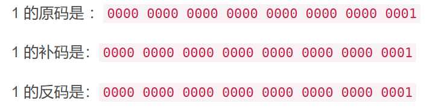
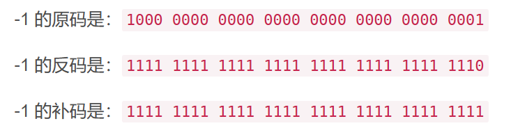
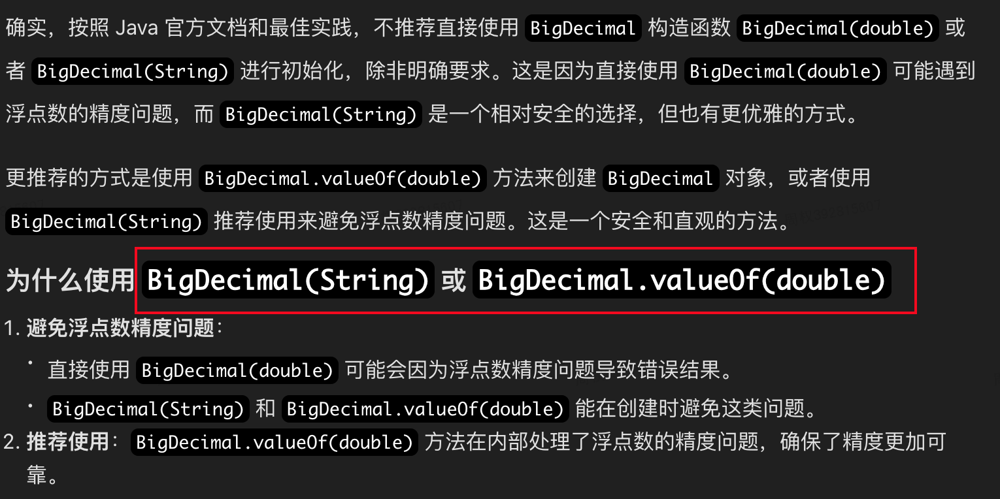

# 1、为什么int型的取值范围是-2^31^~ 2^31^-1

这个问题与计算机组成原理有关，涉及到计算机如何进行加减乘除，原码、补码、反码的知识

1. 计算机数据的最小组成单位：字节，1byte=8bit（计算机的所有数据都是由0101101这种二进制码构成的）

   比特是二进制位的简称，它代表了计算机中最小的数据单元，可以表示0或1

2. 1个字节8个比特，意思是它可以表示2^8^（256）个数据，而不是说其最大取值为256，两个是完全不同的东西！！！

   即无符号位时可以表示的数据范围是0—255（0—2^7^-1），有符号位时（0正1负）为-128—127（-2^7^~ 2^7^-1）

3. 那么，先搞清楚正、负、数在计算机中的表示方式，我们知道，计算机能够认识的只有二进制（也就是 0 和 1），而我们所认识的**字符和数字**都要转换成二进制才能让计算机识别并执行。以Java的int为例，内存占用四个字节，共32个比特，其中，第32位（最高位）是符号位，0正1负。

4. 而在计算机中，每个数的编码表示方法有三种：**原码、反码和补码**，它们用于表示**有符号整数**，设计目的是为了正确处理加减运算，并能够识别和处理数值的正负。

   原码：即人类可以看懂的二进制表示，一个数的二进制表示，直接将符号位和数值位表示出来。

   反码：在原码的基础上，对负数进行按数值位取反操作。即正数的反码与原码保持一致。

   补码：在反码的基础上，将负数进行加1操作。即正数的补码与反码与原码保持一致。

   

   

5. 为什么要有三种表示方式呢？

   这与计算机的加减乘除的方式有关，我们知道正数的原码、反码、补码是相同的，就不用多说，直接二进制相加就可以，并且不会出现问题，而负数的原码、反码、补码是不同的！！！

   既然原码才是被人脑直接识别并用于计算表示方式，为何还会有反码和补码呢?

   首先，因为人脑可以知道第一位是符号位, 在计算的时候我们会根据符号位, 选择对数值区域的加减，但是对于计算机, 加减乘数已经是最基础的运算, 要设计的尽量简单. 计算机辨别"符号位"显然会让计算机的基础电路设计变得十分复杂! 于是人们想出了将符号位也参与运算的方法。

   我们知道, 根据运算法则减去一个正数等于加上一个负数, 即: 1-1 = 1 + (-1) = 0 , 所以机器可以只有加法而没有减法, 这样计算机运算的设计就更简单了，于是人们开始探索 **将符号位参与运算, 并且只保留加法的方法.**

   以计算十进制的表达式: 1-1=0为例子

   1、原码计算

   ```java
   1 - 1 = 1 + (-1) = [00000001]原+ [10000001]原= [10000010]原= -2
   ```

   可以看出，如果用原码表示, 并且要让符号位也参与计算, 显然对于减法来说, 结果是不正确的.这也就是为何计算机内部不使用原码表示一个数。

   2、反码计算（为了解决原码做减法的问题）

   ```java
   1 - 1 = 1 + (-1) 
     = [0000 0001]原+ [1000 0001]原
     = [0000 0001]反+ [1111 1110]反
     = [1111 1111]反
     = [1000 0000]原
     = -0
   ```

   可以看出，如果使用反码表示，并且让符号位参与运算，结果的数值位部分是正确的，唯一的问题在于在"0"这个特殊的数值上。虽然人们理解上+0和-0是一样的，但是0带符号是没有任何意义的，而且会有[0000 0000]原和[1000 0000]原两个编码表示0，这是不行的。

   3、补码计算（解决了0的符号问题以及原码的减法问题)

   ```java
   1-1 = 1 + (-1) 
     = [0000 0001]原+ [1000 0001]原
     = [0000 0001]补+ [1111 1111]补
     = [0000 0000]补
     = [0000 0000]原
     = 0
   ```

   可以看出，0就直接用[0000 0000]表示, 而以前出现问题的 -0 也不存在了，而且可以用[1000 0000]表示-128。

   ```java
   (-1) + (-127) 
     = [1000 0001]原+ [1111 1111]原
     = [1111 1111]补+ [1000 0001]补
     = [1000 0000]补
   ```

   -1-127的结果应该是-128, 在用补码运算的结果中, [1000 0000]补 就是-128，但是注意因为实际上是使用以前的-0的补码来表示-128, 所以-128并没有原码和反码表示.(对-128的补码表示 [1000 0000]补 算出来的原码是[0000 0000]原, 这是不正确的)

​		因此，计算机对于有符号整数都是使用补码表示, 不仅仅修复了0的符号以及存在两个编码的问题, 而且还能够多表示一个最低数.

6. **结论**

   【1】计算机中有符号整数都是用补码的形式进行表示、符号位直接参与运算，减法会被转换为加法，计算机中没有减法运算。

   【2】反码是为了解决原码减法运算的问题，补码是为了解决反码产生的±0的问题。

   【3】补码表示的范围更广，相对原码、反码可以额外表示一个最小值（我们人为设定的，且这个数只有补码，没有原码和反码）

所以说：

​		Java中整数类型，如int表示范围是-2^31^~ 2^31^-1


# 2、计算机如何存储浮点数？

结论：

【1】浮点数在计算机中是无法准确存储的，存储历史包括了使用固点数，即整数部分和小数部分都用二进制表示，其中某一比特位作为分割点，且固定，所以说是固点数，但这种方式很不灵活，所有出现了浮点数，即这个点位是会变化的，浮动的！！！

【2】浮点数有很多表示方式，目前JAVA采用的是IEEE 754标准，即分别用符号位、尾数、阶数进行类似科学计数法的方式表示

【3】计算机是无法准确表示所有浮点数的，能准确表示整数是因为，二进制比特位能覆盖所有的整数范围，取值可能性有限，而小数这种，是无限制的取值，所以说只能无穷逼近，因为在进行浮点数的运算时，会存在精度丢失。

【4】其中，float表示精度较低，double精度更高

【5】如果要准确精度表示，可以使用Java提供的Big Decimal类，代价就是计算成本和运行复杂度较高

```java
import java.math.BigDecimal;

public class FloatingPointExample {
    public static void main(String[] args) {
        double num1 = 0.1;
        double num2 = 0.2;
        double sum = num1 + num2;
        System.out.println(sum); // 输出 0.30000000000000004

        BigDecimal bd1 = new BigDecimal("0.1");  // 用string的方式初始化
        BigDecimal bd2 = new BigDecimal("0.2");
        BigDecimal bdSum = bd1.add(bd2);
        System.out.println(bdSum); // 输出 0.3
    }
}
```

**强制：**使用 **BigDecimal**的时候，要通过String的方式进行初始化！！！！！




